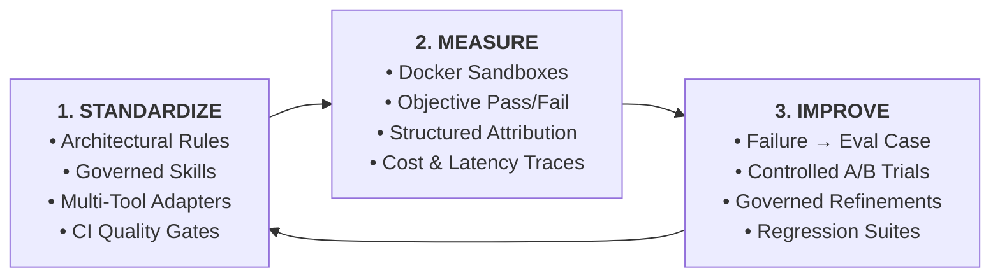
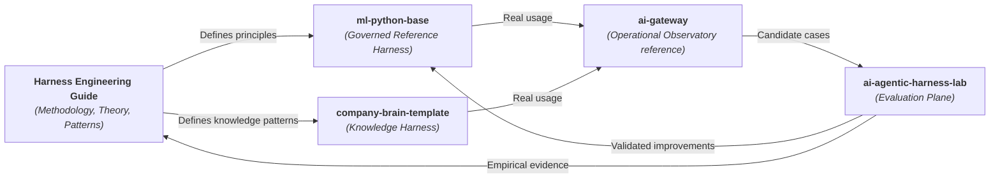

# Harness Engineering Guide

**A public, vendor-neutral methodology and technical guide for designing, governing, evaluating, and continuously improving the systems around AI agents in software and knowledge work.**

[](https://marcosdh1987.github.io/harness-engineering-guide/)
[](https://marcosdh1987.github.io/harness-engineering-guide/)
[](LICENSE)

---

## 🎯 The Core Mission

> **How can people and organizations build a reliable way to work with AI, measure what happens, and improve the system over time?**

As AI assistants evolve across software and knowledge work, prompt engineering alone is not enough. Context becomes scattered, decisions disappear, and the quality of a workflow is difficult to verify.

**Harness Engineering** treats the complete system around the model (rules, context, skills, tools, verification, observability, and evaluation) as an engineered, owned, and continuously improved system. The provider, model, or runtime can change without changing the stable core.

---

## 🔄 The Guiding Methodology: Standardize → Measure → Improve

$$\mathbf{STANDARDIZE} \longrightarrow \mathbf{MEASURE} \longrightarrow \mathbf{IMPROVE}$$



1. **Standardize**: Define and version how agents are expected to work, architectural boundaries, approved tools, reusable skills, and validation gates.
2. **Measure**: Replace subjective perception with reproducible evaluation cases executed inside controlled Docker sandbox environments.
3. **Improve**: Close the feedback loop. Transform agent failures into reproducible evaluation cases, test improvements under controlled conditions, and retain them as permanent regression tests.

---

## 🌐 The Reference Ecosystem

This guide is supported by separate reference implementations with different responsibilities:



1. **[Harness Engineering Guide](https://github.com/marcosdh1987/harness-engineering-guide)**: The methodology, concepts, patterns, and adoption guidance.
2. **[`ml-python-base`](https://github.com/marcosdh1987/ml-python-base)**: The Engineering Harness reference with rules, skills, adapters, gates, and multi-tool support.
3. **[`company-brain-template`](https://github.com/marcosdh1987/company-brain-template)**: The Knowledge Harness reference for sources, decisions, provenance, and trusted organizational context.
4. **[`ai-gateway`](https://github.com/marcosdh1987/ai-gateway)**: An operational observability reference with LiteLLM routing, metadata-only usage capture, reports, and optional Langfuse export.
5. **[`ai-agentic-harness-lab`](https://github.com/marcosdh1987/ai-agentic-harness-lab)**: The evaluation plane with sandboxed runs, attribution, behavioral audits, and improvement proposals.

---

## 📖 Key Sections

- **[Agentic SDLC for Engineering Teams](https://marcosdh1987.github.io/harness-engineering-guide/en/start-here/agentic-sdlc-for-teams/)**: A 10-minute briefing for engineering managers, staff engineers, and CTOs.
- **[Agentic SDLC Maturity Model](https://marcosdh1987.github.io/harness-engineering-guide/en/adoption/maturity-model/)**: Progression from Level 0 (Ad-hoc AI) to Level 5 (Continuously Improving Agentic SDLC).
- **[Controlled Environments & Sandboxing](https://marcosdh1987.github.io/harness-engineering-guide/en/evaluation/controlled-environments-sandboxing/)**: Why reproducible execution requires container isolation, backed by frontier lab research.
- **[Building an Internal Evaluation Suite](https://marcosdh1987.github.io/harness-engineering-guide/en/adoption/internal-evaluation-suite/)**: Encoding company architecture and incident learnings into an organizational benchmark.
- **[Choose your path](https://marcosdh1987.github.io/harness-engineering-guide/en/use/choose-your-path/)**: Find an entry point by role or goal.

---

## 🛠️ Local Development & Build

### Prerequisites
- Python 3.11+
- [uv](https://github.com/astral-sh/uv) (recommended)

### Commands (Makefile)

```bash
# Serve docs locally with live reload (http://localhost:8000)
make docs-serve

# Build and validate strictly (CI gate check)
make docs-build

# Synchronize reference implementation metadata & evidence bibliography
make sync-reference

# Run all quality checks (lint + strict build)
make check
```

---

## 🌍 Bilingual Documentation

The guide is maintained with **English** as canonical and **Spanish** as a first-class translation:
- 🇬🇧 [English Documentation](https://marcosdh1987.github.io/harness-engineering-guide/en/)
- 🇪🇸 [Documentación en Español](https://marcosdh1987.github.io/harness-engineering-guide/es/)

---

## 📄 License

This repository is open source and available under the [MIT License](LICENSE).
