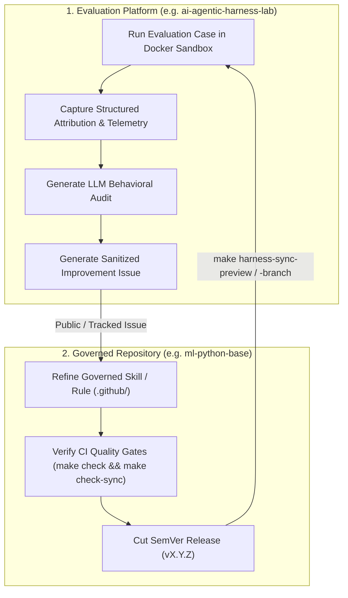
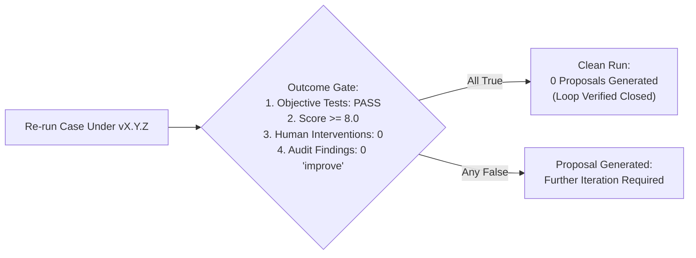

# Continuous Harness Improvement

**Continuous Harness Improvement** is the operational methodology for translating evaluation evidence into versioned, gate-verified improvements to the engineering harness.

Instead of modifying prompts or rules ad-hoc across multiple repositories, teams manage their engineering harness with the same rigor as an enterprise shared library: through **evidence, sanitized issue tracking, SemVer releases, and re-measurement**.

---

## The Closed-Loop Improvement Cycle

The continuous improvement loop operates across two synchronized boundaries: the **Evaluation Platform** and the **Governed Repository Template**:

---

## The 4 Steps of the Improvement Loop

### 1. Evidence (Observed in the Lab)
- Run a benchmark or internal evaluation case inside an isolated Docker sandbox container.
- Review the **Attribution Panel** (which governance files and skills were consulted) and the **Behavioral Audit** (did the agent loop commands, violate style rules, or hallucinate CLI flags?).
- Isolate a **measurable symptom** (e.g., *"the agent re-read the same configuration file 8 times without taking action; repeated equivalent commands should be $\le 2$*").

### 2. Sanitized Issue Generation
- Generate a sanitized markdown issue from the evaluation run.
- **Sanitization Protocol**: Automatically strip local workspace paths, machine hostnames, API tokens, and private environment variables.
- The resulting issue defines:
  - The **target skill or rule** (`.github/skills/systematic_debugging.md`).
  - The **failed behavior** observed in the run.
  - The **suggested remediation**.
  - The **quantitative success criterion** (`repeated_equivalent_commands <= 2`).

### 3. Iteration & Release (In the Governed Template)
- In the governed template repository, create a development branch.
- Update the governed skill or rule under `.github/`.
- Run local quality gates (`make check`, `make check-sync`) to ensure multi-tool adapters (`CLAUDE.md`, `AGENTS.md`, `OPENCODE.md`) are regenerated and synchronized.
- Merge the PR and tag an immutable SemVer release (e.g., `v1.4.0`).

### 4. Re-Measurement & Validation (Closing the Loop)
- In the evaluation platform, synchronize the candidate governance version into an isolated worktree.
- Re-run the exact same evaluation case with the same model, prompt, and sandbox parameters.
- Compare attribution, token consumption, and behavioral audits:
  - Did the measurable symptom disappear?
  - Did the objective test suite pass?
  - Did the run produce **zero improvement proposals** (clean outcome gate)?
- If validated, promote the governance release across all production engineering repositories.

---

## The Deterministic Outcome Gate

A core innovation in modern harness lifecycle management is the **deterministic outcome gate**:

A run that cleanly satisfies all objective and behavioral criteria automatically generates **zero proposals**. When re-running the same case across your complete model tier (e.g., Claude Haiku, Sonnet, Opus) yields zero proposals on every arm, the improvement loop is objectively closed.

---

## Governance Synchronization Strategies

When distributing harness improvements to downstream engineering repositories, teams use three controlled strategies:

| Strategy | Mechanism | Recommended Use |
|---|---|---|
| **Dry-Run Preview** | `make harness-sync-preview REF=vX.Y.Z` | Read-only diff inspection before touching any workspace files. |
| **Candidate Worktree** | `make harness-sync-branch REF=vX.Y.Z` | Prepares changes in an isolated Git worktree (`.worktrees/candidate-vX.Y.Z`) for gate verification before merging to `main`. |
| **Direct Template Sync** | `make template-sync REF=vX.Y.Z` | Direct fast-forward sync for non-breaking rule updates in actively maintained repos. |

---

## Findings: Suggested by Machines, Signed by People

Automated analysis is excellent at *noticing* — a case that regressed, a skill nobody consults, a failure that repeats. It must never be allowed to *conclude*. In a mature improvement loop, auto-generated patterns arrive labeled **suggested** and become findings of record only when a person reviews them, optionally edits them, and signs them; rejections are recorded too, so the same pattern is not re-raised every week. A finding nobody owns is an assertion nobody has to defend — and a client-facing report built on unsigned findings is marketing, not evidence.

## Auditing a Repository You Have Never Seen

The same loop scales to consulting: auditing a client's repository transparently. The mechanics that make it credible:

- **Derive the benchmark from their own history** — commits that changed source and tests together become reproducible cases, so the evaluation measures *their* work, not a synthetic puzzle.
- **Infer their quality gate from their own files** (Makefile targets, lockfiles, test configs) and adopt it explicitly — never guess it silently.
- **Judge every run against the governance that run actually had.** A "native" control arm audited against *your* rules would look worse by construction; the comparison native-vs-injected is only honest when each arm is measured against its own surface.
- **Report only what the evidence supports.** With no runs, the report says "reading, not measurement"; with exploratory repetitions, it says exploratory.

The closing move of every audit is the same experiment: *their repo as-is* versus *their repo with your harness injected*, same cases, five or more repetitions per arm — the engagement question, answered as a measurement.

---

### Related Resources
- **[Building an Internal Evaluation Suite](internal-evaluation-suite.md)**
- **[From Failures to Regression Cases](failures-to-regression-cases.md)**
- **[Team Governance & Ownership](team-governance.md)**
