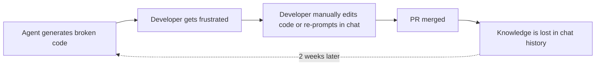
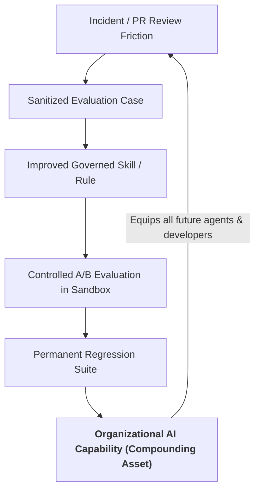

# From Agent Failures to Regression Cases

One of the most foundational principles of Harness Engineering is bridging traditional software quality engineering with agentic AI development.

In mature software engineering, teams never let a production bug pass by without writing a regression test. In agentic engineering, **we must apply the exact same discipline to AI agent failures.**

---

## The Core Software Engineering Analogy

```mermaid
flowchart TD
    subgraph Traditional["Traditional Software Engineering"]
        direction LR
        B["1. Production Bug"] --> R1["2. Reproduce locally"]
        R1 --> T1["3. Write Unit/Integration Test (Failing)"]
        T1 --> F1["4. Fix Code in codebase"]
        F1 --> RT1["5. Commit test to permanent CI Regression Suite"]
    end

    subgraph Agentic["Agentic Engineering"]
        direction LR
        AF["1. Agent Failure / Hallucination"] --> R2["2. Reproduce in Sandbox"]
        R2 --> T2["3. Create Reproducible Eval Case"]
        T2 --> F2["4. Improve Rule / Skill / Quality Gate"]
        F2 --> RT2["5. Commit case to permanent Harness Regression Suite"]
    end
```

| Traditional Software Engineering | Agentic AI Engineering |
|---|---|
| **Defect** | Code throws an uncaught exception or violates logic. | Agent violates architecture, ignores safety rules, or loops erratically. |
| **Reproduction** | Minimal unit test or integration scenario reproducing the bug. | Minimal repository commit + prompt reproducing the agent failure. |
| **Fix Mechanism** | Patching source code in application files. | Improving a governed `.github/skill/`, refining a rule, or adding a gate. |
| **Verification** | Running test runner (`pytest`, `jest`) locally to ensure the test passes. | Running the evaluation case across multiple trials in an isolated sandbox. |
| **Prevention** | Test runs on every pull request via CI to prevent regressions. | Evaluation case runs on every harness candidate release to prevent regressions. |

---

## Why Ephemeral Prompting Fails

When developers operate without a governed harness, agent mistakes trigger an **ephemeral correction loop**:

In this unengineered mode:
1. The developer spends time fixing the issue manually.
2. The root cause (missing skill guidance, ambiguous rule, or lack of quality gate) remains unaddressed.
3. The prompt fix remains trapped in that developer's private chat history.
4. Another engineer encounters the exact same failure shortly after.

---

## The Compounding Knowledge Flywheel

By converting every agent failure into a permanent evaluation case, engineering knowledge **compounds** across the organization:

### The Compounding Effect:
- **Month 1**: 10 baseline evaluation cases protect core architecture boundaries.
- **Month 3**: 50 cases encode database migrations, concurrency patterns, and security constraints.
- **Month 6**: 200+ cases form an automated benchmark. When Anthropic, OpenAI, or Google releases a new model, the organization tests the entire model against the suite in hours—knowing exactly which skills improve and which regress before deploying to engineers.

---

## Step-by-Step: Turning a Failure into a Regression Case

### Step 1: Capture and Isolate
When an agent produces an incorrect patch or gets stuck in a loop during development:
- Record the **base commit SHA** of the repository.
- Record the **exact task prompt** and any context files provided.
- Record the **undesired symptom** (e.g., table-exclusive lock in migration, circular imports, unhandled error).

### Step 2: Create the Evaluation Case
Define the case in your internal evaluation harness:
- **Task**: The sanitized prompt describing the requirement.
- **Environment**: Docker container specification with exact dependency versions.
- **Validation Commands**: Deterministic shell commands (unit test, linter, policy check) that fail when the symptom is present and pass when resolved.

### Step 3: Measure the Baseline
Run the case 5–10 times using your current harness and model without any changes. Document the baseline pass rate (e.g., `2/10 pass (20%)`).

### Step 4: Refine the Harness
Address the root cause by improving the system around the agent:
- Author or update a modular skill (e.g., `.github/skills/concurrency_debugging.md`).
- Add an explicit architectural constraint in `.github/standards.md`.
- Add an automated CI quality gate (`make check`).

### Step 5: Re-evaluate and Verify
Run the case 5–10 times under the improved harness condition (*Treatment*). Verify that the pass rate increases to the target threshold (e.g., `10/10 pass (100%)`) and that no tool thrashing occurred.

### Step 6: Lock into the Regression Suite
Commit the evaluation case to your internal evaluation repository. Every future harness release or model migration must pass this case before promotion.

---

### Related Resources
- **[Building an Internal Evaluation Suite](internal-evaluation-suite.md)**: Structuring cases at scale.
- **[Continuous Harness Improvement](continuous-harness-improvement.md)**: The end-to-end proposal workflow.
- **[Pattern: Failure to Regression](../patterns/failure-to-regression.md)**: Step-by-step implementation recipe.
