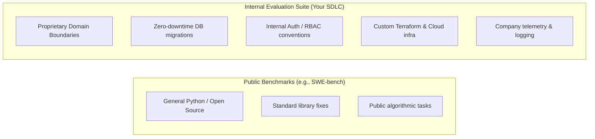
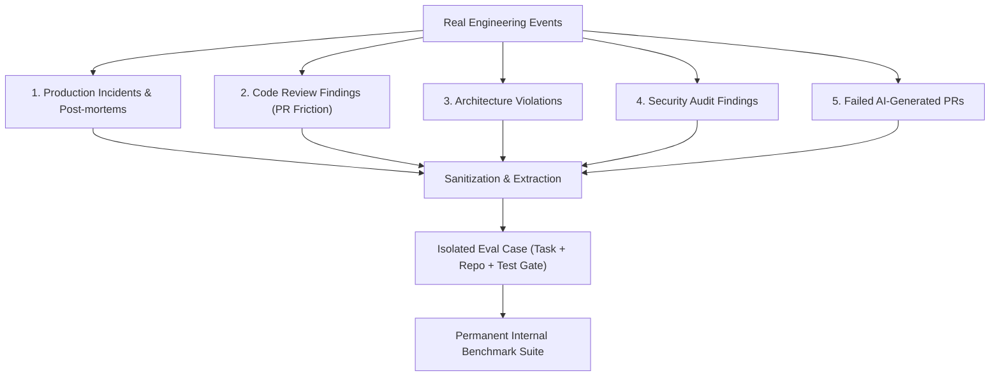

# Building an Internal Evaluation Suite

While public benchmarks like **SWE-bench** provide valuable general-purpose baselines for resolving open-source issues, an engineering organization achieves its highest return on investment by building a proprietary **internal evaluation suite**.

An internal evaluation suite encodes your organization's specific architecture, conventions, security constraints, and production lessons into an executable benchmark.

---

## Why Public Benchmarks Are Not Enough

Public benchmarks test general coding abilities (e.g., fixing an issue in Django or SymPy). However, they cannot evaluate whether an AI agent can successfully navigate your proprietary engineering environment:



| Dimension | Public Benchmarks (SWE-bench) | Internal Evaluation Suite |
|---|---|---|
| **Codebase Target** | Standard open-source repositories | Your actual repository patterns & tech stack |
| **Architecture** | Generic framework conventions | Your layered architecture (Domain, App, Infra) |
| **Safety Rules** | Basic unit test passes | Production safety (zero-downtime, non-blocking locks) |
| **Governance** | Unconstrained tool execution | Governed skills, specific MCPs, and review gates |
| **Business Impact** | Academic comparative metric | Direct reduction in PR cycle time and regressions |

---

## Core Categories for Internal Evaluation Cases

An effective internal evaluation suite spans key engineering competencies:

### 1. Architectural Adherence & Layering
- **Task**: Implement a new REST/gRPC endpoint or service feature.
- **Validation**: Verify that the domain entities remain free of database or framework imports, and dependencies strictly point inward.

### 2. Zero-Downtime Database Migrations
- **Task**: Add a non-nullable column or rename a table on a multi-million-row database.
- **Validation**: Ensure the agent generates a multi-phase migration (nullable column, backfill batch, separate index creation) without holding table-exclusive locks.

### 3. Concurrency & Race Condition Fixes
- **Task**: Resolve an intermittent distributed lock or async state mutation bug.
- **Validation**: Automated concurrent stress-test suite that executes parallel threads/coroutines to verify deadlock freedom.

### 4. Infrastructure-as-Code (Terraform / Kubernetes)
- **Task**: Update cloud networking or storage resources.
- **Validation**: Static policy validation (`conftest`, `tflint`) ensuring no state-destructive re-creations or open security groups.

### 5. Security Vulnerability Remediation
- **Task**: Resolve an OWASP Top 10 finding (e.g., SQL injection, insecure deserialization, SSRF).
- **Validation**: Security unit tests verifying that user inputs are sanitized and parameterized without bypassing auth gates.

### 6. Observability & Telemetry Instrumentation
- **Task**: Add structured logging and OpenTelemetry tracing to a transaction workflow.
- **Validation**: Automated check verifying trace propagation, metric emission, and absence of PII in log payloads.

---

## Where Do Evaluation Cases Come From?

Evaluation cases should not be invented in a vacuum. They are harvested directly from everyday software engineering activities:



1. **Production Incidents & Post-Mortems**: Whenever a bug causes downtime or an emergency hotfix, sanitize the incident into a reproducible case to ensure AI agents never recreate the issue.
2. **Code Review Comments**: Recurring review feedback (e.g., "Don't call the DB inside this loop", "Use our internal error handler") provides immediate candidates for evaluation cases and skills.
3. **Failed AI-Generated PRs**: When an agent produces broken or non-compliant code during regular development, capture the exact prompt, repo commit, and failure symptom.

---

## The Anatomy of an Internal Evaluation Case

A robust evaluation case consists of three deterministic elements:

```yaml
# Example Evaluation Case Specification
id: "internal-db-migration-zero-downtime"
title: "Add active_subscription column to users table without lock"
target_repo: "company/core-service"
base_commit: "9c3f81e"
task_description: |
  Add a non-nullable boolean column `has_active_subscription` with default `false`
  to the `users` table in Alembic, following company zero-downtime guidelines.

environment:
  docker_image: "company-eval-runner:latest"
  memory_limit: "4GB"
  cpu_limit: "2.0"
  timeout_seconds: 300

validation_commands:
  - "python -m pytest tests/migrations/test_zero_downtime.py"
  - "python scripts/lint_migrations.py"

rubric:
  level_0: "Migration failed to execute or syntax error"
  level_1: "Migration executed but held exclusive table lock"
  level_2: "Zero-downtime pattern followed; all migration tests passed"
```

---

## Compounding Organizational Capability

Over time, this growing collection of internal cases forms an **organizational benchmark for AI-assisted development**.

Whenever a new frontier model is released (e.g., Claude 4.5, GPT-5) or your team refactors an engineering skill:
1. You run your internal evaluation suite across the new model or harness candidate.
2. You receive an objective, quantitative report of pass rates, cost deltas, and regression risks.
3. You make evidence-driven decisions on whether to adopt new tools or skills.

---

### Related Resources
- **[Agent Failure → Regression Case](failures-to-regression-cases.md)**: Turning failures into tests.
- **[Controlled Environments & Sandboxing](../evaluation/controlled-environments-sandboxing.md)**: Running evaluations safely.
- **[Behavioral Audits & Scoring](../evaluation/behavioral-audits-and-scoring.md)**: Measuring execution quality.
