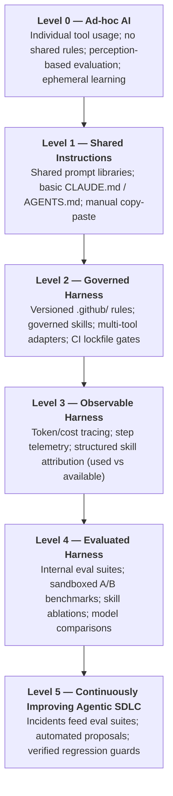

# Agentic SDLC Maturity Model

The **Agentic SDLC Maturity Model** is a proposed organizational framework for understanding and guiding an engineering organization's progression from isolated, individual AI usage to a governed, evaluated, and continuously improving agentic software development lifecycle.

> [!NOTE]
> **Methodological Proposal**: This maturity model is a proposed framework developed within the Harness Engineering methodology. It is designed as a diagnostic and roadmap tool, not an industry-mandated standard.

---

---

## The 6 Stages of Organizational Maturity

### Level 0, Ad-hoc AI
*Individual experimentation without shared standards.*

- **Characteristics**: Developers choose their own AI tools (ChatGPT, GitHub Copilot, Claude, Cursor) without coordination. Prompts are entered ad-hoc into chat interfaces.
- **Evaluation**: Purely subjective and anecdotal ("Claude seems faster today", "Copilot made a weird hallucination").
- **Failure Mode**: Ephemeral learning. When an agent generates broken code or architectural violations, the developer manually fixes it; no organizational learning occurs.
- **Key Artifacts**: None.

---

### Level 1, Shared Instructions
*Emergence of shared prompts and basic instruction files.*

- **Characteristics**: Teams begin documenting common prompts in Notion or sharing baseline instruction files (`CLAUDE.md`, `AGENTS.md`, `.github/copilot-instructions.md`) in repository roots.
- **Evaluation**: Informal peer discussions during standups or code reviews.
- **Failure Mode**: Instruction drift. Instruction files diverge across different tools and repositories; prompt changes are untracked and unvalidated.
- **Key Artifacts**: Static markdown instruction files, prompt cheatsheets.

---

### Level 2, Governed Harness
*Centralized rules, structured skills, and automated drift control.*

- **Characteristics**: Rules, architectural layering guidelines, and modular skills are centralized (e.g., in `.github/`) as the single source of truth. Automated adapters project rules to all supported AI tools. Automated CI quality gates (`make check`, `make check-sync`) enforce lockfile consistency and block uncommitted drift.
- **Evaluation**: Standard unit and integration test passes on pull requests generated by agents.
- **Failure Mode**: Lack of behavioral insight. Teams know if the code compiles and passes CI, but cannot see which skills were consulted or why an agent struggled.
- **Key Artifacts**: Centralized rules layer, `.github/skills/`, automated tool adapters, drift control scripts, pre-commit hooks.
- **Reference Example**: [`marcosdh1987/ml-python-base`](https://github.com/marcosdh1987/ml-python-base).

---

### Level 3, Observable Harness
*Telemetry, execution tracing, and structured attribution.*

- **Characteristics**: Every agent execution is instrumented. Step logs, token consumption, financial cost, wall-clock latency, tool invocations, and error rates are captured into tracing backends (e.g., OpenTelemetry, Langfuse).
- **Attribution**: The system measures **used vs available attribution**, explicitly tracking which repository documentation, rules, and skills the agent actually read and exercised during execution.
- **Failure Mode**: Teams have high observability ("what happened") but lack objective validation of whether changes improved agent capability ("was it good").
- **Key Artifacts**: Step log parsers, tracing integrations, attribution matrices, token cost dashboards.

---

### Level 4, Evaluated Harness
*Internal evaluation suites, sandboxed benchmarks, and controlled A/B testing.*

- **Characteristics**: The organization maintains a repository of **reproducible evaluation cases** reflecting its real-world codebase and architecture. Agent trials run in **isolated container sandboxes** (Docker) with strict resource controls.
- **Experimentation**: Teams perform controlled A/B evaluations and **skill ablations** (e.g., *Baseline* vs *Baseline + Skill X*), holding model, prompt, and environment constant to isolate the impact of harness changes.
- **Evaluation Graders**: Multi-grader toolbox combining objective test runners, LLM-based behavioral auditors, and human scoring.
- **Failure Mode**: Eval creation is manual and disconnected from day-to-day production incidents.
- **Key Artifacts**: Internal eval suites, container runner images, multidimensional scoring rubrics, ablation harnesses.
- **Reference Example**: [`marcosdh1987/ai-agentic-harness-lab`](https://github.com/marcosdh1987/ai-agentic-harness-lab).

---

### Level 5, Continuously Improving Agentic SDLC
*Closed-loop feedback: failures automatically compound into organizational capabilities.*

- **Characteristics**: The feedback loop is fully closed. When an agent fails in production or during code review:
  1. The failure is sanitized into an evaluation case.
  2. Baseline performance is measured.
  3. A targeted harness proposal is drafted.
  4. The improved skill or rule is tested under controlled multi-run conditions.
  5. The change is promoted through a release gate and the case becomes a permanent part of the organization's **regression suite**.
- **Outcome**: The organization's AI capability **compounds** over time, creating a defensible institutional engineering asset.
- **Key Artifacts**: Automated proposal generators, sanitized issue workflows, immutable SemVer harness releases, permanent regression suites.

---

## Maturity Assessment Matrix

| Dimension | Level 0 | Level 1 | Level 2 | Level 3 | Level 4 | Level 5 |
|---|---|---|---|---|---|---|
| **Instruction Layer** | Ad-hoc in chat | Shared markdown | Governed `.github/` | Governed `.github/` | Versioned catalog | Staged & ablated |
| **Tool Adaptation** | None | Manual copies | Automated sync | Automated sync | Controlled overlays | Dynamic injection |
| **CI Quality Gates** | None | Optional | Mandatory | Mandatory | Mandatory | Mandatory |
| **Telemetry & Cost** | Untracked | Untracked | Untracked | Full tracing | Full tracing | Cost per eval arm |
| **Attribution** | None | None | None | Used vs Available | Used vs Available | Per-ablation diff |
| **Execution Env** | Local host | Local host | Local host | Local host | Docker Sandboxes | Docker Sandboxes |
| **Evaluation Method**| Vibe / Intuition | Anecdotal | Unit tests | Trace review | Sandboxed A/B evals| Multi-run regression|
| **Incident Response**| Local fix | Slack tip | Manual doc edit| Manual doc edit | New eval case | Closed-loop cycle |

---

!!! note "Assessing maturity honestly"
    Two rules keep a maturity assessment from becoming a brochure. First, at Levels 4-5 the working unit is the **experiment** (a stated question, declared arms, a mode that licenses its conclusion (see [The Three Questions](../evaluation/the-three-questions.md)), not the individual run. Second, the assessment itself stays **human and evidence-backed**: a level claimed above "governed" should point at concrete runs and experiments, and a dimension without evidence is reported as *unknown*, never scored by intuition) the methodology applies to evaluating your own maturity too.

### Next Steps
- Learn how to **[Build an Internal Evaluation Suite](internal-evaluation-suite.md)**.
- Understand the **[Agent Failure → Regression Case](failures-to-regression-cases.md)** loop.
- Explore **[Continuous Harness Improvement](continuous-harness-improvement.md)**.
