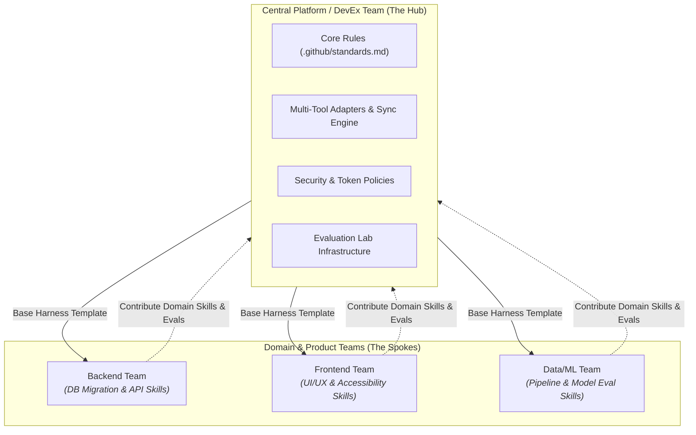
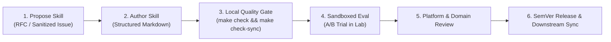
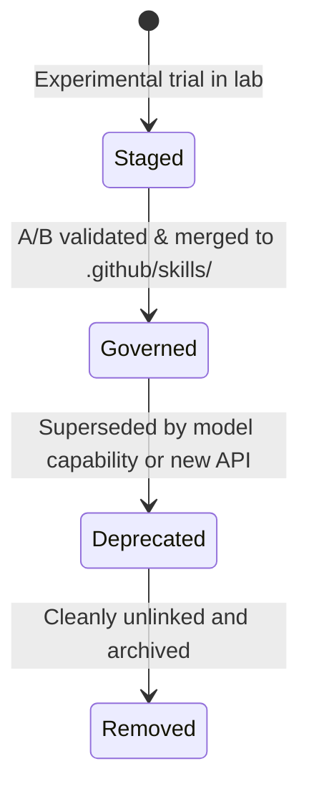

# Team Governance and Harness Ownership

As an organization adopts Harness Engineering, a key organizational question arises: **Who owns the harness, and how do teams collaborate on rules, skills, and evaluation suites?**

Without clear ownership and governance policies, engineering harnesses suffer from either **anarchic divergence** (each team re-invents their own incompatible skills) or **bureaucratic stagnation** (nobody updates skills when tooling evolves).

---

## Governance Models: Centralized Platform vs Federated Ownership

Successful engineering organizations balance platform standardization with domain-specific flexibility using a **hub-and-spoke federated model**:

### 1. Central Platform Responsibilities (The Core Harness)
- Maintains base repository templates (`ml-python-base`).
- Maintains the synchronization engine for multi-tool adapters (`CLAUDE.md`, `AGENTS.md`, `OPENCODE.md`).
- Operates shared evaluation infrastructure (`ai-agentic-harness-lab`) and Docker base images.
- Sets global security constraints, credential protection, and token spend guardrails.

### 2. Domain Team Responsibilities (Domain Extensions)
- Authors specialized skills matching their domain (e.g., GraphQL schema generation, PyTorch training pipelines).
- Harvests production incidents and PR feedback into domain evaluation cases.
- Owns local repository rules and context contracts.

---

## Skill Contribution and Review Workflow

To prevent skill bloat and low-quality prompt pollution, new skills follow a standardized review pipeline:

### Skill Quality Checklist for Reviewers
Every new or updated skill must pass 5 review criteria before merge:

1. **Determinism**: Does the skill prescribe structured, sequential steps with explicit verification checkpoints rather than vague suggestions?
2. **Context Budgeting**: Is the skill concise and focused? (Avoid including encyclopedic reference documentation that consumes unnecessary context window tokens).
3. **Tool Safety**: Does the skill restrict bash execution to safe, idempotent commands?
4. **Attribution Verifiability**: Can the evaluation harness detect whether the agent actually consulted and followed the skill?
5. **Regression Verification**: Does the submission include at least one evaluation case demonstrating a measurable improvement over the unassisted baseline?

---

## Skill Lifecycle and Deprecation

Skills are living engineering software; they must be versioned, maintained, and eventually retired when underlying models or frameworks change:

1. **Staged**: The skill lives in evaluation staging (`data/skills_staging/`) where it can be tested in A/B ablation trials without touching production repositories.
2. **Governed**: The skill is promoted to `.github/skills/`, synced across multi-tool adapters, and included in CI quality gates.
3. **Deprecated**: When frontier models internalize the capability natively or internal APIs change, the skill is marked `@deprecated` with a migration note.
4. **Removed**: The skill is removed from the catalog; CI drift checks verify no lingering references exist.

---

## Managing Multi-Repository Drift

When an organization maintains dozens or hundreds of microservices, preventing configuration drift is essential:

- **Template Repositories**: All new services bootstrap from the governed template (`make init NAME=my_service`), preserving upstream sync links.
- **Automated Sync PRs**: Upstream harness updates trigger automated preview PRs across downstream repositories (`make template-sync REF=vX.Y.Z`).
- **Read-Only CI Quality Gates**: Downstream CI pipelines execute `make check` and `make check-sync` to ensure local developers have not manually desynchronized their tool adapters from the `.github/` source of truth.

---

### Related Resources
- **[Agentic SDLC Maturity Model](maturity-model.md)**
- **[Continuous Harness Improvement](continuous-harness-improvement.md)**
- **[Pattern: Drift Control](../patterns/drift-control.md)**
