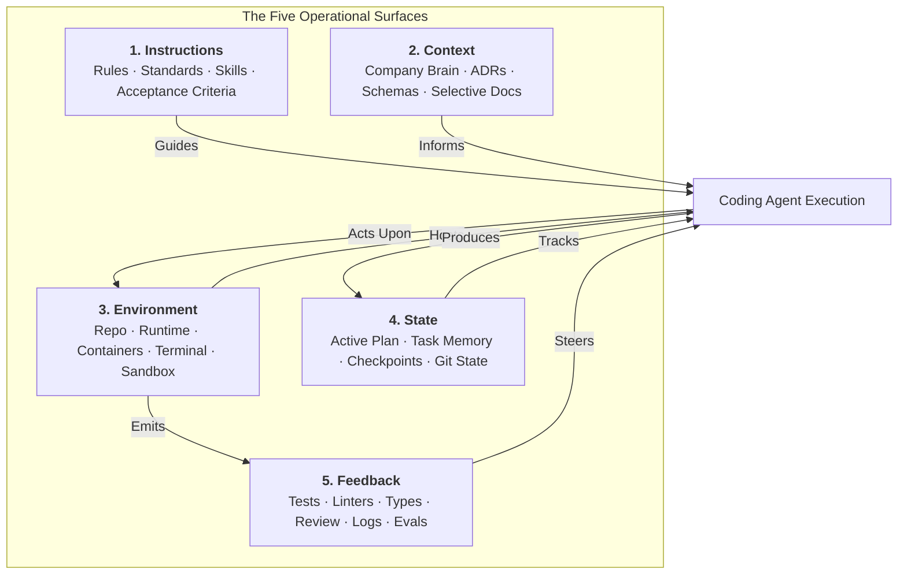

# Five Operational Surfaces of the Harness

Harness Engineering operates across five concrete interaction surfaces between human developers, execution environments, and autonomous coding agents:

1. **Instructions**
2. **Context**
3. **Environment**
4. **State**
5. **Feedback**

While the four-layer Harness Stack (Rules, Skills, Tooling, Gates) describes architectural structure, the **Five Operational Surfaces** describe the runtime topology through which an agent interacts with software systems.

---

## 1. Instructions: Steering and Policy

Instructions declare what an agent must, should, and must not do. They encode human intent, team conventions, and architectural constraints into machine-readable policies.

Instructions operate across three scopes:

- **Global Rules and Policies**: repository standards, architectural boundaries, and safety invariants (such as `.github/standards.md`, `CLAUDE.md`, or `AGENTS.md`).
- **Governed Skills**: parameterized operational procedures for complex, multi-step actions (such as database migrations or API scaffolding).
- **Task-Specific Directives**: enriched issue descriptions, user prompts, and explicit acceptance criteria.

Instructions must remain concise and hierarchical. As shown in frontier research (OpenAI, 2026), an agent instruction file acts as an index or map to detailed documentation rather than an exhaustive encyclopedia.

---

## 2. Context: Grounding and Domain Knowledge

Context provides the domain knowledge, architectural history, and technical constraints required to execute a task correctly without hallucination.

Key context assets include:

- **Organizational Knowledge**: canonical requirements, decisions, and system profiles curated in a Company Brain.
- **Architectural Decision Records (ADRs)**: rationale for past technical decisions, preventing agents from reintroducing rejected designs.
- **Technical Schemas**: database schemas, OpenAPI contracts, and Protocol definitions.
- **Selective Retrieval**: delivering only the smallest useful read set necessary for the task, avoiding context saturation and attention degradation.

Context is not synonymous with the model prompt. Broad organizational context is filtered and compiled into task-specific context by the harness.

---

## 3. Environment: The Physical Workspace

The environment encompasses the operating system, file system, toolchains, runtime services, and network access available to the agent.

Components of the environment surface include:

- **Repository Layout**: consistent directory structures, reproducible dependency locks (`uv.lock`), and deterministic build tooling.
- **Isolated Execution Sandboxes**: containerized environments (Docker, Podman, or OS sandboxes) that permit destructive testing and command execution without endangering developer machines.
- **Runtime Services**: local databases, service mocks, and ephemeral background workers.
- **Agent-Legible Tooling**: CLI commands with machine-readable outputs (JSON, structured exit codes) and unambiguous error diagnostics.

As demonstrated by Anthropic (2026), variations in CPU, RAM, network latency, and container configuration introduce measurable noise in coding evaluations. The environment must be treated as an explicit experimental condition.

---

## 4. State: Progress and Continuity

State captures the transitory working condition of a task. It allows agents to pause, resume, checkpoint, and coordinate across multiple context windows or model invocations.

The state surface tracks:

- **Active Plan and Task Matrix**: checklist of completed items, current work in progress, and remaining tasks.
- **Working Assumptions**: hypotheses formed during investigation that require empirical validation before commit.
- **Execution Artifacts**: temporary diffs, runbook logs, step traces, and intermediate validation summaries.
- **Git Working State**: branch name, worktree path, stash state, and uncommitted modifications.

Distinguishing transitory working state from durable repository memory prevents task notes from polluting canonical documentation.

---

## 5. Feedback: Ground Truth and Validation

Feedback provides the authoritative signal that steers agent execution. In Harness Engineering, empirical outcomes always take precedence over model self-evaluations.

Feedback signals operate in multiple tiers:

- **Deterministic Gates**: linters (Ruff, ESLint), type checkers (Mypy, TypeScript), unit test suites (Pytest, Jest), and security scans (Bandit, Gitleaks).
- **Runtime Observability**: application logs, metrics, OpenTelemetry traces, and HTTP status codes emitted during execution.
- **Agent-to-Agent Review**: specialized subagents inspecting pull requests against architectural rules and style constraints.
- **Human Merge Gate**: final human verification of intent, security implications, and design coherence.

Without rigorous feedback, an agent operates blind, optimizing for plausible-sounding completion rather than verified correctness.

---

## Connecting the Five Surfaces to the Harness Stack

The Five Operational Surfaces align directly with the four structural layers of the Harness Stack:

| Operational Surface | Primary Role | Harness Stack Layer | Representative Mechanism |
|---|---|---|---|
| **Instructions** | Steer behavior and define boundaries | Layer 1: Rules & Policies | `AGENTS.md`, `.github/standards.md`, skills |
| **Context** | Ground execution in system reality | Layer 2: Skills & Workflows | Company Brain, ADRs, schemas |
| **Environment** | Host and isolate execution | Layer 3: Tooling & Environment | Docker, devcontainers, `uv.lock`, Makefile |
| **State** | Preserve progress and allow resumption | Layer 2 & Layer 3 | Working memory, task checklists, git worktrees |
| **Feedback** | Verify outcomes and enforce quality | Layer 4: Verification & Feedback | `make check`, test suites, behavioral audits |

Designing a balanced harness requires investing across all five surfaces. Over-indexing on instructions while neglecting feedback or environment isolation leads to fragile, unverified agent behavior.
