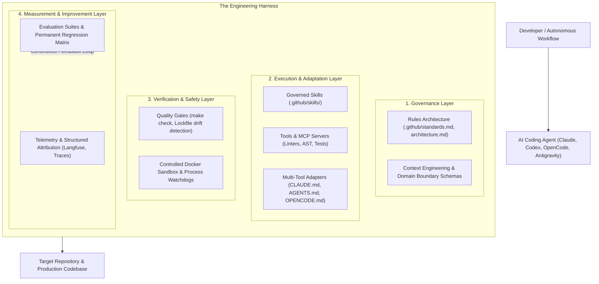

# Harness Engineering

!!! info "About this page"
    **What you will learn:** the stable principles behind context, rules, skills, tools, verification, and evaluation.

    **For:** everyone who wants to understand the methodology, with extra depth for technical practitioners.

    **Read this when:** you want the conceptual foundation before exploring implementations.

**Harness Engineering** is the practice of designing, governing, observing, evaluating, and continuously improving the complete system around AI agents used for software and knowledge work.

Rather than treating AI work as an ephemeral conversation, Harness Engineering structures the surrounding operating system: trusted context, persistent rules, modular skills, tool adapters, verification, quality gates, observability, and evaluation. The same principles can support an Engineering Harness or a Knowledge Harness.

---

---

## The 4 Pillars of Harness Architecture

### 1. Governance & Constraints
Establishes the rules of engagement for the agent:
- **Layering Boundaries**: Strict separation of concerns (e.g., Domain, Application, Infrastructure).
- **Standards & Conventions**: Typing, absolute import paths, naming conventions, and prohibited patterns.
- **Context Boundaries**: Managing token budgets and curating project memory so the model receives high-signal context without prompt dilution.

### 2. Capabilities & Tool Adapters
Equips the agent with structured, repeatable workflows:
- **Governed Skills**: Executable markdown instructions with strict inputs and step-by-step logic.
- **MCP & Tool Servers**: Controlled interfaces for reading ASTs, querying database schemas, or running tests.
- **Declarative Adapters**: Auto-generating native tool configurations (`CLAUDE.md`, `AGENTS.md`, `OPENCODE.md`, `GEMINI.md`, `copilot-instructions.md`) from a single source of truth in `.github/`.

### 3. Verification & Sandboxed Safety
Prevents dangerous execution and silent regressions:
- **Quality Gates**: Read-only pre-commit and CI checks that fail fast on uncommitted drift or rule violations.
- **Isolated Sandboxes**: Running agent trials inside dedicated Docker containers to guarantee reproducibility and prevent unauthorized host modification.

### 4. Measurement & Continuous Improvement
Replaces guesswork with empirical science:
- **Structured Attribution**: Measuring what parts of the harness the agent actually consulted during multi-step runs.
- **Evaluation Engineering**: Multi-run A/B experiments, skill ablations, and permanent regression suites.
- **Closed-Loop Proposals**: Converting observed agent mistakes into sanitized issues that continuously upgrade the harness.

---

### Related Resources
- **[What is Harness Engineering? (Start Here)](../start-here/what-is-harness-engineering.md)**
- **[Standardize → Measure → Improve](../start-here/standardize-measure-improve.md)**
- **[Agentic SDLC Maturity Model](../adoption/maturity-model.md)**
- **[Observability vs Evaluation](observability-vs-evaluation.md)**
