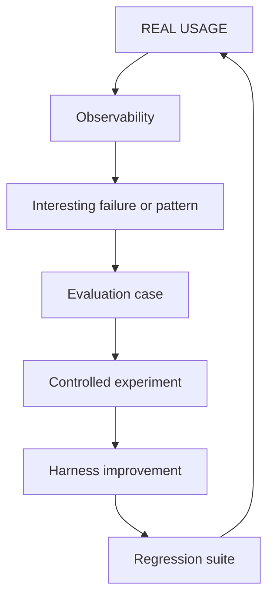

# Observability vs Evaluation

!!! info "About this page"
    **What you will learn:** why operational observability and controlled evaluation answer different questions.

    **For:** engineering managers, tech leads, AI champions, Harness Engineers, and teams adopting AI.

    **Read this when:** you need to connect production evidence with a defensible experiment.

Observability and evaluation are complementary. Observability describes activity in a real system. Evaluation compares alternatives under conditions that are controlled enough to support a conclusion.

| Observability | Evaluation |
| --- | --- |
| What happened | Which alternative works better |
| Production or everyday use | Controlled environment |
| Gateway, traces, and delivery data | Harness Lab |
| Detects patterns | Tests hypotheses |
| Generates candidate cases | Confirms improvements or regressions |

## The bridge from usage to learning

## Observability: what is happening?

Observability captures the runtime signals needed to understand how the system is being used: requests, models, tokens, latency, failures, tags, traces, and, when integrated, delivery events. It can reveal a repeated failure, an expensive workflow, a noisy source, or a skill that is rarely selected.

It does not prove that a model, skill, or rule caused an outcome. It also cannot infer delivery or individual performance from gateway traffic alone.

## Evaluation: does it work better?

Evaluation runs a case with explicit inputs, a candidate system, and objective or calibrated criteria. The Harness Lab can compare a baseline and a candidate harness, vary one factor, record attribution, and preserve a regression case after a failure is fixed.

The object of evaluation is the system around the model: context, rules, skills, tools, routing, execution environment, verification, and workflow. The model is one variable in that system.

## A useful handoff

1. Observe a real pattern without treating it as a conclusion.
2. Sanitize the situation and define a reproducible evaluation case.
3. Run a controlled comparison with a clear baseline.
4. Improve the harness or knowledge source if the result supports it.
5. Add the case to a regression suite and watch future real usage.

!!! note "Read next"
    See the [Engineering Delivery Observatory](../measure-and-improve/engineering-delivery-observatory.md) for the operational plane and [Harness Lab](../reference-implementation/ai-agentic-harness-lab/index.md) for the evaluation plane.
