# Observability vs Evaluation vs Experimentation

A common point of confusion in engineering organizations adopting AI is conflating **observability**, **evaluation**, and **experimentation**.

Many teams install an LLM tracing platform (e.g., Langfuse, LangSmith, or OpenTelemetry) and assume they now possess an evaluation system. While observability is an essential prerequisite, it answers a fundamentally different question than evaluation or experimentation.

---

## The Three Disciplines

```mermaid
flowchart LR
    subgraph OBS["1. Observability"]
        direction TB
        Q1["<b>'What happened?'</b>"]
        O1["Traces & Spans"]
        O2["Token Consumption"]
        O3["Tool Execution Logs"]
        O4["Latency & Error Codes"]
    end

    subgraph EVAL["2. Evaluation"]
        direction TB
        Q2["<b>'Was it good?'</b>"]
        E1["Objective Unit Tests"]
        E2["Pass/Fail Test Gates"]
        E3["Architectural Adherence"]
        E4["LLM & Human Scoring"]
    end

    subgraph EXP["3. Experimentation"]
        direction TB
        Q3["<b>'Did this change cause improvement?'</b>"]
        X1["Control vs Treatment Arms"]
        X2["Skill Ablation Trials"]
        X3["Multi-Run Statistical Validity"]
        X4["Single-Variable Isolation"]
    end

    OBS -->|"Provides Transcript"| EVAL
    EVAL -->|"Provides Score"| EXP
```

---

## 1. Observability: "What happened?"

Observability captures the detailed **runtime telemetry and interaction transcript** of the agent:
- **Trace Spans**: Every model call, tool invocation, and retrieval query.
- **Resource Consumption**: Input tokens, output tokens, cached tokens, and financial cost.
- **Latency**: Time spent waiting on model generation vs time spent executing bash tools.
- **Step Logs**: Exact sequence of files read, files modified, and commands executed.
- **Errors**: Non-zero shell exit codes, timeout triggers, or API rate-limit errors.

> **What Observability Tells You**: *"The agent took 14 steps, read 4 files, executed pytest twice, consumed 42,000 tokens ($0.18), and completed in 45 seconds."*  
> **What Observability CANNOT Tell You**: *"Did the code actually fix the bug? Did it violate architectural boundaries? Did it introduce a regression?"*

---

## 2. Evaluation: "Was it good?"

Evaluation applies **objective criteria, test suites, and calibrated graders** to determine whether the outcome of the agent's run was correct, safe, and high quality:
- **Objective Verification**: Did the test suite pass (`pass/fail`)? Did the linter exit with code 0?
- **Domain Constraints**: Did the code maintain clean architecture boundaries without importing banned libraries?
- **Attribution**: Did the agent consult the relevant governed skill, or did it guess the solution?
- **Behavioral Quality**: Did the agent follow an orderly plan-then-execute workflow, or did it thrash in command loops?

> **What Evaluation Tells You**: *"The generated patch resolved the issue, passed all 8 unit tests, adhered to zero-downtime database migration rules, and consulted the `safe_db_migration` skill."*  
> **What Evaluation CANNOT Tell You**: *"Did the new skill cause this success, or would the base model have succeeded anyway on this run?"*

---

## 3. Experimentation: "Did this specific change cause an improvement?"

Experimentation uses **controlled comparative trials** to establish causality between a harness change and an outcome improvement:
- **Comparative Arms**: Running an identical task under a *Control Condition* (e.g., Base Model without Skill) and a *Treatment Condition* (e.g., Base Model with Staged Skill).
- **Variable Isolation**: Holding model weights, system prompts, OS image, and repository commit constant so that only the skill or rule being tested changes.
- **Multi-Run Repetitions**: Executing multiple runs (e.g., $N=5$ or $N=10$) per arm to measure statistical distribution and filter out stochastic noise.

> **What Experimentation Tells You**: *"Adding the `safe_db_migration` skill increased the pass rate from 20% (2/10 in Control) to 100% (10/10 in Treatment) while reducing step count by 35% across identical container environments."*

---

## Summary Matrix

| Dimension | Observability | Evaluation | Experimentation |
|---|---|---|---|
| **Core Question** | *"What happened?"* | *"Was it good?"* | *"Did this change cause an improvement?"* |
| **Primary Metric** | Tokens, latency, traces, step counts | Test pass/fail, rubric score, SDLC compliance | Pass rate delta ($\Delta$), effect size, cost efficiency |
| **Typical Tool** | Langfuse, OpenTelemetry, Datadog | Pytest test runners, LLM graders, eval rubrics | `ai-agentic-harness-lab`, A/B ablation suites |
| **Scope** | Single run transcript | Single run outcome assessment | Multi-run comparative distribution |
| **Failure Indication** | Error codes, high token spikes | Broken tests, architectural violations | No statistically significant improvement |

---

### Related Resources
- **[What is an Agent Evaluation?](../evaluation/what-is-an-eval.md)**
- **[Controlled Environments & Sandboxing](../evaluation/controlled-environments-sandboxing.md)**
- **[Experimental Validity & Ablations](../evaluation/experimental-validity-and-ablations.md)**
