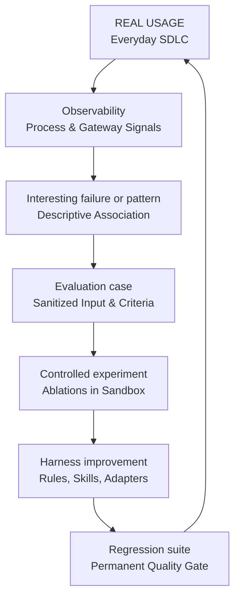

# Observability vs Evaluation

!!! info "About this page"
    **What you will learn:** why operational observability and controlled evaluation answer different questions.

    **For:** engineering managers, tech leads, AI champions, Harness Engineers, and teams adopting AI.

    **Read this when:** you need to connect production evidence with a defensible experiment.

Observability and evaluation are complementary. Observability describes activity in a real system. Evaluation compares alternatives under conditions that are controlled enough to support a conclusion.

| Observability | Evaluation |
| --- | --- |
| What happened | Which alternative works better |
| Production or everyday use | Controlled environment |
| Gateway, process telemetry, and delivery data | Harness Lab |
| Detects patterns and associations | Tests hypotheses and proves causality |
| Generates candidate cases and anomalies | Confirms improvements or regressions |

## The Bridge from Usage to Learning

## Observability: What Is Happening?

Observability captures the runtime signals needed to understand how the system is being used: process telemetry, commits, active engineering windows, model selections, token spend, latencies, and delivery milestones. It follows the core principle:

> "Measure the engineering process without observing the engineering content."

Process telemetry reveals empirical patterns: an expensive workflow, a repeated verification failure, an underutilized skill, or a cohort of work units with elevated cycle time.

However, observational telemetry does not prove that a model, skill, or rule caused a specific outcome. Concluding that "AI caused a cycle time reduction" from observational telemetry commits a post hoc fallacy. Observability yields descriptive associations, not causal proof.

## Evaluation: Does It Work Better?

Evaluation executes reproducible test cases under controlled conditions, varying one parameter while holding the prompt, environment, and inputs constant. The [Harness Lab](../reference-implementation/ai-agentic-harness-lab/index.md) runs:

- **Ablation Studies:** testing performance with and without a specific rule or skill.
- **Controlled Benchmarks:** executing multi-run trials inside isolated Docker containers.
- **Multidimensional Scoring:** combining deterministic test passes, behavioral rubrics, and token efficiency.
- **Regression Suites:** freezing sanitized production failures into permanent checks to prevent behavioral regression.

The object of evaluation is the system around the model: context, rules, skills, tools, routing, execution environment, verification, and workflow. The model is one variable in that system.

## A Useful Handoff

1. **Observe real activity:** identify a pattern, bottleneck, or verification anomaly in the [Engineering Delivery Observatory](../measure-and-improve/engineering-delivery-observatory.md) without jumping to causal conclusions.
2. **Sanitize into a case:** strip proprietary data, isolate the minimal reproducible context, and define clear success criteria.
3. **Run a controlled comparison:** benchmark the baseline harness against the proposed candidate inside the [Harness Lab](../reference-implementation/ai-agentic-harness-lab/index.md).
4. **Deploy verified improvements:** release the upgraded rules, skills, or adapters to the development team once causal evidence supports the change.
5. **Protect with regression suites:** add the test case to the permanent evaluation suite and observe future operational telemetry.

!!! note "Read next"
    See the [Engineering Delivery Observatory Pattern](../measure-and-improve/engineering-delivery-observatory.md) for the operational plane and [Harness Lab](../reference-implementation/ai-agentic-harness-lab/index.md) for the evaluation plane.
