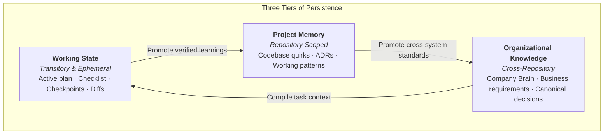

# State and Continuity in Agentic Systems

Autonomous software development rarely fits within a single prompt or context window. Complex tasks require multiple iterative turns, external tool calls, and handoffs across sessions.

To ensure reliable long-running execution, a harness must explicitly distinguish three tiers of information:

$$\mathbf{Working\ State} \neq \mathbf{Project\ Memory} \neq \mathbf{Durable\ Organizational\ Knowledge}$$

---

## 1. The Three Tiers Defined

### Working State (Transitory)

Working State contains the immediate, mutable task context needed to complete an active unit of work. It is ephemeral and should be archived or cleared once the pull request merges.

Examples of working state:

- The active technical plan and current task checklist.
- Completed steps and remaining milestones.
- Known test failures or transient reproduction logs.
- Active branch name or git worktree directory.
- Working assumptions that have not yet been validated.
- Checkpoint data and resume instructions for the next agent turn.

### Project Memory (Repository-Scoped)

Project Memory captures persistent technical context that belongs to a specific codebase. It outlives individual tasks but remains internal to the repository.

Examples of project memory:

- Codebase conventions and operational runbooks (`CLAUDE.md`, `.github/standards.md`).
- Architectural Decision Records (`docs/adr/`).
- Repository-specific learnings and edge cases documented under `memory/`.
- Governed operational skills (`.github/skills/`).

### Durable Organizational Knowledge (Company Brain)

Organizational Knowledge captures cross-cutting business rules, multi-repository architecture, and canonical governance that span an entire organization or engagement.

Examples of organizational knowledge:

- Company Brain registers (`00-context/`, `05-requirements/`, `06-decisions/`).
- Strategic vendor contracts and client system boundaries.
- Cross-project capability libraries.

---

## 2. The Five Continuity Questions

When an agent begins a new turn or resumes after a session restart, it must quickly re-orient itself without consuming massive token budgets re-reading the entire git history.

A robust harness structures working state so the agent can immediately answer five questions:

1. **Where am I?** What repository, branch, worktree, and directory am I operating in?
2. **What has already been done?** Which steps from the technical plan have succeeded and have passing tests?
3. **What remains?** What is the exact next unit of work to tackle?
4. **What assumptions are currently active?** What architectural or business hypotheses am I operating under that still lack empirical verification?
5. **What must be verified before continuing?** Which gates, linters, or test suites must pass before progressing to the next step?

---

## 3. Patterns for Multi-Session Continuity

Frontier research on long-running autonomous agents (Anthropic, 2026) demonstrates that agents perform significantly better when they maintain explicit progress artifacts rather than relying on unstructured conversation history.

Effective harnesses implement several continuity patterns:

### Pattern A: The Progress Tracker Artifact

For complex tasks spanning multiple hours or sessions, the harness maintains a structured progress document (such as `task_progress.md` or a structured state JSON). At the end of each session, the agent records:

- Completed items with references to modified files.
- The exact git commit or stash representing the clean checkpoint.
- Active blockers or open questions.
- The recommended first command for the resuming agent.

### Pattern B: Clean End-of-Session Handoffs

An agent should never exit abruptly mid-refactor with broken syntax across five files. When an agent reaches a turn budget or token compaction threshold, the harness instructs the agent to:

1. Revert or stash non-compiling experimental changes, or record them explicitly as in-progress.
2. Run baseline quality checks to confirm the working tree is in a predictable state.
3. Commit working progress to a task-specific branch.
4. Output a concise handoff summary.

### Pattern C: Resuming from Durable Artifacts

When a fresh agent session starts, it does not re-read hundreds of conversation turns. Instead, it reads:

1. The initial intent (ticket or enriched specification).
2. The progress tracker artifact.
3. The git status and diff.

This reduces context window bloat and eliminates hallucinated memories of previous conversation turns.

---

## What State is Not

- **Working State is not durable documentation**: Task notes, debugging hypotheses, and temporary scratchpads do not belong in canonical READMEs or ADRs.
- **Project Memory is not an agent chat transcript**: Persistent memory consists of curated, high-signal rules and decisions, not raw multi-turn logs.
- **Organizational Knowledge is not a single prompt**: The Company Brain contains extensive organizational evidence; the harness compiles only the relevant fraction into the agent's immediate context.
