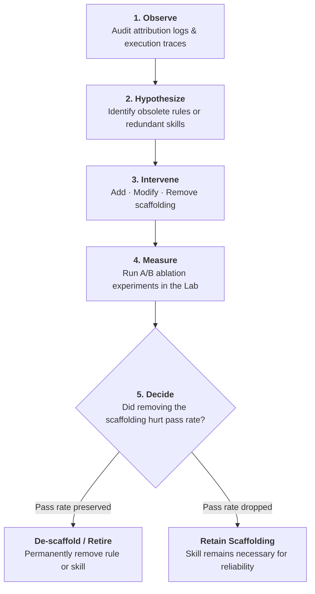

# Adaptive Harnesses & De-Scaffolding

A common failure mode in engineering teams adopting AI agents is the uncontrolled accumulation of rules, prompt guards, and complex skills. Over time, the harness becomes heavy, slow, and expensive, consuming significant context window budget on instructions the model no longer needs.

The foundational principle of mature harness engineering is:

$$\mathbf{The\ best\ harness\ is\ not\ the\ largest\ harness.}$$

---

## 1. Scaffolding Decay & Capability Drift

Harnesses encode human assumptions about model limitations. For example:

- An early model struggled with multi-file refactoring, so the team authored a verbose 500-line skill detailing file navigation and editing order.
- A previous model frequently hallucinated CLI flags, so the team added dozens of negative constraint rules to `AGENTS.md`.

As frontier models improve, their baseline capabilities expand. This creates **Capability Drift**: assumptions encoded in the harness become stale. Continued presence of obsolete scaffolding causes real harms:

1. **Context Window Saturation**: bloated instruction files consume thousands of tokens on every interaction turn.
2. **Attention Dilution**: models pay less attention to high-priority task constraints when surrounded by irrelevant historical rules.
3. **Maintenance Burden**: developers spend time maintaining complex skills that newer models can execute zero-shot.

A mature harness must be designed to **de-scaffold**, not merely accumulate rules indefinitely.

---

## 2. The Adaptive Cycle

To keep the harness lean, teams follow a five-step adaptive maintenance loop:

### 1. Observe
Review evaluation traces and attribution reports in the Harness Lab. Identify skills that are never consulted, rules that are routinely ignored without causing errors, or workflows that run with zero friction.

### 2. Hypothesize
Formulate an explicit ablation hypothesis:
> *"With current frontier models, removing the verbose database migration skill and relying on standard Makefile targets will not degrade migration success rate."*

### 3. Intervene (Ablation Arm)
Stage an ablation branch that comments out or deletes the candidate skill or rule.

### 4. Measure
Execute an A/B ablation experiment in the Harness Lab across a representative test suite:
- **Arm A (Control)**: Candidate repository with the existing heavy scaffolding.
- **Arm B (Treatment)**: Candidate repository with the scaffolding removed.

Hold model, prompt, and execution environment strictly constant.

### 5. Decide (Retire or Retain)
Compare outcomes across both arms:
- If Arm B achieves the same or better pass rate with lower token consumption and faster completion, **permanently de-scaffold** the component.
- If Arm B introduces regressions, **retain** the scaffolding.

---

## 3. De-Scaffolding in Practice

De-scaffolding should be scheduled as regular engineering hygiene:

| Candidate for Retirement | Indicator in the Lab | Remediation |
|---|---|---|
| **Zero-Attribution Skills** | Skill is available in `.github/skills/` but never loaded by agents across 50+ runs | Archive the skill or remove from active index |
| **Obsolete Formatting Rules** | Rules instructing the model how to format diffs or code blocks | Delete rule; modern models handle syntax natively |
| **Redundant Workflow Guards** | Complex multi-turn subagent flows where a single tool loop succeeds | Simplify architecture to a minimal tool loop |
| **Stale Context Documents** | Documentation pages describing legacy APIs or deprecated schemas | Remove from repo context to prevent hallucinations |

By pairing continuous evaluation with aggressive de-scaffolding, engineering teams ensure their harness remains high-signal, cost-effective, and fast.
