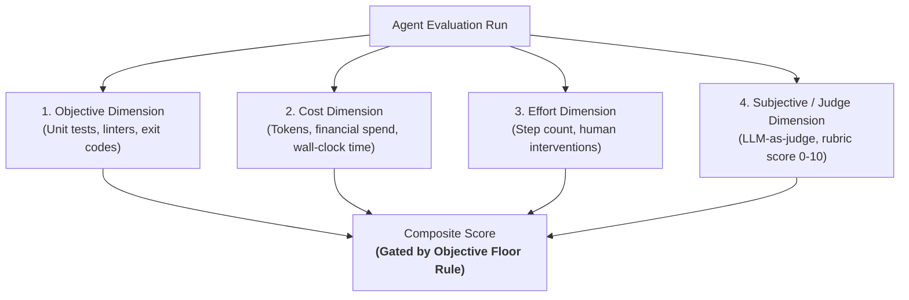
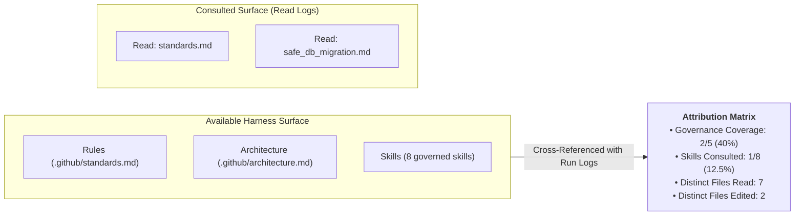
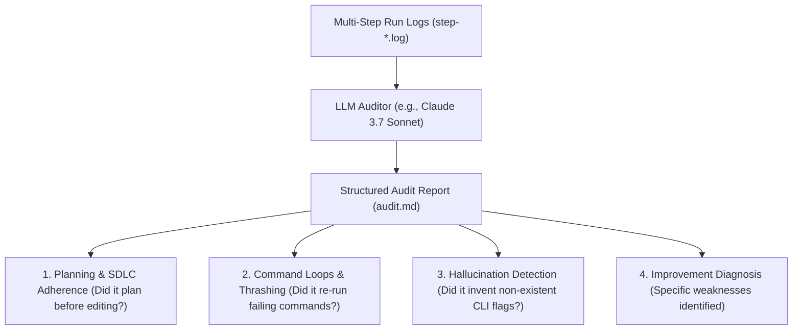

# Behavioral Audits & Scoring

Evaluating an autonomous coding agent requires moving beyond a simplistic single number. Collapsing functional correctness, step counts, token costs, and SDLC compliance into a single score hides the exact signal needed to diagnose and improve the harness.

Harness Engineering employs a **multidimensional scoring framework** combined with **structured attribution** and **LLM-driven behavioral audits**.

---

## The Multidimensional Scoring Architecture

Every evaluation trial generates a multidimensional `Validation` record across four independent dimensions:

### The 4 Evaluation Dimensions

| Dimension | Measured Metrics | Purpose |
|---|---|---|
| **1. Objective** | `pass / fail` on test suites, exit code of validation commands | Determines binary functional correctness. |
| **2. Cost** | Input tokens, output tokens, cache hits, financial USD, latency | Measures computational efficiency and economic scalability. |
| **3. Effort** | Step count, tool calls, human intervention count | Measures agent autonomy and path directness. |
| **4. Subjective / Judge** | Rubric score (0.0 to 10.0), code clarity, SDLC compliance | Measures qualitative architecture, readability, and edge handling. |

---

## The Objective Floor Rule

> [!IMPORTANT]
> **The Objective Floor Principle**:  
> A high qualitative or subjective score is **not credible if the code does not run**.  
> 
> If the objective test validation fails, the composite run score is automatically **capped at 1.0 / 10.0**, regardless of how well-written or elegant the LLM judge perceives the patch to be.

This rule eliminates false positives where an LLM judge gives high marks to plausible-looking code that fails basic syntax or unit tests.

---

## Structured Harness Attribution

**Attribution** measures what parts of the harness the agent *actually exercised* compared to what was *available* in the repository:

### Attribution Metrics Parsed from Step Logs:
- **Tools Executed**: Breakdown of `read_file`, `edit_file`, `bash_command`, and `grep_search`.
- **Files Edited**: Distinct files modified (filtered strictly by `permission=edit/write` events, ignoring passive file-watcher touches).
- **Governance Coverage**: Percentage of core architecture and rule documents read by the agent.
- **Skills Consulted**: Explicit verification of whether the agent consulted the relevant `.github/skills/` document before writing code.

---

## LLM Behavioral Audits

While code graders verify test outcomes and attribution measures file access, an **LLM Behavioral Audit** reads the complete step transcript to evaluate engineering discipline:

### Example Audit Findings
- **Positive SDLC Adherence**: *"The agent drafted a multi-phase implementation plan in `PLAN.md`, verified test commands in dry-run mode, and executed `make check` before concluding."*
- **Command Loop Detected**: *"The agent encountered a `ModuleNotFoundError` and executed the identical `pytest` command 6 consecutive times without modifying imports or installing packages (`repeated_equivalent_commands: 6`)."*
- **Targeted Proposal**: *"The `systematic_debugging` skill should be updated with a rule: if a test fails twice with the same traceback, force a hypothesis re-evaluation before running pytest again."*

---

### Related Resources
- **[What is an Agent Evaluation?](what-is-an-eval.md)**
- **[Continuous Harness Improvement](../adoption/continuous-harness-improvement.md)**
- **[Reference Implementation: ai-agentic-harness-lab](../reference-implementation/ai-agentic-harness-lab/index.md)**
