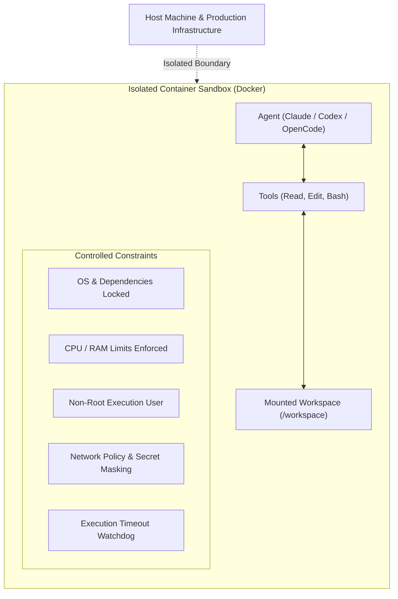
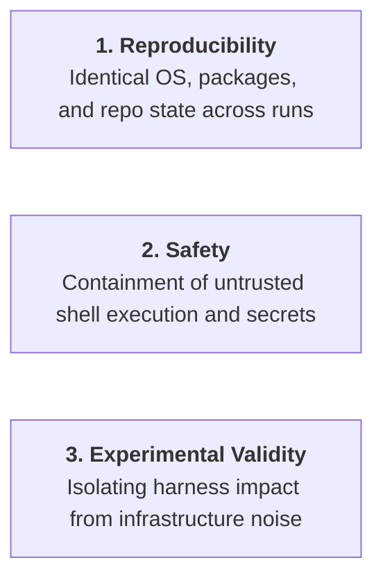

# Controlled Environments & Sandboxing

**Why must AI coding agents be evaluated inside controlled, sandboxed environments?**

A coding agent is not a passive text generator. It is an autonomous actor that:
- Reads and rewrites files across your repository tree.
- Executes shell commands and runs build systems.
- Installs external libraries and system packages.
- Executes test runners and linters.
- Manipulates environment variables and file permissions.
- May attempt outbound network connections.
- Operates iteratively over dozens of multi-turn steps.

Evaluating an agent requires **controlling its execution environment**.

---

---

## The Three Pillars of Controlled Execution

Controlling the agent's runtime environment is essential for three distinct engineering reasons:

### 1. Reproducibility
If two evaluations run on different operating systems, varying dependency versions, or differing CPU allocations, the benchmark outcome can change dramatically even when the underlying model weights and prompts are identical.

To achieve scientific reproducibility, the environment must strictly lock:
- The base operating system and system libraries.
- The repository git commit SHA.
- The locked language runtime and package dependencies (`uv.lock`).
- Available CLI tools, linters, and compilers.
- Hardware resource budgets (CPU cores, RAM limits, execution timeouts).

---

### 2. Safety & Containment
Because coding agents execute arbitrary shell commands generated by stochastic models, running agent evaluations directly on a developer's host machine creates significant security and operational hazards:
- **Filesystem Integrity**: The sandbox restricts write access exclusively to the target workspace directory, preventing modifications to user home directories or host system files.
- **Credential Protection**: Sensitive API keys and internal credentials are not exposed in plaintext within the container environment.
- **Privilege Separation**: Agents execute under an unprivileged, non-root user (`runner` / `developer`) with restricted `sudo` access.
- **Network Egress Policies**: Outbound network requests are restricted to prevent data exfiltration or unintended interaction with external production services.

---

### 3. Experimental Validity & Attribution
In empirical science, to establish that *"Skill X improved the pass rate by 30%"*, **every other variable in the system must remain constant**.

If run $A$ executes on an unconstrained 16-core workstation while run $B$ executes on a throttled 2-core cloud VM, any difference in performance might simply be an artifact of CPU throttling, test timeouts, or memory pressure. The runtime environment is an active experimental condition.

---

## Grounding in Modern Industry Evidence

Harness Engineering grounds its sandboxing methodology in publicly documented research and architectures from leading frontier labs and academic benchmarks:

### 1. SWE-bench (Princeton University)
The industry-standard [SWE-bench](https://www.swebench.com/) benchmark evaluates agent-generated patches by spinning up a dedicated, isolated Docker container for every repository issue instance. This isolation guarantees that test side-effects from one issue do not pollute subsequent evaluations and that all package dependencies match the exact historical environment of the bug.

### 2. OpenAI: Running Codex Safely
In [Running Codex safely at OpenAI (2026)](https://openai.com/index/running-codex-safely/), OpenAI outlines the necessity of multi-layered architectural controls for coding agents:
- **OS-Level Sandboxing**: Utilizing native kernel primitives (such as Seatbelt on macOS, Landlock on Linux, and restricted ACL tokens on Windows) to contain agent actions.
- **Approval Policies**: Categorizing actions into *Allowed*, *Approval-Required*, and *Blocked* tiers.
- **Network Policies & OpenTelemetry**: Enforcing strict network boundaries and capturing comprehensive OpenTelemetry audit logs.

### 3. Anthropic: Demystifying Evals & Infrastructure Noise
In [Demystifying evals for AI agents (2026)](https://www.anthropic.com/engineering/demystifying-evals-for-ai-agents), Anthropic highlights that agent evaluations test the complete system (model + harness + environment) and that transcripts must be captured alongside environment state.

Furthermore, in [Quantifying infrastructure noise in agentic coding evals (2026)](https://www.anthropic.com/engineering/infrastructure-noise), Anthropic published empirical evidence demonstrating that varying runtime infrastructure resources (CPU, RAM, timeouts) caused up to a **6 percentage point swing** on coding benchmarks (such as Terminal-Bench 2.0), a margin larger than the leaderboard gap between top frontier models. This research confirms that infrastructure configuration must be treated with the same rigor as prompt design or temperature settings.

---

## Accessible Scale for Engineering Teams

> [!IMPORTANT]
> **Engineering Scope Clarification**:  
> Our open evaluation reference platform ([`ai-agentic-harness-lab`](https://github.com/marcosdh1987/ai-agentic-harness-lab)) does not pretend to replicate the multi-million-dollar proprietary infrastructure of frontier AI labs.  
> 
> Instead, it adopts the **exact same fundamental principles** at an accessible, practical scale for engineering teams:
> - One Docker container per evaluation run.
> - Condition hashing (`condition_hash`) capturing all environmental variables.
> - Structured attribution separating available vs consulted skills.
> - Automated Celery/Redis execution workers with watchdog timeouts.
> - Read-only host bind-mounts with isolated workspace copies.

---

### Related Resources
- **[Experimental Validity & Ablations](experimental-validity-and-ablations.md)**
- **[Behavioral Audits & Scoring](behavioral-audits-and-scoring.md)**
- **[Evidence & Research Sources](../evidence/research.md)**
