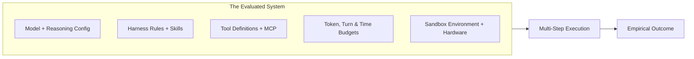
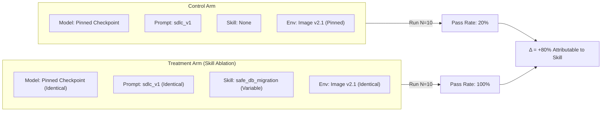

# Experimental Validity and Ablations

In traditional machine learning, evaluating a system often meant holding a dataset constant while swapping model checkpoints.

In **Harness Engineering**, the base model is only one component of the system under test:

$$\mathbf{Model\ Alone} \neq \mathbf{Evaluated\ System}$$

A trustworthy evaluation measures the complete system across its entire operational envelope:



---

## 1. Components of the Evaluated System

As established in frontier evaluation methodology (OpenAI, 2026), an evaluation measures the combined behavior of:

1. **Model & Reasoning Configuration**: the model checkpoint, reasoning effort level, and sampling temperature.
2. **Harness Rules & Skills**: the active rules layer (`AGENTS.md`, `.github/standards.md`) and operational skills.
3. **Tool Access & Schemas**: the specific tools provided, their parameter descriptions, and return formats.
4. **Agent Safeguards**: security policies, permission boundaries, and loop break invariants.
5. **Operational Budgets**: max tokens, maximum turn counts, retry limits, and wall-clock execution timeouts.
6. **Execution Environment**: operating system, container runtime, package dependencies, CPU, and memory limits.

Changing any single component changes the experimental condition.

---

## 2. Infrastructure Noise in Coding Evals

Empirical research by Anthropic (2026) demonstrates that runtime infrastructure is an active experimental variable in agent evaluations:

- Variations in CPU allocation, memory throttling, and network latency can swing benchmark pass rates by up to 6 percentage points on coding benchmarks like Terminal-Bench.
- Non-deterministic package downloads or mirror timeouts create artificial failures unrelated to model reasoning.
- Differences in container base images (such as glibc versions or pre-installed utilities) alter agent command execution success.

**Core Rule**: Two evaluation runs executed on different infrastructure cannot be interpreted as a clean comparison between models or harnesses. The execution environment must be containerized, pinned, and tracked as an explicit part of the experimental condition.

---

## 3. The Golden Rule: Change One Variable at a Time

To establish true causality, proving that a specific modification was responsible for an observed improvement, experiments must follow strict variable isolation:

$$\text{Treatment Outcome} - \text{Control Outcome} = \Delta_{\text{Isolated Variable}}$$

If an experiment simultaneously upgrades the model (from Sonnet 3.5 to Sonnet 4), modifies the system prompt, adds two new skills, and alters the container base image, you cannot attribute any change in pass rate to a specific intervention.



---

## 4. What is Skill Ablation?

**Skill Ablation** is an experimental technique where a specific skill is temporarily disabled or injected to measure its exact marginal contribution:

- **Baseline Arm (Control)**: The agent runs against the evaluation case with all standard repository rules, but without the targeted skill.
- **Ablated Arm (Treatment)**: The agent runs against the exact same case with the targeted skill enabled.
- **Comparison**: We compare objective pass rates, step counts, token costs, and attribution matrices.

If the treatment arm achieves a higher pass rate with fewer steps and positive attribution, the skill has proven its empirical utility. If the pass rate remains unchanged, the skill is a prime candidate for de-scaffolding and retirement.

---

## 5. Condition Hashing and Experiment Provenance

To guarantee that past benchmark results remain interpretable and comparable over time, every evaluation trial captures a deterministic **condition hash**:

```json
{
  "condition_hash": "c8f2a91b4e073d82",
  "harness_fingerprint": "a1f62c29d9814d59",
  "model": "claude-3-7-sonnet-20250219",
  "prompt_variant": "swe_harness",
  "skills_enabled": ["safe_db_migration", "systematic_debugging"],
  "skills_disabled": ["generate_e2e_tests"],
  "environment_image": "harness-runner:v2.4.0",
  "temperature": 0.0
}
```

If any parameter (a prompt line, a skill file, or a container dependency) changes, the `condition_hash` flips automatically, ensuring that runs from different experimental conditions are never improperly aggregated.

---

## 6. Prudent Verdict Language

Because LLMs are non-deterministic, reports must maintain intellectual humility:

- With $N=2$ repetitions, label results as **exploratory**.
- With $N=5$ repetitions, label results as **a useful directional comparison**.
- With $N=10$ repetitions, label results as **strong evidence**.
- Never claim a change is **statistically significant** unless an explicit statistical hypothesis test was conducted.
- A score difference that falls within run-to-run variance must be reported as within noise margin.
