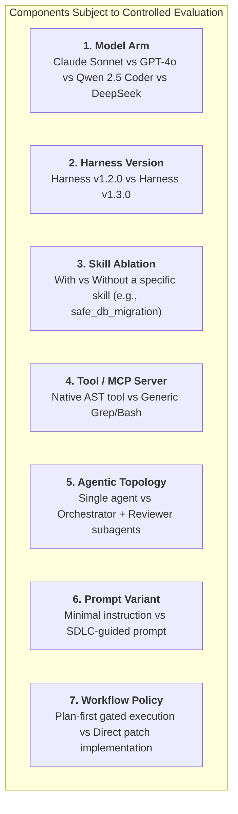
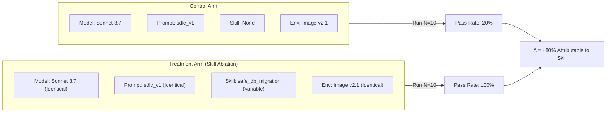

# Experimental Validity & Ablations

In traditional machine learning, evaluating a system often means holding the dataset constant while swapping model checkpoints.

In **Harness Engineering**, the model is only one component of the system. An engineering team should be able to isolate, benchmark, and evaluate **any component of the harness stack**.

---

## Evaluating Across the Complete Stack

The object of evaluation does not have to be solely the base model. You can design controlled experiments targeting seven distinct dimensions:



---

## The Golden Principle: Change One Variable at a Time

To establish true causality—proving that a specific modification was responsible for an observed improvement—experiments must follow strict variable isolation:

$$\text{Treatment Outcome} - \text{Control Outcome} = \Delta_{\text{Isolated Variable}}$$

If an experiment simultaneously upgrades the model (e.g., Sonnet 3.5 $\to$ Sonnet 4), changes the system prompt, adds two new skills, and alters the Docker base image, **you cannot attribute any change in pass rate or token cost to a specific intervention.**



---

## What is Skill Ablation?

**Skill Ablation** is an experimental technique where a specific skill is temporarily disabled or injected to measure its exact marginal contribution:

- **Baseline Arm (Control)**: The agent runs against the evaluation case with all standard repository rules, but without the targeted skill.
- **Ablated Arm (Treatment)**: The agent runs against the exact same case with the targeted skill enabled.
- **Comparison**: We compare objective pass rates, step counts, token costs, and attribution matrices.

If the treatment arm achieves a higher pass rate with fewer steps and higher skill attribution, the skill has proven its empirical utility. If the pass rate remains unchanged, the skill may be redundant or poorly structured.

---

## Managing Non-Determinism & Stochastic Variance

LLM agents are stochastic systems. The same prompt run twice against the same repository can produce different intermediate steps.

### Experimental Rules for Stochastic Systems:
1. **Never Evaluate on a Single Run**: A single passing run might be pure luck; a single failing run might be an anomalous outlier.
2. **Execute Multi-Run Batches**: Run at least $N=5$ (for quick iteration) or $N=10$ (for formal promotion gates) repetitions per condition arm.
3. **Calculate Statistical Distributions**: Report pass rates with confidence intervals and calculate mean token costs and standard deviations.

---

## Condition Hashing & Experiment Provenance

To guarantee that past benchmark results remain interpretable and comparable over time, every evaluation trial should capture a deterministic **condition hash**:

```json
{
  "condition_hash": "c8f2a91b4e073d82",
  "harness_fingerprint": "a1f62c29d9814d59",
  "model": "claude-3-7-sonnet-20250219",
  "prompt_variant": "swe_harness",
  "skills_enabled": ["safe_db_migration", "systematic_debugging"],
  "skills_disabled": ["generate_e2e_tests"],
  "environment_image": "harness-runner:v2.4.0",
  "temperature": 0.0
}
```

If any parameter (a prompt line, a skill file, or a container dependency) changes, the `condition_hash` flips automatically, ensuring that runs from different experimental conditions are never improperly aggregated.

---

### Related Resources
- **[Controlled Environments & Sandboxing](controlled-environments-sandboxing.md)**
- **[Behavioral Audits & Scoring](behavioral-audits-and-scoring.md)**
- **[Building an Internal Evaluation Suite](../adoption/internal-evaluation-suite.md)**
