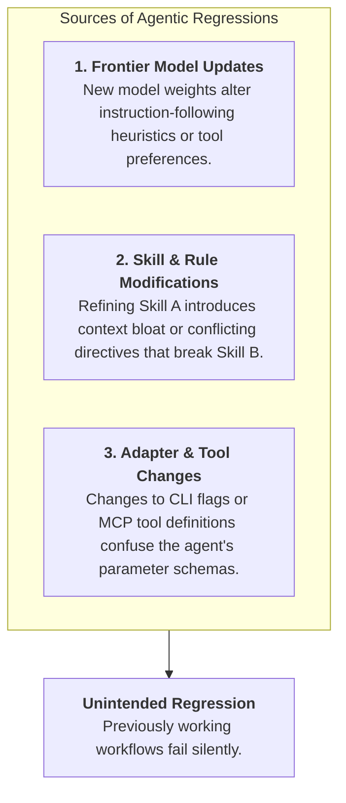
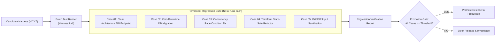
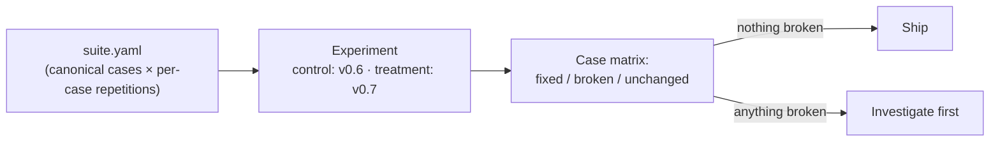

# Regression Suites for AI Harnesses

Just as traditional software requires automated test suites to prevent regression bugs when application code changes, **an AI coding harness requires a durable regression suite to ensure that upgrades to models, prompts, skills, or rules do not degrade existing capabilities.**

---

## 1. Why Regressions Occur in Agentic Systems

In an agentic SDLC, regressions can be introduced by three distinct types of changes:



### Common Regression Scenarios
- **The Context Bloat Regression**: A team adds five detailed architectural guides to `.github/`. While domain knowledge improves, the enlarged prompt dilutes the agent's attention, causing it to overlook basic testing rules.
- **The Heuristic Shift**: An upstream model provider updates their Sonnet or GPT endpoint; the new model prefers direct execution over creating a `PLAN.md`, violating company SDLC policy.
- **The Tool Format Conflict**: A skill update changes a bash command template from raw commands to a helper script that fails on Windows or restricted container environments.

---

## 2. Architecture of a Harness Regression Suite

A harness regression suite consists of curated, deterministic evaluation cases representing past bugs, edge cases, and core architectural workflows:



---

## 3. Release Gate Criteria

Before a new harness release (or a model migration) is deployed to production engineering teams, it must satisfy four automated release gate criteria:

```yaml
# Example Release Gate Policy
release_gate_policy:
  min_pass_rate_critical: 1.00    # 100% pass on critical safety (DB migrations, security)
  min_pass_rate_standard: 0.90    # 90% pass on general feature implementation
  max_repeated_command_loops: 2   # Zero command thrashing
  max_token_cost_increase: 0.15   # Maximum 15% cost increase vs baseline
  required_clean_proposals: true  # Lab outcome gate must yield 0 new proposals
```

1. **Safety Zero-Tolerance**: All safety-critical cases (zero-downtime database migrations, secret handling, auth rules) must achieve a 100% pass rate across $N=10$ trials.
2. **Standard Functional Floor**: General coding and refactoring tasks must maintain at least a 90% pass rate.
3. **Efficiency Boundaries**: Average step count and token costs must not exceed predefined budgets.
4. **Attribution Integrity**: The agent must demonstrably consult the required governed skills.

---

## 4. Batch Execution and Automation

Executing regression suites across dozens of cases and multiple model tiers is automated through batch runs:

- **Cross-Product Matrix**: Case IDs $\times$ Model Tiers $\times$ Prompt Variants $\times$ Repetitions.
- **Worker Queues**: Isolated Celery workers pull runs and execute them in parallel Docker containers with watchdog timeouts.
- **Regression Diff**: The lab UI generates an automated delta report highlighting any cases where pass rates dropped compared to the previous baseline release.

---

## 5. The Suite as a Producer of Experiments

A regression suite should not need its own runner, its own aggregation, or its own custom definition of regression. The suite declares the **design** (which cases are canonical and how many repetitions each deserves) and release validation is an ordinary controlled experiment: previous release as the control arm, candidate as the treatment.



Two consequences worth internalizing:

- **A release is read per case, never as one composite**: "Fixed four, broke none, thirty unchanged" is a shippable sentence; "+3 points overall" is a place for regressions to hide.
- **The suite can refuse a comparison**: If the two arms vary a field the suite holds constant (such as the model or the budget), the design is rejected rather than silently accepted. It follows the same validity rules as every other experiment.

---

### Related Resources

- **[Building an Internal Evaluation Suite](../adoption/internal-evaluation-suite.md)**
- **[Continuous Harness Improvement](../adoption/continuous-harness-improvement.md)**
- **[What is an Agent Evaluation?](what-is-an-eval.md)**
