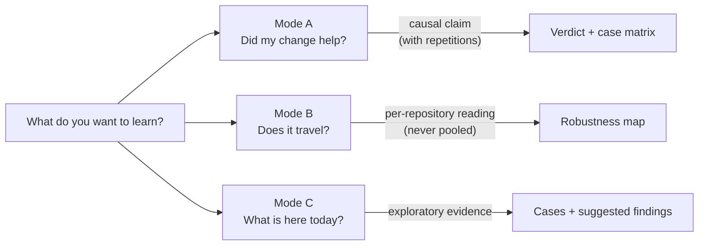
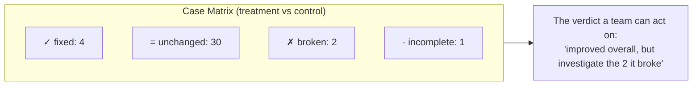

# The Three Questions (Evaluation Modes)

Every engineering team that adopts coding agents eventually asks the same three questions, usually in a hallway, rarely with evidence:

1. *"Does this change to our harness actually improve anything?"*
2. *"Does our setup work outside the repository it was born in?"*
3. *"What can we learn from how this team works with AI today?"*

These are three **different** questions. They require different experimental designs, and (this is the part teams skip) each one licenses a different kind of conclusion. Treating them as interchangeable is how a lucky run becomes a policy.

---

## One Question, One Mode, One Kind of Claim

| | **Mode A (Harness Evaluation** | **Mode B) Cross-Repo** | **Mode C, Discovery** |
|---|---|---|---|
| **The question** | Did *this change* cause a better outcome? | Does the harness hold up outside its home repo? | How does this repo/team behave under an agent today? |
| **Held fixed** | Repository, cases, model | Harness, model, task family |, |
| **Varied** | Exactly one harness factor | The repository | Nothing, it observes |
| **Licenses** | A causal claim, with enough repetitions | Where it holds, where it degrades | Cases, observations, suggested findings |
| **Never** | Vary the repo or model too | Pool scores across repos | Present anything as a causal verdict |

The critical discipline: **an evaluation system should refuse a design that cannot answer the question it declares.** A comparison that varies both the harness and the repository produces a number attributable to neither, it is a perfectly valid *request* and an invalid *experiment*. Catching that at design time, before any tokens are spent, is the difference between an evaluation instrument and a job runner that renders averages.

!!! note "Reference implementation"
    In [`ai-agentic-harness-lab`](../reference-implementation/ai-agentic-harness-lab/index.md), the mode is a field on every experiment, and the design validator rejects contradictions: Mode A refuses a varying repository or model; Mode B refuses any confound beyond the repository and *always* warns that scores must be read per repository; Mode C accepts no control arm and its verdict is permanently labeled "Exploratory, no comparison".

---

## The Repetition Doctrine

Agents are stochastic. The same prompt against the same repository can take a different path, touch different files, and land on a different outcome. This forces a vocabulary rule that is easy to state and hard to keep:

| Repetitions per arm | What you are allowed to call it |
|---|---|
| **2** | *Exploratory only.* A direction to investigate, never a finding. |
| **5** | *A useful comparison.* Enough to act on with eyes open. |
| **10** | *Stronger evidence.* Enough to gate a release on. |

And one word that never appears: **"significant."** A team-scale evaluation harness runs no hypothesis tests, so it must not borrow the vocabulary of one. The honest phrases are: *exploratory*, *useful comparison*, *stronger evidence*, *within observed variance*, *improvement observed*. If a delta sits inside run-to-run noise, the verdict says so instead of rounding it up to a win.

---

## The Case Matrix Beats the Average

An average is where regressions hide. "+8 points overall" can be *"fixed four cases, broke two"*, and the two it broke may be the ones your team ships every day.

Every comparison should be readable per case as **fixed / broken / unchanged / incomplete** before it is readable as a composite number. The composite answers "did it get better on average?"; the matrix answers "what exactly do I need to look at before trusting this?"

---

## The Honest Instrument: Five Design Principles

What makes evaluation evidence *defensible* (to your own team, or to a client) is a handful of rules about what the instrument is allowed to say. They cost little to implement and everything to skip.

### 1. Facts, observations, and judgements are labeled apart

`test_pass_rate = 1.0` is a command's exit code. `files_changed = 2` is parsed from the run's artifacts. `task_completion = 0.4` is a model's opinion. Once all three are numbers in the same table they look identical, and the opinion quietly borrows the authority of the measurement. Label every metric with its provenance (**fact** / **observation** / **judgement**) wherever it is displayed.

### 2. "Not measured" is never zero

A metric that could not be computed (no trajectory recorded, no judge configured, no declared expectation to grade against) returns **no score**, with a stated reason. Writing a zero instead lets an aggregate read *"we could not measure this"* as *"this did badly"*, which silently poisons every trend line built on top.

### 3. Judge each run against what it actually had

When comparing *"the repository's own setup"* against *"our harness injected"*, the evaluator must judge each arm against the governance surface **that arm actually received**. Auditing a native control against rules it was never given makes the control look worse by construction, the measuring instrument itself manufactures the treatment's advantage. Persist which files each run could see, and fingerprint them.

### 4. One experiment is one measurement

Once an experiment has real runs, relaunching it with a different model or budget must be refused: it would file two different measurements under one name, and every summary would average them as though they were one condition. Adding repetitions with the *same* configuration is how evidence grows; changing the configuration is a **new experiment**.

### 5. Machines suggest; people sign

Automatic analysis is excellent at *noticing*, a case that regressed, a skill nobody consults, a repeated failure. It must never be allowed to *conclude*. Auto-generated patterns arrive labeled **suggested**, and become findings only when a person reviews them, optionally edits them, and puts their name on them. Rejections are recorded too, so the same pattern is not re-raised every week. A finding nobody owns is an assertion nobody has to defend.

---

## Why This Works for Any Team

None of the above requires a research lab. It requires:

- Writing the question down **before** running anything (a question-less batch is not an experiment).
- Varying one thing at a time, and letting the tooling refuse designs that vary two.
- Repeating enough to respect the stochasticity of agents, and saying "exploratory" when you did not.
- Reading the case matrix before the average.
- Keeping the instrument honest about what kind of claim each number is.

Teams that adopt this stop arguing from anecdotes. The Slack thread *"the new prompt feels better"* becomes *"success 60% → 85% over 5 repetitions per arm, nothing broken, here is the matrix."* The second sentence ends the meeting.

---

### Related Resources

- **[Experimental Validity & Ablations](experimental-validity-and-ablations.md)**: variable isolation and condition hashing.
- **[Regression Suites](regression-suites.md)**: turning release validation into an experiment.
- **[Behavioral Audits & Scoring](behavioral-audits-and-scoring.md)**: the grader toolbox behind the numbers.
- **[Agentic Harness Lab](../reference-implementation/ai-agentic-harness-lab/index.md)**: the reference implementation of all of the above.
