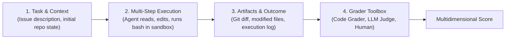
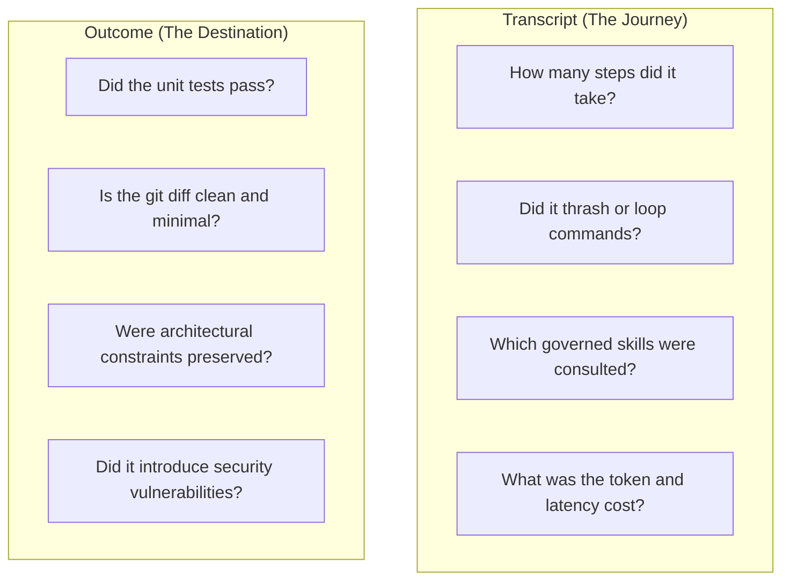
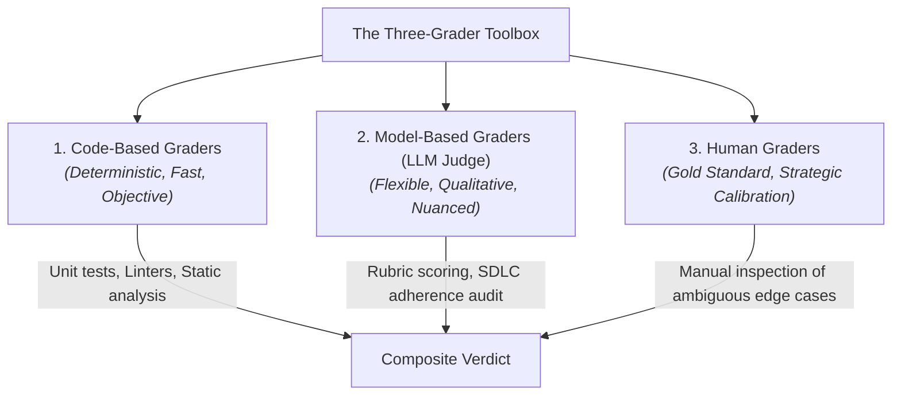
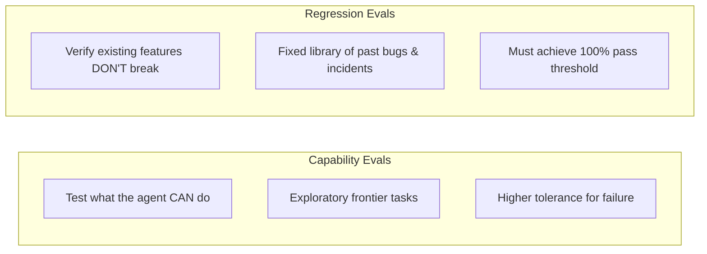

# What is an Agent Evaluation?

An **Agent Evaluation** (or *eval*) is a rigorous, automated, or semi-automated procedure that measures how effectively an AI agent solves a specific task within an environment.

Unlike traditional LLM evaluations that measure single-turn text completion (such as MMLU or HumanEval), agent evaluations test the complete **system: model + harness + tools + environment** across multi-turn interactions.

> [!NOTE]
> **Industry Reference**: The frameworks in this section synthesize principles published by leading AI research organizations, notably Anthropic's *Demystifying Evals for AI Agents* (2026), Princeton's *SWE-bench* research, and OpenAI's evaluation guidelines.

---

## The Anatomy of an Agent Evaluation

An agent evaluation consists of four coordinated components:

1. **Task & Initial State**: A clearly specified problem prompt and a deterministic initial repository commit.
2. **Controlled Runtime Environment**: An isolated sandbox where the agent can inspect code, run terminal commands, and modify files.
3. **Multi-Turn Interaction**: The agent observes tool outputs, forms hypotheses, and iterates toward a solution.
4. **Grading & Scoring**: Quantitative and qualitative assessment of whether the final environment state solves the task without unintended side-effects.

---

## Transcript vs Outcome: The Two Evaluation Lenses

When evaluating coding agents, engineering teams must examine both the **journey** and the **destination**:

- **The Outcome**: Validates functional correctness. If the patch fails unit tests, the run is a functional failure regardless of how articulate the agent was.
- **The Transcript**: Validates efficiency and SDLC adherence. An agent might achieve a passing test by brute force (e.g., trying 40 random variations in 100 steps), but that behavior represents an expensive, brittle failure of engineering discipline.

---

## The Three-Grader Toolbox

No single grading method is sufficient for complex agent tasks. Teams utilize a combination of three grader types:

| Grader Type | Strengths | Limitations | Best Used For |
|---|---|---|---|
| **Code-Based Graders** | 100% deterministic, instant, zero LLM token cost. | Cannot evaluate stylistic elegance or architecture nuance. | Test suite passes, linter exits, compilation checks, lockfile drift. |
| **Model-Based Graders (LLM-as-Judge)** | Handles open-ended nuance, reads diffs, scores rubrics. | Slight non-determinism; requires careful prompt calibration. | Behavioral audits, planning quality, documentation completeness. |
| **Human Graders** | Ultimate source of ground truth and calibration. | Expensive, slow, not scalable for continuous CI testing. | Initial benchmark calibration, reviewing ambiguous failures. |

---

## Handling Stochasticity: Reliability Metrics

Because LLM agents are non-deterministic, evaluating an agent on a single run is an engineering anti-pattern. Teams use standardized multi-run metrics:

### 1. `pass@k` (Human-in-the-Loop Tasks)
Measures the probability that the agent succeeds **at least once** across $k$ independent attempts:
$$\text{pass}@k = 1 - \frac{\binom{n - c}{k}}{\binom{n}{k}}$$
*(Where $n$ is total runs and $c$ is correct runs).*  
- **Use Case**: Developer workflows where an engineer interacts with an agent and can reject 2 bad attempts as long as 1 attempt succeeds quickly.

### 2. `pass^k` (Autonomous Automation)
Measures the probability that the agent succeeds **consistently across all $k$ attempts**:
$$\text{pass}^k = \left(\frac{c}{n}\right)^k$$
- **Use Case**: High-reliability automated pipelines (e.g., automated dependency updates, unattended bug fixing) where failures trigger alarms.

---

## Capability Evals vs Regression Evals

- **Capability Evaluations**: Benchmark new models or ambitious skills on difficult challenges.
- **Regression Evaluations**: A locked, stable suite of previously resolved issues that every candidate harness must pass before release.

---

## Evaluation-Driven Development (EDD) for Agents

In traditional software development, **Test-Driven Development (TDD)** dictates writing tests before implementing code.

In Harness Engineering, we practice **Evaluation-Driven Development (EDD)**:
1. When creating or improving a skill, first define the evaluation case in the lab.
2. Run baseline trials to measure failure rates and identify exact failure modes.
3. Author the governed skill or rule.
4. Iterate until the agent achieves target pass rates across your model tiers.

---

### Related Resources
- **[Controlled Environments & Sandboxing](controlled-environments-sandboxing.md)**
- **[Experimental Validity & Ablations](experimental-validity-and-ablations.md)**
- **[Behavioral Audits & Scoring](behavioral-audits-and-scoring.md)**
