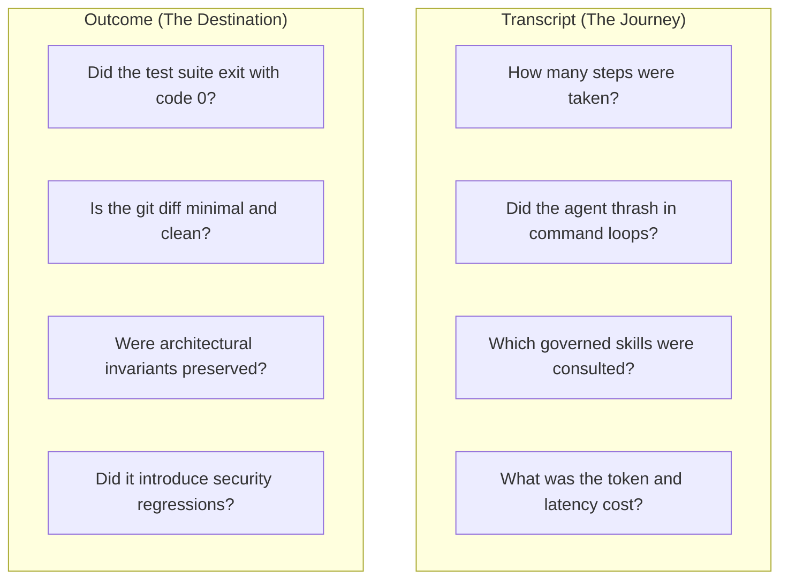
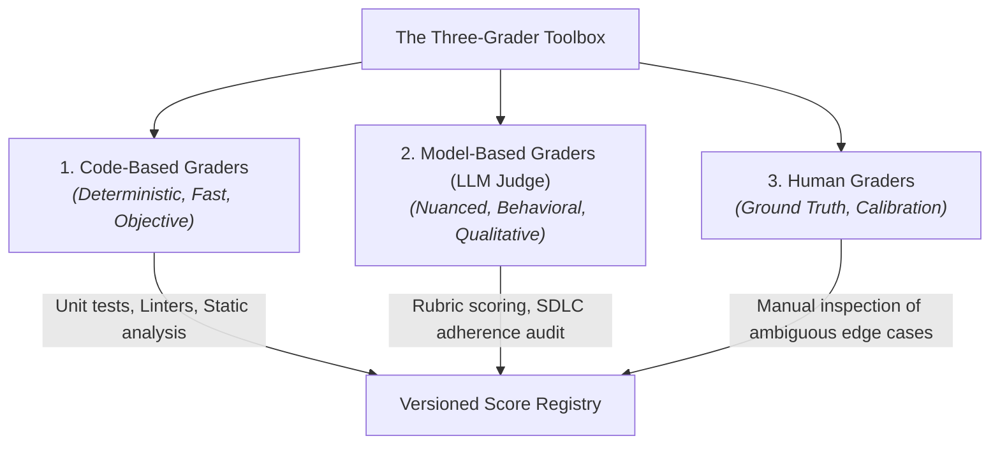
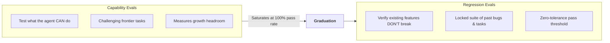

# What is an Agent Evaluation?

An **Agent Evaluation** (or *eval*) is a rigorous, automated procedure that measures how effectively an AI agent solves a specific task within an environment.

Unlike traditional model evaluations that measure single-turn text completion (such as MMLU or HumanEval), agent evaluations test the complete **system: model + harness + tools + environment** across multi-turn interactions.

> [!NOTE]
> **Industry Reference**: The frameworks in this section synthesize principles published by leading AI research organizations, notably Anthropic's *Demystifying Evals for AI Agents* (2026), Princeton's *SWE-bench* research, and OpenAI's *Designing Trustworthy Evaluations* (2026).

---

## 1. Formal Evaluation Vocabulary

To prevent confusion between benchmark runs, experiments, and scores, Harness Engineering defines a strict evaluation taxonomy:

| Term | Definition | Key Principle |
|---|---|---|
| **Task** | A concrete problem specification and pinned initial repository state. | Pinned commit, unambiguous prompt, defined verification. |
| **Trial** | A single execution of a task under a specific condition. | Non-deterministic; one trial is never a verdict. |
| **Experiment** | A declared comparison of conditions across multiple trials to answer a specific question. | **Experiment > Trials**: The experiment governs the design. |
| **Grader** | An assessment instrument evaluating the execution (Code, LLM Judge, or Human). | Separate facts, observations, and judgments. |
| **Trajectory** | The recorded sequence of agent thoughts, tool calls, commands, and outputs. | Measures efficiency, looping, and protocol adherence. |
| **Outcome** | The final environmental state produced by the agent. | **Outcome > Agent Claim**: Verify exit codes, not text. |
| **Condition** | The complete tuple defining execution: model, harness, tools, budgets, and sandbox. | Changing any element changes the condition. |
| **Harness** | The system of rules, skills, adapters, and tools wrapping the model. | The primary independent variable under test. |
| **Evaluation Suite** | A curated collection of tasks categorized as capability or regression benchmarks. | Capability evals measure headroom; regressions guard quality. |

---

## 2. Core Axioms of Agent Evaluation

### Axiom 1: Experiment Above Trial

An isolated run is just a data point. Valid engineering claims require an **Experiment**:

$$\mathbf{Experiment} > \mathbf{Trials}$$

An experiment states the question *before* execution begins, declares its control and treatment arms, holds all other variables constant, and runs sufficient repetitions to account for LLM stochasticity.

### Axiom 2: Outcome Above Agent Claim

An agent's self-reported success is an unverified assertion in the transcript:

$$\mathbf{Outcome} > \mathbf{Agent\ Claim}$$

If an agent asserts "All tests pass successfully", but the test runner in the sandbox exits with code 1, the outcome is a failure. Evaluations must always inspect ground truth environment state rather than trusting model conversation text.

---

## 3. Transcript vs Outcome: Two Evaluation Lenses

- **The Outcome**: Validates functional correctness. If the patch fails unit tests, the trial is a functional failure regardless of how articulate the agent was.
- **The Transcript**: Validates engineering discipline. An agent might achieve a passing test by brute force (for example, trying 40 random variations across 100 steps), but that behavior represents an expensive, fragile failure of methodology.

---

## 4. The Three-Grader Toolbox

No single grading method is sufficient for complex software engineering tasks:

| Grader Type | Strengths | Limitations | Best Used For |
|---|---|---|---|
| **Code-Based Graders** | Deterministic, instant, zero LLM token cost. | Cannot evaluate stylistic elegance or architectural nuance. | Test passes, linter exit codes, type checks, lockfile drift. |
| **Model-Based Graders (LLM Judge)** | Evaluates nuance, reads diffs, scores rubrics. | Slight non-determinism; requires careful prompt calibration. | Behavioral audits, planning quality, documentation completeness. |
| **Human Graders** | Ultimate source of ground truth and calibration. | Expensive, slow, not scalable for continuous CI testing. | Calibrating new benchmarks, reviewing complex regressions. |

---

## 5. Capability Evals vs Regression Evals

- **Capability Evaluations**: Benchmark new models or ambitious skills on difficult challenges. They provide headroom for improvement.
- **Regression Evaluations**: A locked, stable suite of previously resolved issues that every candidate harness must pass before release.
- **Graduation**: When a capability task is solved reliably (achieving 100% pass rate across repeated runs), it graduates into the regression suite to guard against future regressions.

---

## 6. Evaluation-Driven Development (EDD)

In traditional software engineering, Test-Driven Development (TDD) dictates writing tests before implementing application code.

In Harness Engineering, we practice **Evaluation-Driven Development (EDD)**:
1. When designing or improving a skill, first define the evaluation case in the Harness Lab.
2. Run baseline trials to measure failure rates and observe failure modes.
3. Author the governed skill, rule, or adapter.
4. Iterate until the agent achieves target pass rates across supported model tiers.
5. De-scaffold redundant instructions when ablation measurements confirm they are no longer needed.
