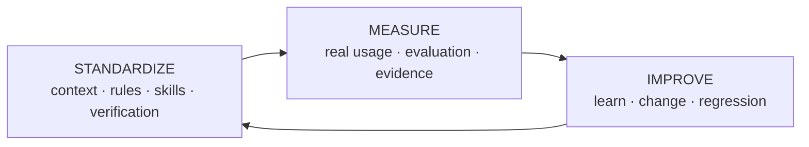
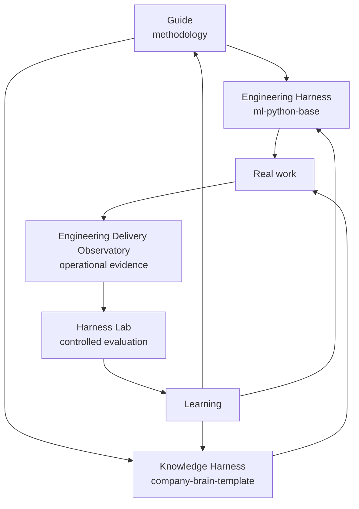

# Harness Engineering Guide

!!! info "About this guide"
    **What you will learn:** how context, rules, skills, tools, verification, and evaluation form a durable way to work with AI.

    **For:** developers, tech leads, engineering managers, PMs, AI champions, and knowledge workers.

    **Read this when:** you want the shortest explanation of the system and a route to the right depth.

Harness Engineering does not try to predict the best tool, model, or agent six months from now. It defines a stable base of context, rules, skills, tools, verification, and evaluation so teams can evolve without redefining how they work each time the ecosystem changes.

Claude, Codex, OpenCode, Copilot, Gemini, open-source models, frameworks, MCP servers, and runtimes can change. The principles can remain useful.

## Standardize, Measure, Improve

This cycle applies to software engineering and knowledge work. Standardize the way work is grounded and checked. Measure what happens in practice and under controlled conditions. Improve the shared system, then standardize the learning.

## Choose your path

-   :material-map-marker-path: **[Choose your path](use/choose-your-path.md)**

    ---

    Find a starting point by role or goal.

-   :material-code-braces: **[Build software](start-here/agentic-sdlc-for-teams.md)**

    ---

    Follow the Engineering Harness route toward `ml-python-base`.

-   :material-book-open-variant: **[Organize knowledge](use/knowledge-work.md)**

    ---

    Start a Company Brain, Team Brain, Role Brain, or Second Brain conceptually.

-   :material-chart-timeline-variant: **[Measure and improve](measure-and-improve/index.md)**

    ---

    Connect real usage in the Observatory with controlled work in Harness Lab.

## The ecosystem

| Piece | Role |
| --- | --- |
| Harness Engineering Guide | Methodology, concepts, patterns, and adoption guidance |
| `ml-python-base` | Engineering Harness for developers and software teams |
| `company-brain-template` | Knowledge Harness for shared organizational context |
| Engineering Delivery Observatory | Operational view of AI use and engineering evidence |
| Harness Lab | Evaluation plane for controlled experiments and regressions |

The guide is not a runtime or a product. The reference repositories show possible implementations and remain separate from the method.

## A common working loop

**Understand → Plan or Design when needed → Execute → Test → Verify → Review → Learn**

A small change can move through this loop quickly. An architectural change may need brainstorming, a specification, an incremental plan, and several review points. The harness should reduce uncertainty, not add ceremony for its own sake. See the [working loop](patterns/working-loop.md).

## Evidence levels

This guide keeps three claims distinct: industry evidence, guide recommendations, and reference implementation facts. That distinction is part of the system's trust model. Start with [Understand](concepts/harness-engineering.md) or go directly to [Reference](reference-implementation/index.md).
