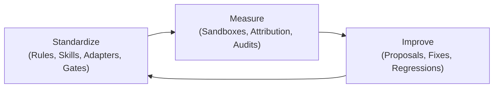
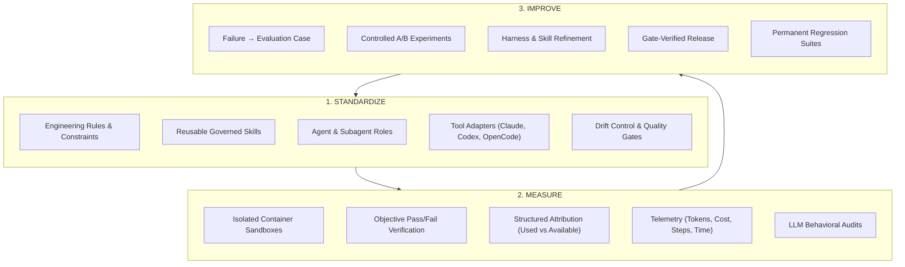
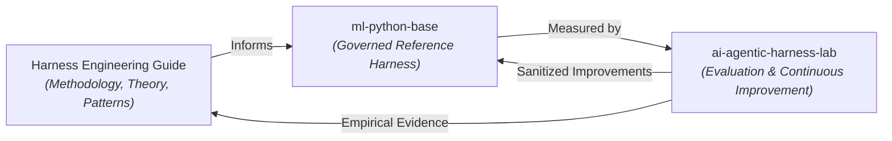

# Harness Engineering Guide

**The Engineering Discipline for Building, Evaluating, and Continuously Improving the Agentic SDLC.**

[Harness Engineering Guide](https://marcosdh1987.github.io/harness-engineering-guide/) is a public, vendor-neutral methodology and reference guide for engineering organizations transitioning from *ad-hoc AI assistance* to a *systematic, measurable, and continuously improving agentic software development lifecycle*.

---

---

## The Core Question

> **How does an engineering organization transition from individual developers using AI coding tools to systematically managing, measuring, and improving an agentic development system?**

As AI coding assistants evolve from single-turn autocompletion into multi-turn autonomous agents (executing shell commands, editing repositories, running test suites, and calling external tools), prompt engineering alone becomes insufficient. 

Organizations face critical challenges:
- **Silent Regressions & Drift**: Agents generate code that passes superficial checks but violates architectural boundaries, security policies, or database migration rules.
- **Perception-Driven Evaluation**: Teams judge agents by individual anecdotal feelings rather than reproducible, quantitative evidence.
- **Ephemeral Learning**: Lessons from agent mistakes remain lost in chat transcripts or Slack channels instead of compounding into organizational capabilities.

**Harness Engineering** solves this by treating the system around the model—the rules, context, skills, tools, execution environments, quality gates, observability, and evaluations—as an engineered, version-controlled software product.

---

## The Guiding Methodology: Standardize → Measure → Improve

The entire framework is structured around three foundational pillars:

1. **Standardize**: Define and version how agents are expected to work—architectural boundaries, approved tools, reusable skills, and validation gates.
2. **Measure**: Replace subjective perception with reproducible evaluation cases executed inside controlled sandbox environments. Capture exact attribution, token costs, step traces, and behavioral audits.
3. **Improve**: Close the feedback loop. Transform agent failures into reproducible evaluation cases, test improvements under controlled conditions, and retain them as permanent regression tests.

---

## Where to Start

-   :material-presentation: **[Agentic SDLC for Teams](start-here/agentic-sdlc-for-teams.md)**

    ---

    A 10-minute executive and technical briefing. Covers the core problem, the Maturity Model, the database migration case study, and implementation roadmaps.

-   :material-school: **[What is Harness Engineering?](start-here/what-is-harness-engineering.md)**

    ---

    Explore the complete Harness Stack: context engineering, rules architecture, governed skills, quality gates, and tool adapters.

-   :material-chart-line: **[Agentic SDLC Maturity Model](adoption/maturity-model.md)**

    ---

    Assess your organization across 6 levels (from Level 0: Ad-hoc AI to Level 5: Continuously Improving Agentic SDLC).

-   :material-flask: **[Controlled Environments & Sandboxing](evaluation/controlled-environments-sandboxing.md)**

    ---

    Understand why evaluating agents requires isolated execution environments for reproducibility, safety, and experimental validity, backed by industry research.

---

## The Closed-Loop Ecosystem

This guide is supported by two public reference implementations:

1. **[Harness Engineering Guide](https://github.com/marcosdh1987/harness-engineering-guide)**: The conceptual methodology, architecture patterns, and evaluation principles.
2. **[`ml-python-base`](https://github.com/marcosdh1987/ml-python-base)**: The production-ready reference harness featuring centralized `.github/` rules, governed skills, multi-tool adapters (Claude Code, OpenAI Codex, OpenCode, Antigravity, GitHub Copilot), and automated lockfile drift control.
3. **[`ai-agentic-harness-lab`](https://github.com/marcosdh1987/ai-agentic-harness-lab)**: The benchmarking and evaluation platform featuring Docker container sandboxes, condition hashing, structured attribution, behavioral audits, and closed-loop proposal generation.

---

## Claim Levels & Academic Rigor

To maintain scientific integrity and engineering clarity, this documentation strictly differentiates three levels of claims:

1. **Industry Evidence**: Publicly documented research, empirical findings, and architecture papers from frontier labs and standard benchmarks (e.g., Anthropic, OpenAI, SWE-bench, Princeton, Microsoft Research).
2. **Guide Recommendation**: Our proposed methodologies, maturity models, and architectural patterns for engineering organizations.
3. **Reference Implementation**: The specific design decisions implemented in `ml-python-base` and `ai-agentic-harness-lab`.
