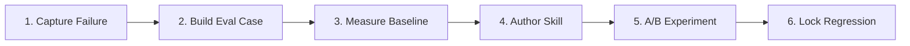
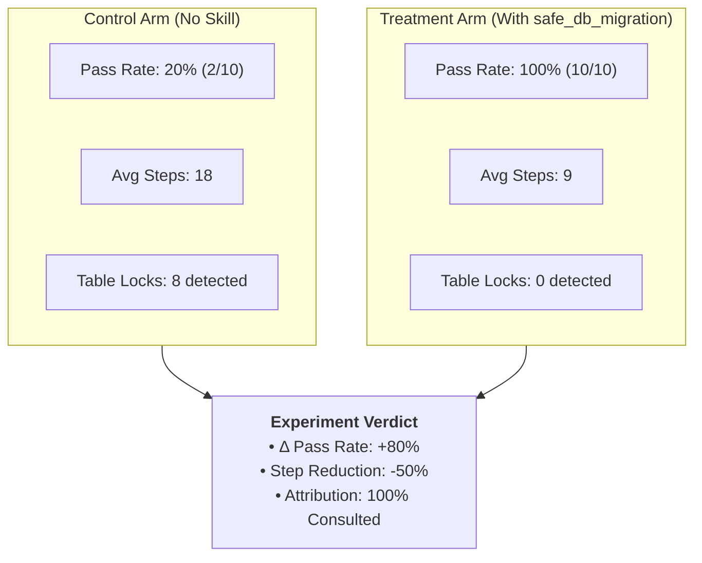

# Lab: Enterprise Database Migration Safety Case

In this hands-on lab, you will walk through the complete **Standardize → Measure → Improve** lifecycle by solving a real-world enterprise challenge: **preventing AI coding agents from generating unsafe, table-locking database migrations.**

---



---

## 1. The Incident (Problem Statement)
An AI coding agent was asked to add an `is_verified` column to the `users` table in a PostgreSQL database using Alembic.

The agent generated the following standard migration:
```python
# Unsafe Migration: Holds exclusive table lock on multi-million row table
def upgrade():
    op.add_column('users', sa.Column('is_verified', sa.Boolean(), nullable=False, server_default='false'))
```
In a production database with millions of active users, adding a non-nullable column with a default value without zero-downtime procedures causes an **exclusive table lock (`ACCESS EXCLUSIVE`)**, blocking all read and write queries and causing an outage.

---

## 2. Creating the Evaluation Case

We extract the incident into a deterministic evaluation case in `cases/safe_migration_case.yaml`:

```yaml
id: "custom-db-migration-zero-downtime"
title: "Add non-nullable is_verified column to users without table lock"
target_repo: "company/core-service"
base_commit: "d41d8cd"

task_description: |
  Add a non-nullable boolean column `is_verified` with default `false` to the
  `users` table in Alembic. Follow company zero-downtime migration standards:
  add as nullable first, populate default in batches, and set NOT NULL constraint.

environment:
  docker_image: "harness-runner:latest"
  timeout_seconds: 240

validation_commands:
  - "pytest tests/test_migration_locks.py"
  - "python scripts/lint_alembic_locks.py"
```

---

## 3. Measuring the Baseline

In **Agentic Harness Lab**, execute 10 baseline trials of the case with `claude-3-7-sonnet` without the specialized skill.

### Baseline Trial Results:
- **Pass Rate**: `2 / 10 (20%)`
- **Failure Mode**: In 8 out of 10 runs, the model generated a single-step `op.add_column` holding an exclusive table lock.
- **Attribution**: No migration safety guidance was available or consulted.

---

## 4. Authoring the Governed Skill

Create `.github/skills/safe_db_migration.md` in your repository:

```markdown
---
name: safe_db_migration
description: Zero-downtime database migration rules for PostgreSQL and Alembic.
---

# Zero-Downtime Database Migrations

## Rules
1. **Never add a non-nullable column directly** to existing tables with data.
2. **Three-Phase Migration Pattern**:
   - **Phase 1**: Add column as `nullable=True`.
   - **Phase 2**: Backfill existing rows with the default value in background batches.
   - **Phase 3**: Add the `NOT NULL` constraint with a `CHECK` constraint or `ALTER COLUMN SET NOT NULL` only after all rows are populated.
3. **Index Creation**: Always use `op.create_index(..., postgresql_concurrently=True)`.
```

Synchronize the skill into multi-tool adapters:
```bash
make check-sync
```

---

## 5. Running the Controlled A/B Experiment

In the lab, run an A/B trial comparing:
- **Control Arm**: Model without skill ($N=10$)
- **Treatment Arm**: Model with `safe_db_migration` enabled ($N=10$)



---

## 6. Closing the Loop: Permanent Regression Guard

1. **Merge the Skill**: Commit `.github/skills/safe_db_migration.md` and release `v1.4.0` in your governance repository.
2. **Lock into Regression Suite**: Add `custom-db-migration-zero-downtime` to your CI release test matrix.

Every future model migration or harness update will automatically execute this test case, ensuring that database migration safety remains permanently protected.

---

### Related Resources
- **[Building an Internal Evaluation Suite](../adoption/internal-evaluation-suite.md)**
- **[Pattern: Failure to Regression](../patterns/failure-to-regression.md)**
- **[Lab Evaluation Workflow](../reference-implementation/ai-agentic-harness-lab/evaluation-workflow.md)**
