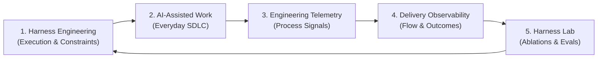
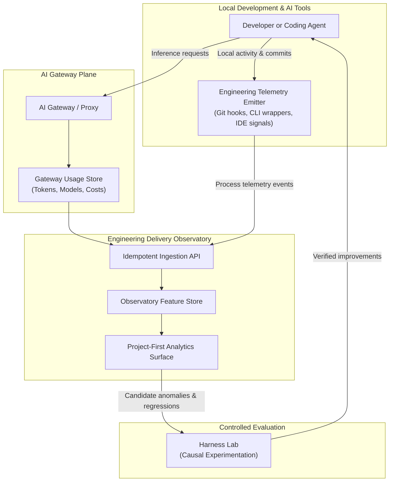
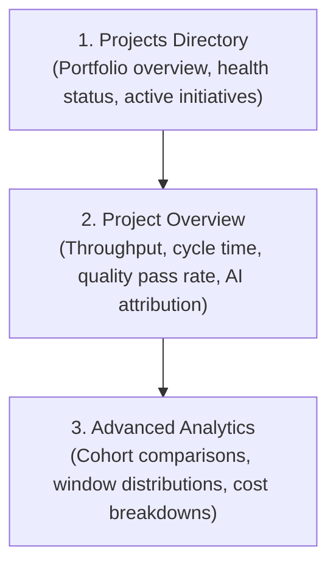
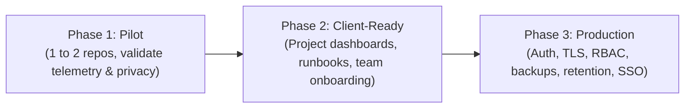
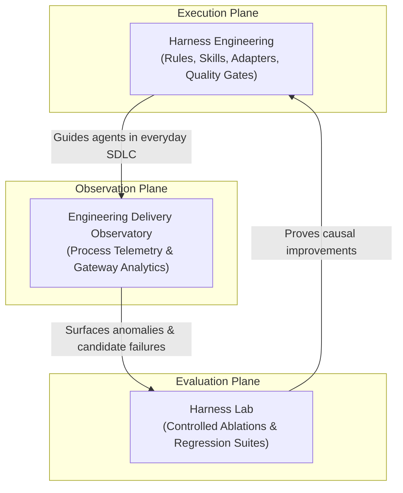

# Engineering Delivery Observatory Pattern

!!! info "About this page"
    **What you will learn:** how to close the AI-assisted SDLC feedback loop by observing engineering flow, activity, quality, and AI usage without inspecting private source code.

    **For:** engineering managers, tech leads, AI champions, platform teams, and Harness Engineers.

    **Read this when:** you want to move beyond prompt tweaks and verify whether your engineering system is actually improving.

A software engineering harness is incomplete until the engineering system can observe whether it is actually improving. Adopting AI-assisted workflows often stops at introducing better agents, richer prompts, or modular skills. Without operational observability, teams rely on subjective impressions rather than empirical evidence.

The **Engineering Delivery Observatory Pattern** establishes a privacy-preserving measurement plane across everyday development. It captures process telemetry, correlates AI investment with delivery flow, and surfaces candidate patterns for controlled evaluation in the [Harness Lab](../reference-implementation/ai-agentic-harness-lab/index.md).

---

## 1. Closing the Feedback Loop

Harness Engineering connects agent execution with verified delivery through an empirical loop:



To close this loop responsibly, the Observatory tracks six balanced dimensions:

1. **Throughput:** completed work units, merge velocity, and delivered initiatives.
2. **Flow:** lead time, cycle time, review iterations, and batch sizes.
3. **Quality:** verification pass rates, automated test success, regression rates, and defect escaping.
4. **Engineering Activity:** local commit cadence, active engineering windows, and repository churn.
5. **AI Usage:** model selection, prompt and completion tokens, cache hit rates, and request volumes.
6. **Efficiency Signals:** rework ratio, cycle stability, and API-equivalent computational costs.

---

## 2. The Core Privacy Principle

> "Measure the engineering process without observing the engineering content."

Observability must never degenerate into surveillance. The system records how work moves through the development lifecycle, strictly excluding proprietary artifacts, source content, and personal prompts.

| Telemetry Category | Included in Process Telemetry | Excluded by Default (Engineering Content) |
| --- | --- | --- |
| **Identifiers** | Canonical project slug, repository name, branch type | Individual developer surveillance identity, email, username |
| **Temporal Data** | Event timestamps, duration windows, latency | Keystroke logs, continuous surveillance timers |
| **Code Changes** | Aggregate lines changed (+/- LOC), commit count | Source code, diffs, abstract syntax trees, file paths |
| **Verification** | Pass/fail exit codes, test suite execution status | Terminal output, standard error dumps, failure stack traces |
| **Work Units** | Issue references, task identifiers, pull request numbers | Ticket descriptions, confidential customer requirements |
| **AI Interactions** | Model name, token counts, request duration, cost | Prompts, completions, reasoning traces, embedded secrets |

---

## 3. Reference Architecture

The architecture separates concerns into lightweight telemetry emission, centralized AI routing, and project-first aggregation:



### Architectural Roles

- **AI Gateway:** acts as a unified proxy for cloud and self-hosted model providers. It records model usage, prompt and completion tokens, status codes, latencies, and API-equivalent financial cost without logging prompt bodies.
- **Engineering Telemetry Emitter:** operates in developer environments, automated CI runners, or agent runtimes. It emits events on commits, verification commands, and task state changes.
- **Engineering Observatory:** stores, normalizes, and indexes process events, offering project-scoped views of delivery flow.
- **Vendor-Agnostic Implementation:** the pattern works with open-source proxies (such as LiteLLM), custom API gateways, standard SQL backends (such as PostgreSQL or ClickHouse), and standard visualization platforms (such as Metabase, Grafana, or dedicated portals).

---

## 4. Common Project Identity: Canonical Project Slug

Correlating AI gateway traffic with repository delivery requires a shared identifier across disconnected tools. The **canonical project slug** serves as this single join key:

```text
Repository Telemetry:   project_slug = "customer-portal"
AI Gateway Key Alias:   key_alias    = "customer-portal"
Observatory Project:    project_id   = "customer-portal"
```

Using a consistent project slug eliminates the need for invasive developer tracking or distributed trace header propagation across external vendor APIs. The Observatory correlates aggregate model investment with aggregate repository delivery simply by matching on `customer-portal`.

---

## 5. Delivery Semantics: At-Least-Once with Idempotent Ingestion

Network interruptions, offline development, and pre-commit hook retries mean telemetry delivery cannot guarantee exactly-once transport. The pattern adopts:

$$\text{At-Least-Once Delivery} + \text{Idempotent Ingestion}$$

- **Client Resilience:** telemetry emitters buffer events locally and retry during subsequent network connectivity.
- **Deterministic Event Identity:** each event payload carries a deterministic identifier (derived from event timestamp, repository hash, commit SHA, or client-generated UUID).
- **Idempotent Ingestion:** the backend stores events via upsert or deduplication keys. Duplicate submissions return HTTP 200/201 success.
- **Operational Reality:** duplicate events represent normal network retries, not infrastructure failures.

---

## 6. Development Activity vs Delivered Evidence

A common pitfall in engineering measurement is conflating in-flight effort with shipped outcomes. The Observatory explicitly separates two lifecycles:

| Dimension | Development Activity | Delivered Evidence |
| --- | --- | --- |
| **Scope** | In-flight, exploratory, local | Merged, verified, shippable |
| **Key Signals** | Dirty tree status, local branches, unstaged LOC churn, active AI sessions, local commits | Pull request approvals, CI build passes, trunk merges, production deployments |
| **Interpretation** | Represents active engineering thinking, exploratory debugging, and agent iteration | Represents verified organizational value and shippable progress |
| **Risks** | High activity with zero delivery indicates blockages or rabbit holes | Over-indexing on delivered metrics ignores the cost of upstream exploration |

A developer or agent making 15 local commits while debugging a complex algorithm represents genuine engineering activity. That activity is not yet delivered evidence until it passes quality gates and integrates into trunk.

---

## 7. Active Engineering Time: Window-Based Approximation

Traditional time tracking is inaccurate, intrusive, and counterproductive. The Observatory approximates focus using event-window clustering:

```mermaid
flowchart LR
    E1["Event 1<br/>10:00"] -->|5 min gap| E2["Event 2<br/>10:05"]
    E2 -->|8 min gap| E3["Event 3<br/>10:13"]
    E3 -->|45 min gap (> threshold)| E4["Event 4<br/>10:58"]
    
    subgraph W1["Window 1 (18 min)"]
        E1
        E2
        E3
    end
    
    subgraph W2["Window 2 (Active)"]
        E4
    end
```

- **Inactivity Threshold:** when the interval between consecutive events exceeds a set threshold (e.g. 20 or 30 minutes), the current window closes.
- **Focus Approximation:** the sum of active windows estimates engineering attention dedicated to a project during a given cycle.
- **Clear Limits:** this is an operational heuristic for workload estimation, never a punch-clock metric for individual evaluation.

---

## 8. AI Usage as an Attribution Dimension

AI assistance is a contextual dimension of modern engineering, not an independent measure of productivity. The Observatory tags work units into three explicit categories:

1. `observed`: process telemetry or gateway logs confirm AI tools were invoked during the work unit lifecycle.
2. `no_observed_signal`: no AI gateway activity or tool session was recorded for this work unit.
3. `unknown`: telemetry was incomplete, detached, or unverified.

!!! warning "Avoid Missing-Data Bias"
    Never assume that `no_observed_signal` proves that no AI was used. Developers may use browser interfaces, personal accounts, or uninstrumented tools. Labeling unobserved work as strictly manual introduces bias.

---

## 9. Multidimensional Productivity Interpretation

There is no single "productivity score" in software engineering. A healthy engineering system balances multiple opposing forces:

```text
System Health = (Throughput ↑) + (Cycle Time ↓) + (Quality Stable/↑) + (Rework Stable/↓) + (Unit Cost Stable/↓)
```

- **Throughput:** completed work units and feature cadence.
- **Flow Velocity:** cycle time from first commit to production deployment.
- **Defect Pressure:** rework ratios, rollback frequencies, and regression rates.
- **Resource Investment:** token spend and platform runtime costs.

Lines of code, commit counts, and raw token usage are descriptive activity indicators. Treating them as productivity targets triggers Goodhart's Law, degrading code quality and incentivizing bloated solutions.

---

## 10. Causal Rigor and Descriptive Phrasing

Observational telemetry shows statistical associations across production environments. It does not prove causality.

| Permitted Phrasing (Descriptive Association) | Prohibited Phrasing (Unjustified Causality) |
| --- | --- |
| "AI-observed work units exhibited a 22% lower median cycle time over the last quarter." | "Using AI agents caused a 22% reduction in cycle time." |
| "Repositories with governed skills experienced fewer verification failures." | "Governed skills eliminated verification defects." |
| "Higher gateway token spend was correlated with higher initial code churn." | "More tokens created more code churn." |

To test whether a harness rule, skill, or agent configuration directly causes an improvement, take the candidate pattern to the [Harness Lab](../reference-implementation/ai-agentic-harness-lab/index.md) for controlled ablation experiments.

---

## 11. Project-First User Experience

Observability interfaces must serve delivery decisions, not database administration. The primary user journey follows a project-first hierarchy:



Engineering leaders and tech leads should immediately grasp project health without writing SQL queries, inspecting internal join tables, or configuring telemetry filter masks.

---

## 12. Baselines and Historical Comparisons

Teams should evaluate their progress against their own internal trajectory rather than arbitrary external benchmarks:

- **Internal Comparison Window:** compare current performance against previous periods (e.g. the last 30 days versus the preceding 90 days).
- **Contextual Drift:** teams evolve, codebases grow, and architectures change. Internal baselines naturally control for tech stack, domain complexity, and team size.
- **External Benchmarks:** industry figures (such as general DORA surveys) offer broad reference points, but do not represent universal ground truth for every domain.

---

## 13. The Observatory Maturity Model

Organizations progress through six distinct stages of measurement capability:

| Level | Name | Description | Key Capabilities |
| :---: | --- | --- | --- |
| **0** | **Ad-hoc AI** | Uninstrumented individual usage | Developers use isolated AI tools without tracking or cost visibility |
| **1** | **Gateway Visibility** | Centralized proxy telemetry | Token usage, model routing, error rates, and API spend tracking |
| **2** | **Engineering Telemetry** | Local process events captured | Git hooks capture commits, active windows, and verification passes |
| **3** | **Delivery Observability** | Correlated project lifecycle | Canonical project slugs unify AI spend with PR flow and delivery metrics |
| **4** | **Cohort Association** | AI vs delivery comparisons | Systematic analysis of cycle time, rework, and quality across attribution states |
| **5** | **Closed-Loop Improvement** | Production feeds experimentation | Real-world telemetry anomalies feed Harness Lab eval suites and regression guards |

---

## 14. Rollout Pattern: From Pilot to Enterprise Production

Adopting the Observatory pattern should proceed in three incremental phases:



1. **Pilot Phase:**
    - Instrument 1 or 2 representative software repositories.
    - Validate the telemetry data contract and verify that no proprietary source content or secrets escape.
    - Confirm canonical slug alignment between gateway keys and repository emitters.
2. **Client-Ready Phase:**
    - Deploy clean project navigation and automated team dashboards.
    - Publish onboarding runbooks and automated smoke tests for client hooks.
    - Train tech leads on non-causal metric interpretation.
3. **Production Phase:**
    - Secure the ingestion API with mutual authentication, TLS encryption, and role-based access control (RBAC).
    - Establish automated database backups and data retention policies.
    - Integrate single sign-on (SSO) and audit logging for organizational compliance.

---

## 15. The Full Ecosystem: Harness, Observatory, and Lab

The Engineering Delivery Observatory works in tandem with the broader Harness Engineering methodology:



- **Harness Engineering:** improves how agents work by providing rules, skills, adapters, and safety gates.
- **Engineering Observatory:** measures what happens to the engineering system across production cycles.
- **Harness Lab:** tests whether observed variations are truly causal through isolated, reproducible A/B evaluations.

---

## 16. Practical Implementation Checklist

Use this checklist before rolling out measurement, performing comparisons, or publishing claims:

### Before Measuring
- [ ] **Canonical Project Identity:** canonical project slugs are defined and matched across repositories, gateway keys, and dashboard views.
- [ ] **Privacy Boundaries:** filters strictly exclude prompts, source code, diffs, developer surveillance metrics, and secrets from payloads.
- [ ] **Telemetry Contract:** event schemas and payloads are versioned, documented, and validated.
- [ ] **Attribution Configured:** AI gateway virtual keys and client emitters supply matching project attributes.

### Before Comparing
- [ ] **Sufficient Window:** sample periods cover at least 30 to 60 days of representative team activity.
- [ ] **Project Scoping:** metrics are aggregated per project rather than merged across dissimilar codebases.
- [ ] **No Cross-Project Contamination:** shared libraries or monorepos use explicit slug boundaries.
- [ ] **Missing-Data Bias Addressed:** work without telemetry is classified as `no_observed_signal` or `unknown`, never assumed to be manual.

### Before Making Claims
- [ ] **Multidimensional View:** throughput, flow time, quality, rework, and cost are evaluated together.
- [ ] **Quality Included:** verification pass rates and defect escape counts accompany velocity metrics.
- [ ] **Rework Assessed:** code churn and post-merge rollbacks are tracked alongside initial speed.
- [ ] **Cost Evaluated:** model inference costs and infrastructure overhead are factored into efficiency assessments.
- [ ] **Causal Language Avoided:** findings report descriptive associations; causal assertions are reserved for controlled [Harness Lab](../reference-implementation/ai-agentic-harness-lab/index.md) experiments.
