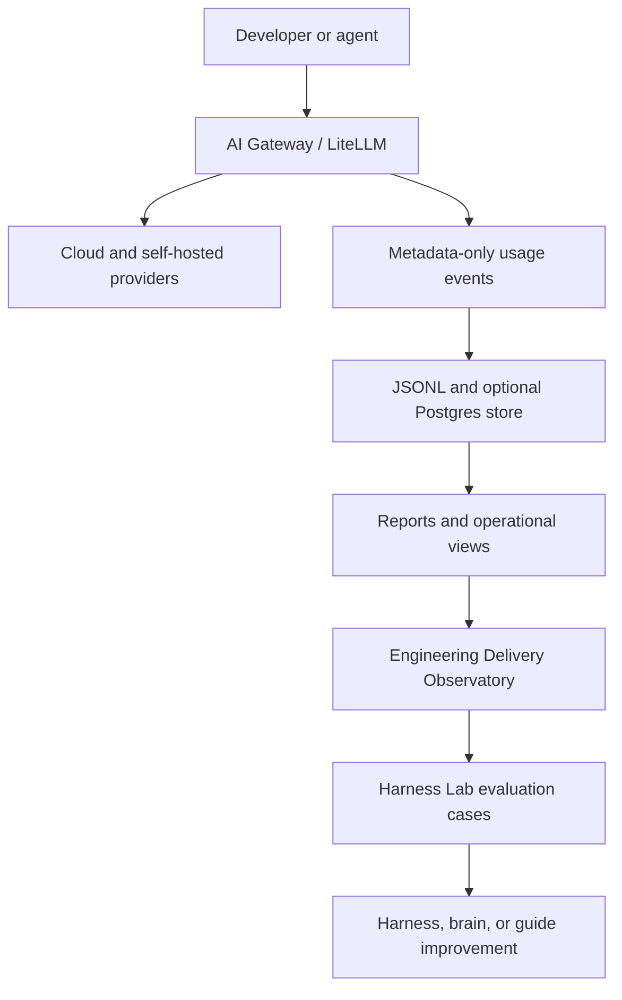

# Engineering Delivery Observatory

!!! info "About this page"
    **What you will learn:** what an operational observability plane can reveal and what it cannot prove.

    **For:** engineering managers, tech leads, AI champions, platform teams, and Harness Engineers.

    **Read this when:** you want to connect AI usage with engineering evidence without inventing a productivity score.

The Observatory is a reference architecture for observing AI in the everyday engineering workflow. It is related to the `ai-gateway` project, but it is broader than an LLM proxy.

## Evaluation and observability are different

| Evaluation | Observability |
| --- | --- |
| Controlled experiment | Real activity in the running system |
| Asks which alternative works better | Asks what actually happened |
| Harness Lab, cases, baselines, and regressions | Gateway traffic, traces, and delivery data |
| Confirms or rejects a hypothesis | Finds patterns and candidate failures |

## What the current gateway can observe

The local `ai-gateway` implementation records metadata such as requests, model and provider, prompt and completion tokens, cost, latency, status, virtual-key attribution, tool, harness, repository, benchmark, run, environment, and tags when clients provide them. It writes a metadata-only JSONL capture and can ingest it into a Postgres feature store. Optional Langfuse export provides trace-oriented observability.

The current project also exposes summary, per-developer profile, anomaly, forecast, and segmentation commands. A proxy does not see git history, editor actions, accepted changes, or agent transcripts by itself. Those signals require additional collectors and responsible attribution.

## Recommended metric layers

| Layer | Examples | Interpretation |
| --- | --- | --- |
| Usage | Requests, tokens, cost, latency, models, errors | What passed through the gateway |
| Process | Tasks, agent runs, skills, tool calls, verification attempts, CI executions | How work was performed, when available |
| Delivery | Lead time, PR cycle, review iterations, test failures, deployment frequency, change failure rate | What happened in delivery, when integrations exist |
| Quality | Verification pass rate, regressions, rework, architecture violations, security findings | Evidence about outcomes |

These layers are recommendations, not a mandatory standard. More tokens do not mean more productivity. More AI usage does not mean better engineering. Less elapsed time does not necessarily mean a better result.

## Privacy and responsible attribution

Metadata should classify activity, not capture prompts or responses by default. Do not put secrets or personal content in tags. Define ownership and access for operational telemetry separately from Company Brain data and private Second Brain data.

The measurement should help formulate questions, not turn AI telemetry into an individual performance metric. Avoid causal claims unless the data and study design support them.

!!! note "Current status"
    The gateway, metadata contract, local store, Postgres ingest, reports, and optional Langfuse export are reference implementation capabilities. A delivery collector, unified dashboard, and causal productivity analysis are future integrations, not current guarantees.
