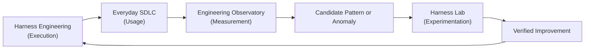

# Measure and Improve

!!! info "About this section"
    **What you will learn:** how real engineering usage, delivery observability, controlled evaluation, and continuous improvement connect.

    **For:** engineering managers, tech leads, AI champions, Harness Engineers, and teams adopting AI.

    **Read this when:** you need empirical evidence about whether an engineering harness is improving your delivery system.

The goal is not to reduce engineering to a single productivity score. It is to close the engineering feedback loop: did a rule help, did a skill improve behavior, did a context source add signal, and did a change regress under another model or tool?

Harness Engineering is incomplete until the engineering system can observe whether it is actually improving.

## Two Complementary Surfaces

| Surface | Main Question | Typical Output | Core Principle |
| --- | --- | --- | --- |
| [Engineering Delivery Observatory](engineering-delivery-observatory.md) | What is actually happening across our engineering projects, flow, and AI investment? | Operational process telemetry, activity windows, flow metrics, and candidate anomalies | Measure the process without observing the content |
| [Harness Lab](../reference-implementation/ai-agentic-harness-lab/index.md) | Which harness configuration performs better under controlled, comparable conditions? | Benchmark scores, skill attribution, ablation results, and regression suites | Isolate variables to establish causal proof |

Observability discovers patterns, associations, and operational regressions in real-world activity. Evaluation tests hypotheses under isolated, reproducible conditions. Neither surface alone is enough to sustain continuous organizational improvement.

## Where to Start

1. **Understand the Conceptual Boundary:** read [Observability vs Evaluation](../concepts/observability-vs-evaluation.md) to understand why telemetry indicates association while evaluation determines causality.
2. **Deploy the Operational Pattern:** follow the [Engineering Delivery Observatory Pattern](engineering-delivery-observatory.md) to instrument lightweight emitters, establish canonical project slugs, and observe flow without capturing proprietary source code.
3. **Run Controlled Experiments:** explore the [Harness Lab](../reference-implementation/ai-agentic-harness-lab/index.md) to test candidate improvements with reproducible test cases, ablations, and regression suites.

!!! note "Measure the System, Not Just the Model"
    We evaluate and observe the complete system around the model: context, rules, skills, tool adapters, verification gates, delivery flow, and human collaboration. Model choice is one variable, not the entire engineering system.
