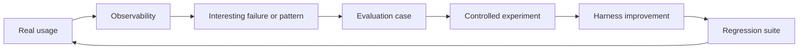

# Measure and Improve

!!! info "About this section"
    **What you will learn:** how real usage, controlled evaluation, and improvement connect.

    **For:** engineering managers, tech leads, AI champions, Harness Engineers, and teams adopting AI.

    **Read this when:** you need evidence about whether a change improved the system.

The goal is not to reduce engineering to a score. It is to make useful questions answerable: did a rule help, did a skill improve behavior, did a source add signal, and did a change regress under another model or tool?

## Two complementary surfaces

| Surface | Main question | Typical output |
| --- | --- | --- |
| Engineering Delivery Observatory | How is AI actually being used, and what happens around that use? | Operational evidence, patterns, and candidate cases |
| Harness Lab | Which configuration performs better under comparable conditions? | Scores, attribution, experiment results, and regressions |

Observability discovers patterns in activity. Evaluation tests hypotheses under controlled conditions. Neither surface alone is enough for continuous improvement.

Start with [Observability vs Evaluation](../concepts/observability-vs-evaluation.md), then read the [Engineering Delivery Observatory](engineering-delivery-observatory.md) and [Harness Lab](../reference-implementation/ai-agentic-harness-lab/index.md).

!!! note "Measure the system"
    We evaluate the system around the model: context, rules, skills, tools, routing, verification, and human workflow. Model choice is one variable, not the whole system.
