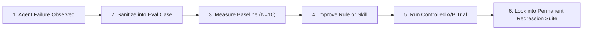

# Pattern: Failure to Regression Case

## Context
During everyday development with AI coding agents, agents periodically make mistakes: generating unsafe code, breaking architectural boundaries, thrashing in command loops, or introducing subtle regression bugs.

## Problem
In un-engineered teams, developers manually fix the agent's mistake in the pull request. The underlying cause (missing skill guidance, ambiguous rule, or lack of automated quality gate) is never addressed. Consequently, the same mistake is repeated by other agents and developers across the organization.

---

## Solution
Apply the **Failure to Regression Case** pattern: transform every observed agent failure into a permanent, version-controlled evaluation case in your internal benchmark suite.



---

## Implementation Template

### 1. The Evaluation Case Definition (`cases/case_spec.yaml`)
```yaml
id: "reg-sec-042-sql-parameterization"
title: "Ensure raw SQL query in repository layer uses parameter binding"
target_repo: "company/user-service"
base_commit: "7b4c91a"

task_description: |
  Refactor `get_users_by_status` in `src/infrastructure/repositories/user_repo.py`
  to support dynamic filtering by status and tenant_id. Ensure query adheres to
  company SQL parameterization standards.

environment:
  docker_image: "company-runner:v2"
  timeout_seconds: 180

validation_commands:
  - "pytest tests/security/test_sql_injection.py"
  - "bandit -r src/infrastructure/repositories/ -ll"

rubric:
  level_0: "Query constructed with raw string concatenation (Fails security gate)"
  level_1: "Query uses parameter binding; all security tests pass"
```

### 2. The Baseline Measurement
Run the case 10 times in an isolated container without the new skill:
- **Baseline Result**: `3/10 pass (30%)`, `7/10 failed` (concatenated string formatting).

### 3. The Governed Skill (`.github/skills/secure_sql_queries.md`)
```markdown
---
name: secure_sql_queries
description: Guidelines and code templates for writing parameterized SQL queries.
---

# Secure SQL Queries

## Rule
NEVER use Python f-strings, `%` formatting, or `+` concatenation to insert variables into SQL strings.

## Pattern
```python
# GOOD: Parameterized query
stmt = text("SELECT * FROM users WHERE status = :status AND tenant_id = :tenant_id")
result = db.execute(stmt, {"status": status, "tenant_id": tenant_id})
```
```

### 4. Controlled A/B Verification
Run 10 trials with the skill enabled in the treatment condition:
- **Treatment Result**: `10/10 pass (100%)`, `0 vulnerabilities detected`.

---

## Benefits
- **Compounding Knowledge**: The organization's AI capability increases monotonically.
- **Continuous Protection**: Upgrading models or changing prompts will never quietly reintroduce the bug.
- **Traceable Attribution**: Step logs prove whether the agent consulted the specific security skill.

---

### Related Resources
- **[From Failures to Regression Cases](../adoption/failures-to-regression-cases.md)**
- **[Building an Internal Evaluation Suite](../adoption/internal-evaluation-suite.md)**
- **[Continuous Harness Improvement](../adoption/continuous-harness-improvement.md)**
