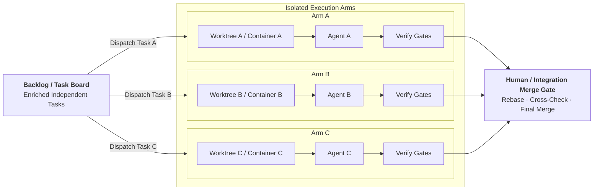

# Parallel Agent Execution

As engineering teams scale autonomous agent adoption, executing tasks sequentially through a single agent becomes a delivery bottleneck. However, running multiple agents concurrently against the same working tree causes file contention, clobbered state, and corrupt test runs.

The fundamental axiom of concurrent agent engineering is:

$$\mathbf{Parallelism\ requires\ isolated\ mutable\ state.}$$



---

## 1. Why Isolation Matters

When humans collaborate on software, they use separate branches, personal laptops, and isolated development containers. Coding agents require the same physical and logical isolation.

Concurrent agents running in a shared directory encounter severe failure modes:

- **Dirty Working Trees**: Agent B edits a file that Agent A is compiling, producing phantom build errors.
- **Port Collisions**: Agent A starts a local test server on port 8000 while Agent B attempts to bind to the same port.
- **Database Contention**: Parallel test suites running against a shared local database overwrite or truncate each other's test fixtures.
- **Git Index Locks**: Simultaneous git commands produce `.git/index.lock` errors, terminating execution turns abruptly.

---

## 2. Dimensions of State Isolation

True parallel agent execution isolates five distinct layers:

| Layer | Isolation Requirement | Concrete Mechanisms |
|---|---|---|
| **Filesystem** | Separate working copies of the repository | Git worktrees (`git worktree add`), separate clones |
| **Processes** | Independent execution environments | Container sandboxes (Docker, Podman), separate shells |
| **Network & Ports** | Dedicated ports per agent instance | Ephemeral ports (port 0 allocation), separate container bridges |
| **Data Stores** | Isolated databases and queues | Ephemeral schema prefixes, containerized test databases |
| **Artifacts** | Distinct log files and coverage outputs | Run-scoped artifact paths (e.g. `artifacts/{run_id}/`) |

---

## 3. Git Worktrees as an Isolation Primitive

Git worktrees provide a lightweight, filesystem-native isolation primitive. Multiple working trees can be linked to a single underlying `.git` repository, allowing distinct agents to check out different branches simultaneously without cloning overhead:

```bash
# Create isolated worktree for Agent A
git worktree add -b feat/oauth-auth ../worktrees/oauth-auth main

# Create isolated worktree for Agent B
git worktree add -b fix/payment-retry ../worktrees/payment-retry main
```

Each worktree possesses its own independent working directory, index, and untracked files, while sharing object storage with the primary repository. Once an agent finishes and verifies its changes, the worktree can be removed:

```bash
git worktree remove ../worktrees/oauth-auth
```

While worktrees isolate files, they do not isolate running network processes or databases. For full isolation, pair git worktrees with dedicated container environments.

---

## 4. When Tasks Are Truly Independent

Parallel execution only succeeds when tasks are decoupled. Attempting to parallelize tightly coupled tasks produces unresolvable merge conflicts and architectural divergence.

Tasks are candidates for parallel execution when:

1. **Orthogonal File Sets**: the tasks modify non-overlapping files or distinct packages.
2. **Clear Interface Boundaries**: communication between the components occurs through existing, stable interfaces.
3. **No Schema Dependencies**: neither task depends on unmerged database migrations authored by the other.
4. **Independent Test Suites**: test suites can execute without relying on shared global state.

If two tasks touch the same core models, utility files, or database tables, execute them sequentially.

---

## 5. Control Planes and Orchestration

Recent frontier research, such as OpenAI's Symphony architecture (2026), highlights the separation between task orchestration and model capability. In this model:

- The **Project Management System** (Issue Tracker, Jira, Linear, or GitHub Projects) serves as the **Control Plane**.
- Agents are transient workers claimed from a queue to execute bounded tasks.
- The control plane enforces dependency ordering, dispatches work to isolated worktrees, and collects status.

Similarly, Anthropic's research on agent teams (2026) emphasizes that multi-agent coordination overhead rises quickly when agents attempt autonomous peer-to-peer negotiation. A central control plane with explicit task boards and isolated sandboxes produces far more reliable outcomes.

---

## 6. The Human Integration Gate

Parallel agent branches must never auto-merge directly into production branches. A centralized integration gate is essential:

1. **Rebase and Fast-Forward**: the candidate branch is rebased against the latest integration branch.
2. **Full Repository Gate**: `make check` executes across the entire repository to ensure cross-module invariants hold.
3. **Human Review**: an engineer reviews the aggregated diff for architectural consistency, performance implications, and unexpected side effects.
