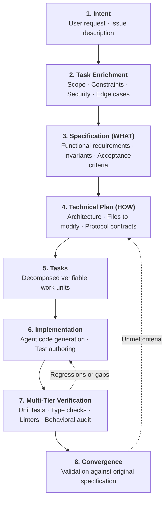

# Spec-Driven Agentic Work

Spec-Driven Agentic Work is an engineering pattern that introduces explicit, verifiable specifications into autonomous software development. It replaces the fragile practice of prompting an agent with vague instructions and hoping the generated output satisfies unstated requirements.



---

## 1. The Core Problem Solved

Without formal specifications, autonomous coding agents commonly fall into a recurring failure mode:

```text
Vague initial request
       ↓
Large autonomous code generation
       ↓
Happy path appears to work
       ↓
Missing edge cases, broken non-functional requirements, security oversights
```

A model prompted with "Add Stripe webhook support" will generate syntactically valid code that handles the happy path. However, it will frequently omit signature verification, idempotent event processing, replay attack protection, rate limiting, and structured logging.

Spec-Driven Agentic Work prevents this by requiring that **WHAT** the system must do is explicitly defined, reviewed, and agreed upon before writing the **HOW**.

---

## 2. The Spec-Driven Lifecycle

### 1. Intent & Task Enrichment

Raw tickets and user requests are rarely complete specifications. Task enrichment transforms an ambiguous request into a structured brief containing:

- **Business Intent**: what problem is being solved and why.
- **In-Scope and Out-of-Scope**: clear boundaries preventing scope creep.
- **Functional Requirements**: explicit system behaviors and inputs/outputs.
- **Non-Functional Requirements (NFRs)**: latency budgets, throughput limits, memory constraints.
- **Security Invariants**: authorization checks, secret handling, input sanitization.
- **Edge Cases & Failure Modes**: network timeouts, partial database failures, invalid payloads.
- **Acceptance Criteria**: binary conditions that determine task completion.
- **Open Questions**: ambiguities that require human clarification before implementation.

### 2. Specification (WHAT)

The specification defines system behavior independently of implementation choices. It establishes:

- Data models and interface contracts.
- State transition rules and validation constraints.
- Concrete Given/When/Then acceptance criteria.

### 3. Technical Plan (HOW)

The technical plan defines how the software will satisfy the specification. It specifies:

- Architecture diagrams and dependency flows.
- Specific files to create, modify, or delete.
- Database migrations and schema adjustments.
- Configuration and environment variables.

### 4. Tasks (Verifiable Units)

The technical plan is broken down into small, ordered, verifiable task units. Each task should be small enough to complete in a single agent turn and must declare its own verification command.

### 5. Implementation & Verification

The agent implements tasks sequentially. After each task, the agent runs deterministic checks (tests, linters, types). If a check fails, the agent repairs the implementation before moving to the next task.

### 6. Convergence

A task is not complete merely because files were modified or the agent claims "done". **Convergence** means the final system state satisfies:

- All functional acceptance criteria in the specification.
- All non-functional invariants in the technical plan.
- All automated quality gates in the repository harness.

---

## 3. Representative Implementations

Spec-Driven Agentic Work is a vendor-neutral methodology. Organizations implement it using various tooling approaches:

### GitHub Spec Kit 1.x

GitHub Spec Kit implements an intent-driven, artifact-based workflow for coding agents. It structures agent interactions into explicit phases: `Specify`, `Plan`, `Tasks`, `Implement`, and `Converge`. Each phase produces durable Markdown artifacts stored in the repository, enabling seamless collaboration between humans and agents.

### OpenSpec

OpenSpec focuses on brownfield development and complex repository refactors. It maintains an artifact dependency graph linking proposals, domain specifications, technical designs, and verifiable tasks. OpenSpec is particularly suited for tracking multi-file architectural transitions.

### Repository-Native Spec Workflows

Many teams implement lightweight spec workflows natively using repository conventions:

- A dedicated issue template that enforces task enrichment fields.
- A `docs/specs/` directory storing feature specifications and acceptance criteria.
- Automated CI checks that verify test coverage against specified acceptance criteria.

The harness does not require a specific framework; it requires that requirements and acceptance criteria are made explicit and mechanically verifiable.
