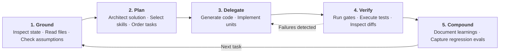

# The Working Loop: Understand, Execute, Verify, Learn

!!! info "About this page"
    **What you will learn:** a common loop for human and agent work, from understanding intent to retaining the lesson.

    **For:** developers, tech leads, engineering managers, and anyone designing repeatable work.

    **Read this when:** you want a lightweight operating rhythm that scales with task risk.

The common loop is broad enough for software engineering and knowledge work:

**Understand → Plan or Design when needed → Execute → Test → Verify → Review → Learn**

The engineering reference implementation compresses these ideas into a five-stage operational loop:

$$\mathbf{Ground} \longrightarrow \mathbf{Plan} \longrightarrow \mathbf{Delegate} \longrightarrow \mathbf{Verify} \longrightarrow \mathbf{Compound} \circlearrowleft$$

This loop governs how people and agents collaborate. A small task can move through it quickly. A risky architectural change can expand the planning, design, testing, and review steps without imposing the same ceremony on every task.



---

## 1. The Five Stages Explained

### 1. Ground
Before modifying any code, the agent must anchor itself in the reality of the codebase:
- Read the relevant source files, existing tests, and architectural guidelines (`AGENTS.md`, `.github/standards.md`).
- Verify existing behavior by running current test suites.
- Answer the five continuity questions: Where am I? What has been done? What remains? What assumptions are active? What must be verified?
- Identify active constraints, dependencies, and interfaces.

### 2. Plan
The agent formulates a concrete, step-by-step implementation plan:
- Specify exactly which files will be created, modified, or removed.
- Break large initiatives into small, verifiable units of work.
- Select governed operational skills relevant to the task (such as database migrations or API scaffolding).
- Solicit human review and approval on non-trivial architectural changes before writing code.

### 3. Delegate
With an approved plan, the agent executes implementation tasks:
- Make focused, modular modifications adhering strictly to repository standards.
- Author unit and integration tests alongside code changes.
- Avoid scope creep by modifying only files declared in the plan.

### 4. Verify
No code change is accepted based on the agent's claim that it works. Verification enforces empirical proof:
- Run fast local linters, formatters, and type checkers (`make lint`).
- Execute targeted unit tests and full test suites (`make test`).
- Perform multi-tier quality gate validation (`make check`).
- Inspect the unified git diff to confirm no unintended edits or debug statements leaked in.

### 5. Compound
The final step ensures that lessons learned during the task become permanent organizational assets:
- Update technical documentation and API schemas.
- If a bug was fixed, convert the reproduction test into a permanent regression test case.
- Record notable architectural discoveries or edge cases in repository memory (`memory/` or ADRs).
- Ensure the repository remains in a clean, deployable state.

---

## 2. Architectural Analysis: Evolution of the Working Loop

During the evolution of Harness Engineering, we analyzed whether to expand the universal mantra to six stages by adding `Specify`:

$$\mathbf{Ground} \longrightarrow \mathbf{Specify} \longrightarrow \mathbf{Plan} \longrightarrow \mathbf{Delegate} \longrightarrow \mathbf{Verify} \longrightarrow \mathbf{Compound}$$

### The Decision: Retain the Five-Stage Mantra

We chose to retain the concise five-stage loop as the universal baseline across `ml-python-base`, `ml-langchain-agent`, and the guide.

### Rationale

1. **Preventing Over-Scaffolding on Simple Tasks**: For routine tasks (such as fixing a typo, updating a dependency, or adjusting a CSS property), forcing a distinct formal specification stage introduces unnecessary ceremony and token overhead. The best harness is not the largest harness.
2. **Backward Compatibility**: The five-stage mantra is established across developer documentation, skill templates, and automated prompts.
3. **Spec-Driven Work as a Formal Sub-Flow**: For non-trivial features, architectural migrations, and complex initiatives, [Spec-Driven Agentic Work](spec-driven-agentic-work.md) operates as the explicit specification sub-flow bridging Ground and Plan:

```text
Ground (Enrich & Understand)
   ↓
Specify (WHAT: Requirements, Invariants, Acceptance Criteria)
   ↓
Plan (HOW: Architecture, File Changes, Verifiable Task Units)
   ↓
Delegate (Implement)
   ↓
Verify (Multi-Tier Convergence)
   ↓
Compound (Capture Learnings & Regressions)
```

This framing maintains conceptual simplicity for everyday engineering while providing rigorous specification depth whenever task complexity warrants it.
