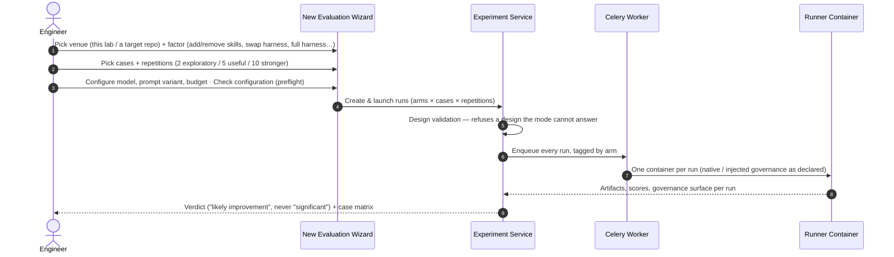
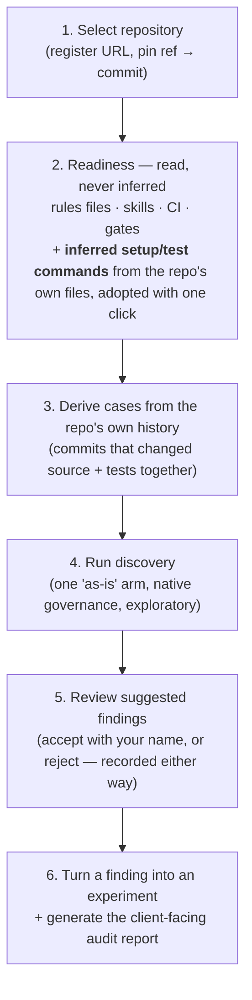
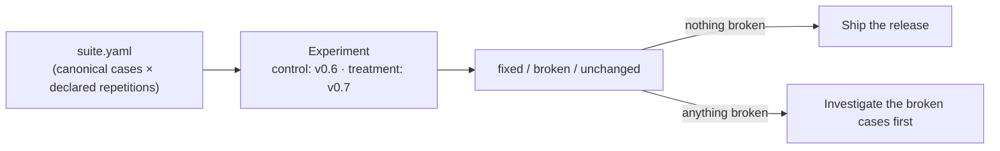

# Lab Evaluation Workflow

The lab is organized around **four journeys**, one per question a team actually arrives with. Each journey starts on the home screen ("What do you want to learn?") and ends in evidence a team can act on, a verdict with a case matrix, a robustness map, an audit report, or a release decision.

---

## Journey A, Evaluate a Harness Change (Mode A)

*"Does this skill / rule / prompt change actually improve anything?"*

Key properties:

- **The form cannot express an invalid design.** One factor varies; repository, cases and model are pinned across arms. The backend validates again and refuses contradictions.
- **The "Full harness" factor** runs the founding comparison: a bare arm (plain prompt, every governed skill hidden) against the whole harness, one treatment, one claim about the harness as a unit.
- **Launch locks the configuration.** Further rounds reuse it verbatim (that is how repetitions grow); a different model is a different experiment.
- **The result opens with a ten-second verdict**: did it improve, on which metrics, at what cost, with how much evidence, followed by the **case matrix** (fixed / broken / unchanged), which is the number that survives an average.

---

## Journey B, Test Across Repositories (Mode B)

*"Does our harness hold up outside the repository it was born in?"*

Same wizard, cross-repo mode: the harness and model stay fixed, each selected repository becomes its own arm, and the first one is a **reference** (a reading anchor, not a baseline, nothing here is causal). The summary is deliberately per-repository: pooling scores across different codebases would treat them as one condition, which they are not.

---

## Journey C, Audit a Repository (Mode C)

*"What can we learn from how this project or team works with AI today?"*, including a client's repository you have never seen.

The audit's claims stay narrow at every step: readiness is *detected* ("Not detected" when unobservable), cases are *proposed* from real commits the team already made, findings are *suggested* until signed, and the generated markdown report **only says what the evidence supports**: with no runs, it says "reading, not measurement".

The natural closing experiment for any audit: **native vs injected**: the repository exactly as the team has it, against the same repository with your harness projected in, same cases, 5+ repetitions per arm. That is the question every client engagement ends on, answered as a measurement.

---

## Journey D, Validate a Harness Release

*"Is v0.7 safe to ship over v0.6?"*

The regression suite (`suite.yaml`) is a **producer of experiments**, not a second runner: it contributes the canonical cases and their per-case repetition counts; you contribute the two arms (previous release as control, candidate as treatment). Everything downstream (design validation, the beyond-noise column, the case matrix) is the same machinery as every other comparison.

A release is read as *"fixed four, broke none, thirty unchanged"*, never as a single composite number that could hide the two it broke.

---

## The Improvement Loop (Unchanged in Spirit, Sharper in Form)

When a run exposes a harness weakness, the loop into the governed template still closes the same way:

1. Open the run, it leads with its **condition** (experiment, arm, repository @ commit, governance source) before its logs.
2. Run the **LLM audit** (judged against the governance surface that run actually had) and synthesize **improvement proposals**.
3. Collect proposals across runs on the **Improvements** screen and generate one **sanitized combined issue** for the governed template (private paths and tokens stripped).
4. Fix, release, and validate the new version through **Journey D**.

---

### Related Resources
- **[Agentic Harness Lab Overview](index.md)**
- **[The Three Questions (Evaluation Modes)](../../evaluation/the-three-questions.md)**
- **[Regression Suites](../../evaluation/regression-suites.md)**
- **[Continuous Harness Improvement](../../adoption/continuous-harness-improvement.md)**
