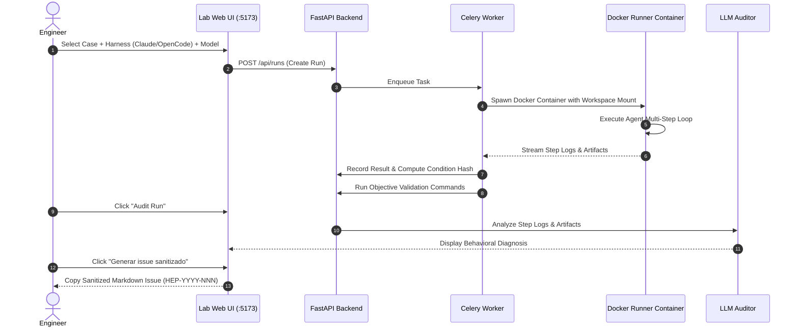

# Lab Evaluation Workflow

This guide details the end-to-end operational workflow for executing evaluations, diagnosing agent behavior, and generating verified improvements using the **Agentic Harness Lab** (`ai-agentic-harness-lab`).

---

## The End-to-End Operational Loop



---

## Step-by-Step Workflow Guide

### Step 1: Queue a Benchmark Run
1. Open the Web UI at `http://localhost:5173` (or run `make app-up`).
2. Navigate to the **Runs** screen and click **"New Run"** (or use **Batch Runs** to queue a full cross-product matrix).
3. Configure the experimental parameters:
   - **Case**: Choose an internal custom case or SWE-bench instance.
   - **Harness**: Choose `claude` (Claude Code), `opencode`, `codex`, or `antigravity`.
   - **Model**: Select cloud-routed models (via AI Gateway) or local endpoints (Ollama/LM Studio).
   - **Prompt Variant**: Select `swe_harness` or `sdlc` (to load governed rules and skills).
   - **Skill Ablation**: (Optional) Explicitly disable or stage a skill to measure its marginal impact.

---

### Step 2: Containerized Execution
- The Celery worker pulls the task and spawns a dedicated, isolated Docker container (`harness-runner`).
- The repository workspace is bind-mounted read-write inside the container under an unprivileged user.
- The execution watchdog monitors process liveness, enforcing CPU, RAM, and maximum step/time thresholds.
- Step-by-step stdout/stderr, tool calls (`read`, `edit`, `bash`), and permission events are streamed to `data/runs/<id>/steps/step-*.log`.

---

### Step 3: Attribution & Validation Indexing
Upon run completion:
- **Attribution Parsing**: The API parses the step logs to compute the **Attribution Record**:
  - Distinct files read vs edited (`permission=edit`).
  - Governance surface coverage (which `.github/` rules were read).
  - Explicit skill consultation (`SKILL.md` read events).
- **Objective Validation**: The worker executes the case's `validation_commands` (e.g., `pytest tests/test_case.py`).
  - If tests pass $\to$ Objective: `PASS`.
  - If tests fail $\to$ Objective: `FAIL` (Composite score capped at 1.0).

---

### Step 4: Behavioral Audit & Proposal Generation
1. In the Web UI, open the completed run and click **"Audit"**.
2. The LLM Auditor analyzes the transcript and outputs `audit.md`, evaluating:
   - Planning quality and SDLC adherence.
   - Command loops, tool thrashing, or repetitive failing commands.
   - Hallucinated flags or incorrect parameters.
3. Click **"Generar issue sanitizado"** (or run `make harness-proposal RUN=<id>`).
4. The system allocates an immutable `HEP-YYYY-NNN` identifier, strips private tokens and host paths, and generates a formatted issue for `ml-python-base`.

---

### Step 5: Implement Improvement in `ml-python-base`
1. Open the issue in [`ml-python-base`](https://github.com/marcosdh1987/ml-python-base).
2. Create a development branch and edit the targeted governed skill under `.github/skills/`.
3. Run local quality gates:
   ```bash
   make check        # Ruff linting, formatting, type checks
   make check-sync   # Sychronize CLAUDE.md, AGENTS.md, OPENCODE.md
   ```
4. Merge the PR and tag an immutable SemVer release (e.g., `v1.4.0`).

---

### Step 6: Validate in Candidate Worktree & Close the Loop
1. Point the lab at the new governance version using an isolated worktree:
   ```bash
   make harness-status                    # Compare current vs latest release
   make harness-sync-preview REF=v1.4.0   # Preview read-only diff
   make harness-sync-branch REF=v1.4.0    # Prepare candidate worktree
   ```
2. Re-run the exact same evaluation case with the candidate version.
3. Verify that:
   - The original symptom disappeared.
   - Objective validation passes.
   - The run produces **zero new proposals** (Clean Outcome Gate).
4. Merge the candidate branch into your production repositories.

---

### Related Resources
- **[Agentic Harness Lab Overview](index.md)**
- **[Continuous Harness Improvement](../../adoption/continuous-harness-improvement.md)**
- **[Controlled Environments & Sandboxing](../../evaluation/controlled-environments-sandboxing.md)**
