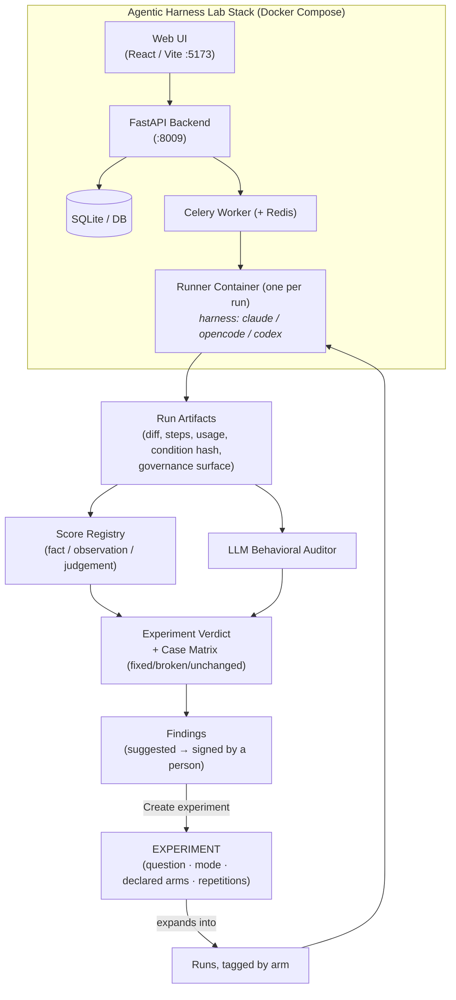

# Agentic Harness Lab: Overview

**Agentic Harness Lab** (`ai-agentic-harness-lab`) is an open-source, local evaluation instrument for AI coding harnesses. Its identity in one sentence: *an evaluation instrument for continuously improving AI-assisted software engineering systems* — not a dashboard for benchmark runs.

The v2 platform is organized by **intent** rather than by internal entities. The home screen asks one question — **"What do you want to learn?"** — and offers the [three evaluation modes](../../evaluation/the-three-questions.md) as the ways in:

- **Evaluate a harness change** (Mode A): does this skill, rule, prompt or harness change actually improve performance? The only mode that supports a causal claim — and only with enough repetitions.
- **Test across repositories** (Mode B): does this harness generalize? Results stay per repository, never pooled.
- **Audit a repository** (Mode C): what can we learn from how this project works with AI today? Exploratory by design — it produces cases, observations and suggested findings, never a causal verdict.

---

The load-bearing abstraction is that **the experiment sits above the run**. A run is one data point; an experiment states the question *before* anything executes, declares its arms and its control, and refuses designs its mode cannot answer. The result arrives as a cautious verdict ("likely improvement", never "significant") plus the per-case matrix.

---

## Key Capabilities

### 1. Intent-Driven Experimentation
A wizard builds Mode A / Mode B designs that **cannot express an invalid experiment**: one factor varies at a time (add/remove skills, swap the harness, native vs injected governance, bare model vs **full harness**), everything else is pinned, and configuration + preflight + launch happen in one place. Once launched, an experiment's configuration is **locked** — relaunching with a different model is refused, because one experiment is one measurement.

### 2. Target Repositories & the Governance Condition
Cases can run against any registered repository, cloned fresh and pinned to a commit per run. The harness the agent *sees* is a first-class condition: `native` (the repo's own setup — a true control), `injected` (the lab's harness projected in), or `lab_root`. Each run is audited against the governance surface **it actually had**, with the file list and fingerprint persisted.

### 3. Guided Repository Audit (Mode C)
A six-step flow for auditing any repository — including a client's: readiness detection (never inferred: "Not detected" when unobservable), **validation-gate inference** from the repo's own files (Makefile targets, lockfiles, pytest config — adopted with one click, never silently), **case derivation from the repo's own commit history**, an explicit discovery experiment, suggested findings, and a generated **client-facing audit report** in markdown that only claims what the evidence supports.

### 4. Score Registry with Provenance
Every metric is filed under a versioned definition (`name@version`) and labeled **fact** (a command exited), **observation** (parsed from artifacts) or **judgement** (a model's opinion). A metric that cannot be computed returns *no score with a stated reason* — never a zero.

### 5. Trajectory Metrics (DeepEval) in the Default Profile
`task_completion`, `step_efficiency` and `tool_correctness` ride in ordinary scoring, judged through the lab's own model gateway with zero extra configuration. Each metric skips gracefully — no library, no judge, no trajectory → no score. The judged metrics matter most on repositories **without** an objective test gate: they provide a labeled judgement where a pass/fail cannot exist.

### 6. Findings: Suggested by Machines, Signed by People
The corpus is mined for patterns — regressions, never-passing cases, skills the auditor keeps judging unused — and they arrive in a review queue labeled **suggested**. Accepting one requires an author's name; rejections are recorded so patterns are not re-raised. An accepted finding links to a prefilled experiment that can settle it.

### 7. Regression Suite as an Experiment
`suite.yaml` is a *producer* of experiments, not a second runner: harness `v0.6` vs `v0.7` over the canonical cases, read as **fixed / broken / unchanged** through the same case matrix as every other comparison. This is the standard mechanism for validating a harness release.

### 8. Honest Lifecycle
Experiments can be **abandoned** (hidden; their runs stay in the corpus — "stop showing me this", never "this never happened") or **deleted** together with their runs, scores and artifacts (half a deletion would strand orphan measurements biasing every aggregate, so it is refused).

---

## Technical Stack

| Layer | Technology |
|---|---|
| **Frontend** | React, TypeScript, Vite — semantic design tokens, local SVG icon set (no CSS framework) |
| **Backend** | Python 3.11+, FastAPI, Pydantic v2, SQLModel, SQLite (WAL) |
| **Async Execution** | Celery, Redis, Docker (one runner container per run; node + pnpm/yarn + uv baked in) |
| **Evaluation** | Versioned score registry, LLM behavioral audits, DeepEval trajectory adapter |
| **Telemetry & Gateway** | LiteLLM AI Gateway, Langfuse tracing |
| **Tooling & Gates** | `uv`, `ruff`, `pytest`, `make app-up`, `make ci` (read-only) |

---

### Related Resources
- **[Evaluation Workflow in the Lab](evaluation-workflow.md)** — the four journeys, step by step.
- **[The Three Questions (Evaluation Modes)](../../evaluation/the-three-questions.md)** — the methodology the lab implements.
- **[Continuous Harness Improvement](../../adoption/continuous-harness-improvement.md)**
- **[Repository on GitHub](https://github.com/marcosdh1987/ai-agentic-harness-lab)**
