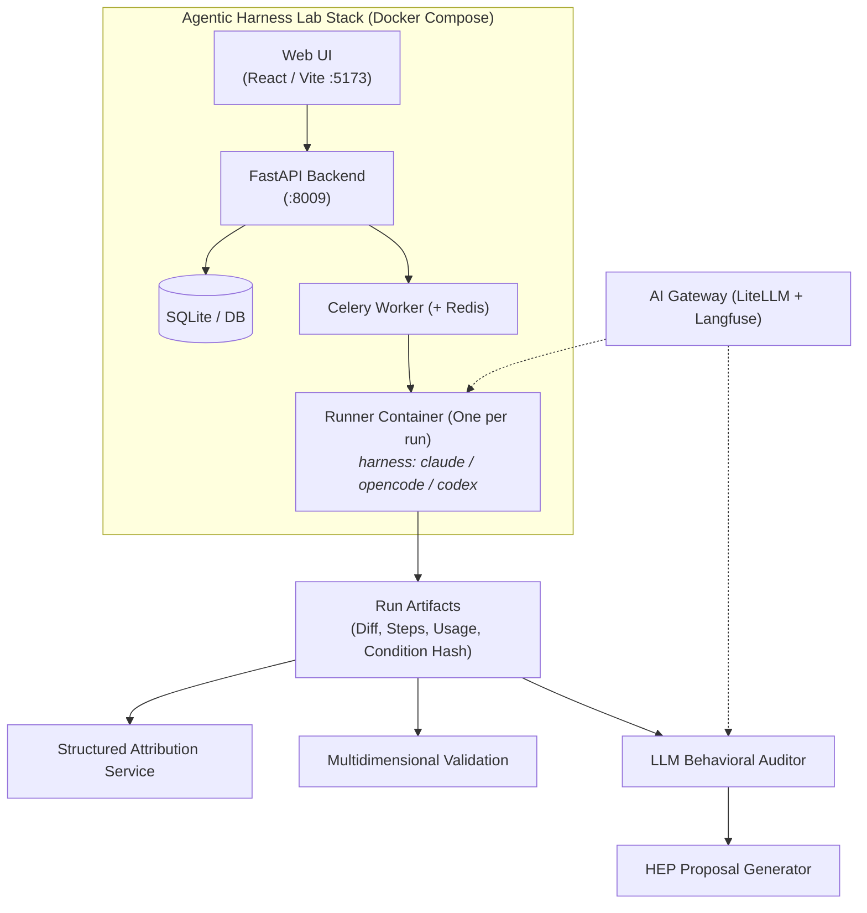

# Agentic Harness Lab: Overview

**Agentic Harness Lab** (`ai-agentic-harness-lab`) is an open-source local web application and benchmarking platform for evaluating AI coding harnesses (Claude Code, OpenCode, Codex, Antigravity) on real coding tasks—and feeding what you learn back into the shared governance template (`ml-python-base`) as concrete skill improvements.

---

---

## Key Capabilities

### 1. Benchmark Lanes (Custom Cases & SWE-bench)
- **Custom Cases**: Organization-specific tasks defined in YAML/Python (e.g., zero-downtime DB migrations, FastAPI endpoints, refactoring).
- **SWE-bench / SWE-bench Pro**: Standardized real-world GitHub issues executed in isolated, reproducible Docker containers.

### 2. Multi-Harness & Multi-Model Execution
- Select which CLI drives the run (**Claude Code**, **OpenCode**, **Codex**, or **Antigravity**) and which reasoning model to use (cloud models via AI Gateway or local self-hosted models via Ollama/LM Studio).

### 3. Rich Provenance & Condition Hashing
- Every run automatically computes a deterministic `condition_hash` and `harness_fingerprint` capturing the exact prompt variant, skill ablation set, model configuration, and container dependencies.

### 4. Structured Attribution (Used vs Available)
- Parses multi-step execution logs to determine which governance documents and skills the agent actually consulted versus what was available in the repository.

### 5. Multidimensional Scoring & Objective Floor
- Evaluates code execution objectively (`pass/fail` on validation test commands) while capturing step counts, token costs, latency, and rubric scores.

### 6. LLM Behavioral Audits & Sanitized Issue Generator
- An LLM auditor inspects run transcripts to detect command loops, hallucinated CLI flags, and SDLC deviations.
- Clicking **"Generar issue sanitizado"** outputs a ready-to-paste markdown issue (`HEP-YYYY-NNN`) stripped of private paths, keys, and tokens.

---

## Technical Stack

| Layer | Technology |
|---|---|
| **Frontend** | React, TypeScript, Vite, Tailwind CSS, Lucide Icons |
| **Backend** | Python 3.11+, FastAPI, Pydantic v2, SQLAlchemy, SQLite |
| **Async Execution** | Celery, Redis, Docker SDK (Docker-out-of-Docker) |
| **Telemetry & Gateway** | LiteLLM AI Gateway, Langfuse tracing, OpenTelemetry |
| **Tooling & Gates** | `uv`, `ruff`, `pytest`, `make app-up`, `make ci` |

---

### Related Resources
- **[Evaluation Workflow in the Lab](evaluation-workflow.md)**
- **[Controlled Environments & Sandboxing](../../evaluation/controlled-environments-sandboxing.md)**
- **[Continuous Harness Improvement](../../adoption/continuous-harness-improvement.md)**
- **[Repository on GitHub](https://github.com/marcosdh1987/ai-agentic-harness-lab)**
