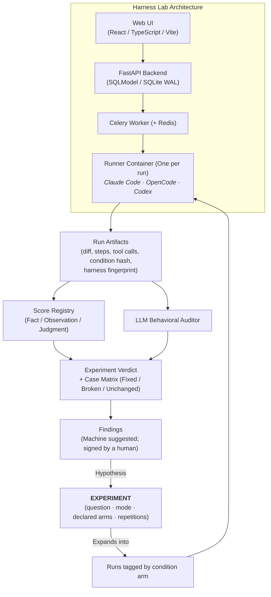

# Harness Lab: Evaluation Platform

!!! info "About this page"
    **What you will learn:** how the evaluation plane compares harness configurations and feeds failures into improvement.

    **For:** Harness Engineers, AI champions, technical leads, and teams running controlled experiments.

    **Read this when:** you need to understand the reference lab after learning the observability distinction.

The **Harness Lab** is the reference implementation of the **Evaluation Plane** in Harness Engineering. It provides an empirical evaluation instrument for testing AI coding harnesses, benchmarking frontier models on real tasks, and feeding observed failures back into shared governance templates.

The platform exists in two related implementations:

1. **`sdlc-ml-python-harness-lab`**: The active enterprise evaluation platform developed at Xmartlabs, featuring full experiment validity checks (ADR-0046), local sources browsing, and deep audit reports.
2. **`ai-agentic-harness-lab`**: The initial open-source reference baseline demonstrating per-run container sandboxing, condition hashing, and structured attribution.

---

## 1. Core Architecture: Experiment Above Run

A foundational architectural decision in the lab is that **the Experiment entity sits above the Run** (ADR-0033).

A single run is merely an isolated data point. An experiment states the scientific question *before* execution begins, declares its arms, pins the control condition, and rejects experimental designs its declared mode cannot answer.

---

## 2. The Three Evaluation Modes

The lab organizes experiments around three explicit modes (ADR-0028), preventing invalid causal claims:

- **Mode A (Harness Evaluation)**: Does this skill, rule, prompt, or harness change improve performance? Target repository, benchmark case, model, and environment are held strictly constant; only the harness varies. This is the only mode that supports a causal claim.
- **Mode B (Cross-Repository Validation)**: Does this harness generalize across different codebases? Results remain stratified per repository and are never pooled into a misleading global mean.
- **Mode C (Exploratory Repository Audit)**: What can we learn from how an unfamiliar repository works with AI today? It produces baseline cases, observations, and suggested findings without asserting a comparative verdict.

---

## 3. Verified Platform Capabilities

### Comparison Validity Preflight (ADR-0046)

Before reporting a comparison verdict between two arms, the lab executes automated validity preflights:

- Verifies that both arms were tested against identical case sets and commit SHAs.
- Checks that infrastructure conditions (sandbox limits, image tags) remained consistent.
- Rejects comparisons where confounds (such as changing both the model and the harness) invalidate attribution.

### Score Registry with Provenance (ADR-0034, ADR-0038)

Metrics are versioned (`name@version`) and explicitly categorized by authority:

- **Fact**: reproducible without judgment (such as process exit codes or file presence).
- **Observation**: parsed directly from execution artifacts (such as step counts or tool invocations).
- **Judgment**: evaluative opinions produced by models or humans (such as code readability or skill usefulness).

### DeepEval Trajectory Metrics & Behavioral Audits

The lab incorporates trajectory evaluation directly into scoring:

- **Task Completion**: verified against objective test runners.
- **Step Efficiency**: ratio of productive actions to exploratory loops.
- **Tool Correctness**: adherence to tool schemas and error-recovery behaviors.

### Structured Attribution & Condition Hashing (ADR-0003, ADR-0005)

Every run captures an immutable `condition_hash` and `harness_fingerprint`. Attribution tracking records which governed skills were available, which were actually read by the agent, and which directly contributed to solving the task.

### Findings and Human-Curated Maturity (ADR-0035)

Audit logs are mined for failure patterns. Detected weaknesses arrive in a review queue labeled as suggested findings. A finding requires human review and signature before being promoted into an actionable task or regression suite.

---

## 4. Technical Stack

| Layer | Technology |
|---|---|
| **Frontend** | React, TypeScript, Vite, semantic design tokens, local SVG icon set |
| **Backend** | Python 3.11+, FastAPI, Pydantic v2, SQLModel, SQLite with WAL mode |
| **Execution** | Celery, Redis, Docker container isolation per run with baked toolchains |
| **Evaluation** | Score registry, LLM behavioral auditor, DeepEval adapter |
| **Telemetry** | LiteLLM AI Gateway, Langfuse tracing |
| **Quality Gates** | `uv`, `ruff`, `pytest`, `make check` |

---

### Related Resources

- **[Evaluation Workflow in the Lab](evaluation-workflow.md)**: step-by-step experiment walkthrough.
- **[The Three Questions (Evaluation Modes)](../../evaluation/the-three-questions.md)**: evaluation methodology.
- **[Adaptive Harnesses & De-Scaffolding](../../evaluation/adaptive-harnesses.md)**: retiring obsolete scaffolding.
- **[Enterprise Lab Repository](https://github.com/xmartlabs/sdlc-ml-python-harness-lab)**: corporate evaluation platform.
- **[Open Baseline Repository](https://github.com/marcosdh1987/ai-agentic-harness-lab)**: initial open implementation.
