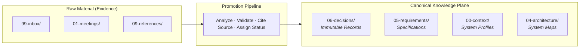

# Company Brain Template: Knowledge Plane

The `company-brain-template` is the reference implementation of the **Knowledge Plane** in multi-repository agentic software development. It provides the persistent, agent-readable memory for an organization or consulting engagement, storing canonical context, decisions, requirements, conventions, and system maps.

While the engineering harness (`ml-python-base`) governs the **execution plane**, the Company Brain governs the **knowledge plane**.

---

## 1. The Core Principle: Evidence vs Knowledge

A Company Brain is not an uncurated wiki or a dumping ground for meeting transcripts. Its foundational design principle is:

$$\mathbf{Evidence} \neq \mathbf{Canonical\ Knowledge}$$

Raw transcripts, chat exports, and client slide decks represent **evidence**, not verified facts. The Company Brain enforces a structured promotion pipeline:



Every statement promoted into canonical documents carries:

1. **Explicit Source Provenance**: citation of the meeting, document, or pull request that originated it.
2. **Standardized Status Vocabulary**:
   - `CONFIRMED`: validated by authoritative stakeholders or system verification.
   - `PENDING VALIDATION`: extracted from evidence but awaiting human or technical confirmation.
   - `INFERRED`: deduced by agents or developers from surrounding context.
   - `SUPERSEDED`: historically accurate but replaced by a later canonical decision.
   - `BLOCKED`: dependencies prevent verification or execution.

---

## 2. Directory Structure and Governance

The template organizes organizational knowledge into numbered, predictable namespaces:

```text
00-context/        # Organizational profiles, domain glossaries, environment maps
01-meetings/       # Timestamped meeting notes with attendees and raw action items
02-organization/   # Team rosters, stakeholder roles, and communication protocols
03-projects/       # Active initiatives, roadmaps, and delivery milestones
04-architecture/   # System boundary diagrams, data flow models, and integration points
05-requirements/   # Business rules, domain models, and feature specifications
06-decisions/      # Immutable Architectural Decision Records (ADR-YYYY-NNN)
07-delivery/       # Sprint cadence, release calendars, and deployment runbooks
08-vendors/        # Third-party SaaS contracts, API limits, and support paths
09-references/     # Technical documentation links, whitepapers, and external schemas
99-inbox/          # Unprocessed raw material awaiting promotion
```

---

## 3. The Brain is Not the Prompt

A critical architectural distinction in Harness Engineering is:

$$\mathbf{Company\ Brain} \longrightarrow \mathbf{Selective\ Context} \longrightarrow \mathbf{Task\ Prompt}$$

An agent cannot and should not ingest the entire Company Brain into its context window on every turn. The Brain acts as a governed knowledge database. The engineering harness:

1. Evaluates the incoming task or issue.
2. Navigates the Company Brain index (`00-context/index.md`, `06-decisions/index.md`).
3. Selects only the minimal set of relevant documents.
4. Compiles this high-signal context into the active working state.

---

## 4. No Mandatory RAG: Complexity Must Be Earned

The Company Brain does not require vector databases, embedding models, or knowledge graphs to function effectively.

For most engineering organizations (1 to 20 repositories):

- Markdown files structured in predictable directories provide immediate agent legibility.
- Standard file reads, `grep`, and agent tool navigation (`find_files`, `view_file`) provide high precision with zero infrastructure overhead.
- Version-controlled Git repositories provide audit logs, pull request review workflows, and immutable change tracking.

Advanced retrieval mechanisms (semantic search, RAG, knowledge graphs) should only be introduced when the volume of documentation exceeds what direct navigation can efficiently index. **Complexity must be earned by scale.**

---

## 5. When to Adopt a Company Brain

| Project Scope | Recommended Knowledge Strategy |
|---|---|
| **Single Repository** | In-repo memory (`docs/adr/`, `memory/`). A Company Brain is unnecessary overhead. |
| **Multi-Repo Architecture** | Shared Company Brain repository linking decisions across service boundaries. |
| **Consulting Engagement** | Company Brain tracking client requirements, stakeholder approvals, and multi-team handoffs. |
| **Enterprise Platform** | Centralized Company Brain serving as the single source of truth for platform teams. |
