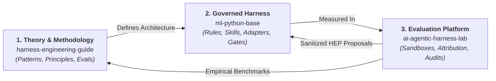
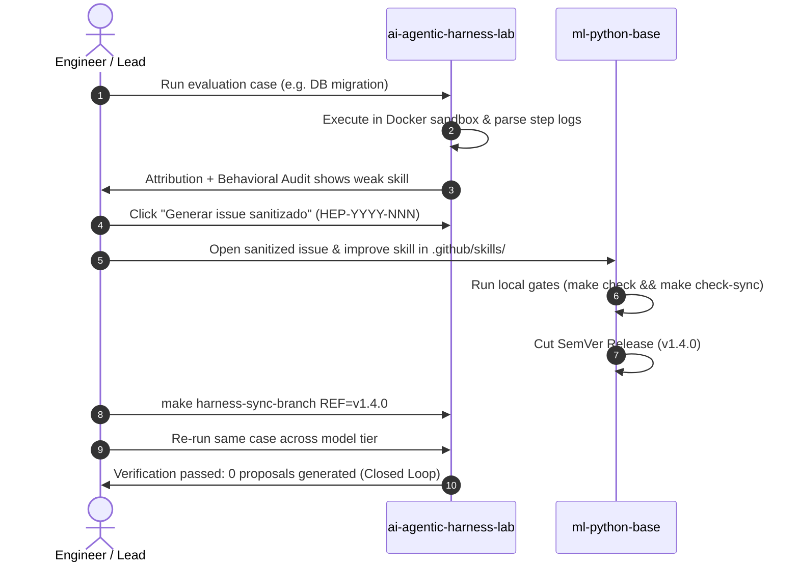

# Reference Implementations & The 3-Repo Ecosystem

The **Harness Engineering** methodology is not a theoretical abstraction. It is fully grounded in a public, working **three-repository ecosystem** that connects methodology, governed implementation, and empirical evaluation into a closed continuous improvement loop:

---

$$\mathbf{METHOD} \longrightarrow \mathbf{IMPLEMENT} \longrightarrow \mathbf{MEASURE} \longrightarrow \mathbf{LEARN} \longrightarrow \mathbf{IMPROVE} \circlearrowleft$$

---

## The Three Repositories

### 1. Harness Engineering Guide (`harness-engineering-guide`)
*The public knowledge base and methodology.*
- **Role**: Explains concepts, the Agentic SDLC Maturity Model, the Standardize-Measure-Improve lifecycle, sandboxing principles, evaluation engineering, and design patterns.
- **Independence**: **Self-contained.** You do not need to clone or run the other repositories to learn and adopt the methodology in your own organization.
- **Repository**: [`marcosdh1987/harness-engineering-guide`](https://github.com/marcosdh1987/harness-engineering-guide).

---

### 2. ML Python Base (`ml-python-base`)
*The reference implementation of a governed repository harness.*
- **Role**: Serves as a production-ready template for engineering repositories.
- **Key Features**:
  - Centralized rules layer under `.github/` (`standards.md`, `architecture.md`, `automation.md`).
  - Governed skills catalog (`.github/skills/`) with structured procedures.
  - Declarative Python synchronization engine generating native tool adapters (`CLAUDE.md`, `AGENTS.md`, `OPENCODE.md`, `GEMINI.md`, `.github/copilot-instructions.md`).
  - Read-only CI quality gates (`make check`, `make check-sync`) ensuring lockfile integrity and preventing uncommitted configuration drift.
- **Repository**: [`marcosdh1987/ml-python-base`](https://github.com/marcosdh1987/ml-python-base).
- **Documentation**: [ml-python-base Reference Guide](ml-python-base/index.md).

---

### 3. Agentic Harness Lab (`ai-agentic-harness-lab`)
*The reference implementation of an evaluation, benchmarking, and continuous improvement platform.*
- **Role**: Provides a local web application and execution backend to benchmark agentic harnesses and feed empirical observations back into governance templates.
- **Key Features**:
  - Isolated Docker container execution per run with Celery + Redis workers.
  - Multi-harness support (Claude Code, OpenCode, Codex, Antigravity).
  - Condition hashing (`condition_hash`) and harness fingerprinting.
  - Structured harness attribution (used vs available skills).
  - LLM behavioral audits and multidimensional validation scoring.
  - Closed-loop sanitized proposal generator (`HEP-YYYY-NNN`).
- **Repository**: [`marcosdh1987/ai-agentic-harness-lab`](https://github.com/marcosdh1987/ai-agentic-harness-lab).
- **Documentation**: [ai-agentic-harness-lab Reference Guide](ai-agentic-harness-lab/index.md).

---

## How the Loop Closes in Practice

---

### Explore the Implementations
- **[ml-python-base: Governed Harness](ml-python-base/index.md)**
- **[ai-agentic-harness-lab: Evaluation Platform](ai-agentic-harness-lab/index.md)**
- **[Lab Evaluation Workflows](ai-agentic-harness-lab/evaluation-workflow.md)**
