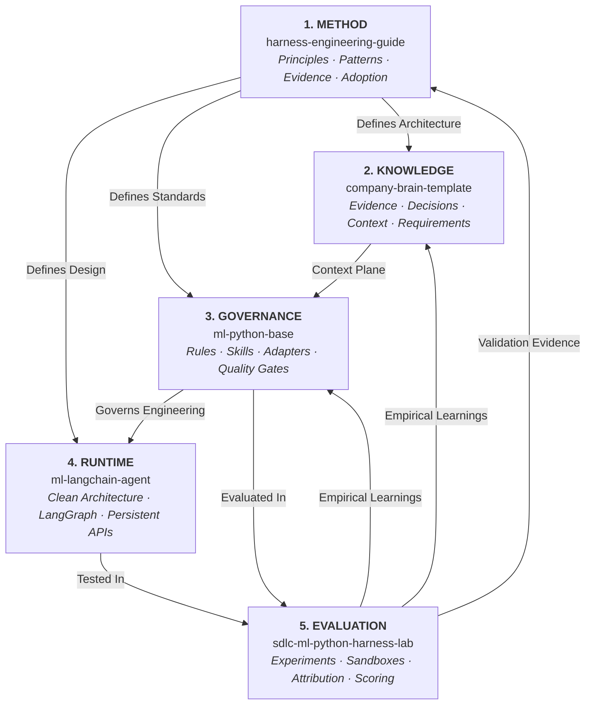

# Reference Implementations and the Five-Layer Ecosystem

The **Harness Engineering** methodology is not an abstract theory. It is grounded in a working, modular five-layer ecosystem that connects methodology, canonical knowledge, execution governance, product runtimes, and empirical evaluation into a continuous improvement loop.



---

## The Two Architectural Perspectives

The ecosystem addresses two distinct but complementary concerns:

### 1. Organizational Context Perspective

How knowledge flows from corporate systems into active developer workspaces:

```text
Corporate Systems of Record
GitHub · Jira · Slack · Notion · Client Sources
                    │
                    ▼
               COMPANY BRAIN
              Knowledge Plane
 evidence · decisions · requirements · capabilities · context
                    │
                    ▼
            ENGINEERING HARNESS
               ml-python-base
 rules · skills · tools · gates · environment · working loop
```

### 2. Full System Lifecycle Perspective

How the entire agentic system learns, operates, measures, and improves:

```text
Evidence
   ↓
Governed Knowledge
   ↓
Selected Context + Executable Governance
   ↓
Agent Execution
   ↓
Measured Outcomes
   ↓
Reviewed Learning
   ↓
Harness / Knowledge Improvement
   ↺
```

---

## The Five Ecosystem Repositories

### 1. Methodology: `harness-engineering-guide`
*The public knowledge base, architecture reference, and patterns catalog.*
- **Role**: Explains core principles, the Five Operational Surfaces, State & Continuity, Spec-Driven Development, and Evaluation Engineering.
- **Repository**: [`marcosdh1987/harness-engineering-guide`](https://github.com/marcosdh1987/harness-engineering-guide).

### 2. Knowledge Plane: `company-brain-template`
*The persistent, agent-readable memory for an organization or engagement.*
- **Role**: Structures organizational evidence into canonical knowledge through an explicit promotion pipeline with standardized status tracking (`CONFIRMED`, `PENDING VALIDATION`, `INFERRED`, `SUPERSEDED`, `BLOCKED`).
- **Repository**: [`marcosdh1987/company-brain-template`](https://github.com/marcosdh1987/company-brain-template).
- **Documentation**: [Company Brain Reference Guide](company-brain-template/index.md).

### 3. Engineering Governance: `ml-python-base`
*The production-ready reference implementation of a governed repository harness.*
- **Role**: Governs how coding agents work inside a codebase via centralized rules (`.github/`), governed skills (`.github/skills/`), multi-tool projection engines (Claude Code, Codex, OpenCode, Antigravity, Copilot), and strict read-only CI gates (`make check`).
- **Repository**: [`marcosdh1987/ml-python-base`](https://github.com/marcosdh1987/ml-python-base).
- **Documentation**: [ml-python-base Reference Guide](ml-python-base/index.md).

### 4. Agent Product Runtime: `ml-langchain-agent`
*The production-ready application template for shipping agentic software products.*
- **Role**: Governs how teams build agentic products and services using Clean Architecture, LangGraph loops terminated by provider stop reasons, conversation persistence (thread_id, resume, fork), and standardized agent-to-agent FastAPI contracts.
- **Repository**: [`marcosdh1987/ml-langchain-agent`](https://github.com/marcosdh1987/ml-langchain-agent).
- **Documentation**: [ml-langchain-agent Reference Guide](ml-langchain-agent/index.md).

### 5. Evaluation Plane: `sdlc-ml-python-harness-lab`
*The enterprise benchmarking, evaluation, and continuous improvement platform.*
- **Role**: Runs controlled experiments across candidate harnesses and models in isolated Docker sandboxes. Features Mode A/B/C comparisons, condition hashing, harness fingerprinting, attribution tracking, DeepEval metrics, LLM behavioral audits, and score registries separating Facts, Observations, and Judgments.
- **Repository**: `git@github.com:xmartlabs/sdlc-ml-python-harness-lab.git` (with early open baseline at [`marcosdh1987/ai-agentic-harness-lab`](https://github.com/marcosdh1987/ai-agentic-harness-lab)).
- **Documentation**: [Harness Lab Reference Guide](ai-agentic-harness-lab/index.md).

---

## Incremental Adoption: Complexity Must Be Earned

Not every project requires all five repositories. Teams adopt the ecosystem incrementally:

- **Standard Python Project**: `ml-python-base` alone provides immediate rules, skills, and quality gates.
- **Agent Product Initiative**: `ml-python-base` for repo governance paired with `ml-langchain-agent` for the agent runtime.
- **Multi-Repo Organization**: Company Brain template introduced to link requirements and architecture decisions across repos.
- **Mature Enterprise**: Centralized Company Brain, shared engineering harnesses, multiple domain runtimes, and an active evaluation lab running continuous regression suites.

---

### Explore the Implementations

- **[Company Brain Template: Knowledge Plane](company-brain-template/index.md)**
- **[ml-python-base: Governed Harness](ml-python-base/index.md)**
- **[ml-langchain-agent: Agent Product Runtime](ml-langchain-agent/index.md)**
- **[Harness Lab: Evaluation Platform](ai-agentic-harness-lab/index.md)**
