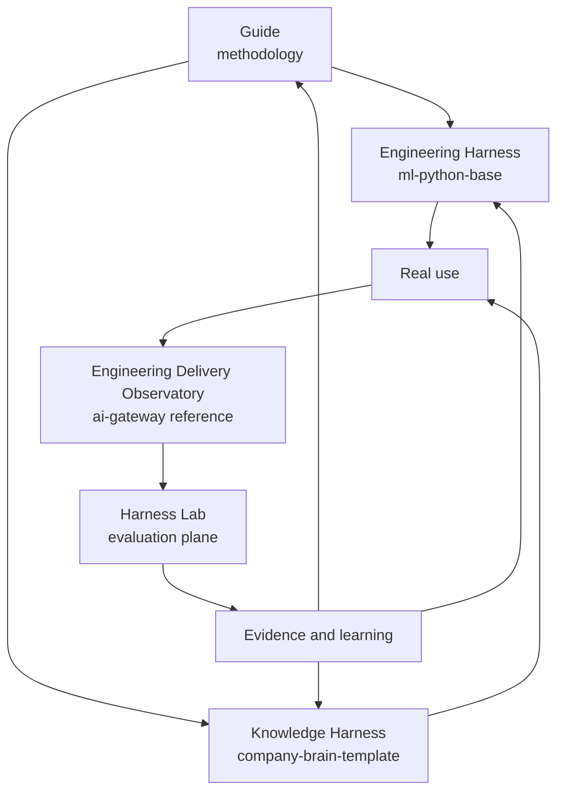

# Reference implementations and ecosystem

!!! info "About this page"
    **What you will learn:** which repositories illustrate the methodology and what each one is responsible for.

    **For:** technical practitioners, managers evaluating adoption, and readers moving from concepts to implementation.

    **Read this when:** you want to inspect evidence without treating one repository as the whole method.

The guide defines the method. The repositories below illustrate separate responsibilities. They can be adopted incrementally and do not form a mandatory stack.

## Five responsibilities

| Piece | Role | Do not confuse it with |
| --- | --- | --- |
| Harness Engineering Guide | Methodology, concepts, patterns, and adoption | A runtime or product |
| `ml-python-base` | Engineering Harness for developers and software teams | A requirement for non-technical readers |
| `company-brain-template` | Knowledge Harness for sources, decisions, provenance, and organizational context | A personal Second Brain by default |
| `ai-gateway` | Operational observability reference for AI usage and metadata | A complete delivery or productivity measurement system |
| Harness Lab | Evaluation plane for controlled experiments, attribution, and regressions | A production observability dashboard |

`ml-langchain-agent` remains a useful product runtime reference. It is linked from the Reference navigation, but it is not the conceptual center of Harness Engineering.

## Adopt incrementally

- **Individual or small team:** begin with the working loop, a source register or repository rules, and one verification habit.
- **Software team:** adopt `ml-python-base` for rules, skills, adapters, quality gates, and a common engineering baseline.
- **Knowledge team:** use Company Brain concepts for sources, decisions, provenance, and ownership. Infrastructure is optional at the start.
- **Adoption team:** add the Observatory to understand real usage and the Lab to test changes under comparable conditions.

The [Engineering Harness vs Knowledge Harness](../understand/engineering-vs-knowledge-harness.md) page explains how the two main applications relate.

## Claim levels

Each reference page should distinguish industry evidence, guide recommendation, and implementation fact. A capability documented in a repository is not automatically a universal standard.

### Explore

- [Engineering Harness: `ml-python-base`](ml-python-base/index.md)
- [Knowledge Harness: `company-brain-template`](company-brain-template/index.md)
- [Engineering Delivery Observatory](../measure-and-improve/engineering-delivery-observatory.md)
- [Harness Lab](ai-agentic-harness-lab/index.md)
- [Product runtime: `ml-langchain-agent`](ml-langchain-agent/index.md)
