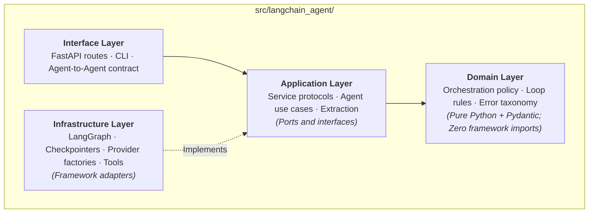

# ml-langchain-agent: Agent Product Runtime

`ml-langchain-agent` is the reference implementation of an **Agent Product Runtime**. It provides a production-grade template for engineering teams building standalone AI agents, multi-agent networks, and agentic API services.

While [`ml-python-base`](../ml-python-base/index.md) governs how AI tools write code inside a repository, `ml-langchain-agent` governs how developers build agentic software products.

---

## 1. The Architectural Problem It Solves

Building agentic products frequently collapses into an unmaintainable tangle of prompt strings, ad-hoc API calls, framework lock-in, and fragile loops:

- **Loop Instability**: agents loop endlessly on counters or return cut-off responses when hitting model token limits.
- **Framework Coupling**: business logic directly imports LangChain or LangGraph types, making unit testing, mocking, and provider transitions painful.
- **Lack of Programmatic Contracts**: agents are built as interactive chat widgets rather than addressable backend microservices.
- **Zero Persistence**: conversations vanish on process restarts, preventing human-in-the-loop workflows, resumption, or counterfactual forking.

`ml-langchain-agent` resolves these challenges through clean architecture, stop-reason driven graph routing, conversation persistence, and standardized service contracts.



---

## 2. Key Architecture Capabilities

### Enforced Clean Architecture Boundaries

The codebase enforces strict separation of concerns:

- **Domain (`domain/`)**: stdlib and Pydantic only. Contains loop policy, escalation rules, and error taxonomies. No framework imports permitted.
- **Application (`application/`)**: contains ten Protocol definitions (`ports.py`) defining the entire contract surface.
- **Infrastructure (`infrastructure/`)**: contains concrete adapters touching LangChain, LangGraph, databases, providers, or networks.

This boundary is not advisory: `tests/test_architecture_boundaries.py` walks the Python Abstract Syntax Tree (AST) during `make check` and fails the build if domain or application modules import infrastructure libraries.

### Stop-Reason Driven Graph Topology

Rather than relying on arbitrary iteration counters, graph routing is driven by the provider's standardized `stop_reason`:

```text
START
  │
  ▼
llm_call ── route_after_llm ──[tool_use]────► tools ──► llm_call   (tool loop)
                 │
                 ├──[end_turn]──────────────► reflect ──► END / revision
                 │
                 └──[max_tokens | refusal]──► escalate ────────────► END
```

The `escalate` state is terminal by design. A response cut off at `max_tokens` or refused by safety filters is never returned to callers as a valid answer.

### Three Starting Blueprints

New projects instantiate one of three pre-tested blueprints using `make init`:

- **`reflection` (default)**: tool loop paired with an automated critic that checks the answer before returning.
- **`tool_loop`**: standard tool invocation loop without reflection.
- **`minimal`**: basic single-turn model interaction without tools or reflection.

Running `make init NAME=my_agent TYPE=tool_loop` renames the package, configures the selected topology, and removes unused blueprint files.

### Conversation Persistence and Forking

Persistence is built natively over LangGraph checkpointers:

- **Thread Tracking**: every session carries an explicit `thread_id`.
- **State Resumption**: callers can pause execution for human review and resume seamlessly.
- **State Forking**: `fork()` allows branching execution from an earlier checkpoint to explore alternative trajectories.

### Agent-to-Agent Service Contract

The agent exposes a standardized FastAPI interface:

- `GET /health`: liveness, readiness, and model connectivity.
- `GET /capabilities`: machine-readable declaration of tools, skills, and constraints.
- `POST /invoke`: structured endpoint allowing other services or agents to dispatch tasks.
- `/v1/chat/completions` and `/v1/embeddings`: OpenAI-compatible routes for Open WebUI integration.

---

## 3. Relationship to the Shared Engineering Harness

`ml-langchain-agent` is itself built upon the engineering harness of `ml-python-base`:

- It includes a `.template-version` file tracking synchronization with the base template.
- It inherits the centralized rules layer, pre-commit hooks, and CI quality gates.
- Its internal coding agents are governed by `CLAUDE.md`, `AGENTS.md`, and `OPENCODE.md`.

In short: **`ml-python-base` governs how the agent code is engineered, while `ml-langchain-agent` governs how the agent executes at runtime.**
