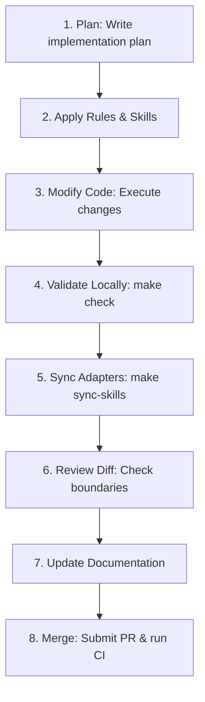

# Harness Working Loop

> [!NOTE]
> **Generated content**: This page is automatically generated from the template snapshot.
> - **Reference Commit**: [1fc65a8](https://github.com/marcosdh1987/ml-python-base/commit/1fc65a8b6cef84e9aa40ed333a8a78475cbb22a0) on branch `main`
> - **Last Synced**: `2026-06-30T13:26:01.964630Z`
> *Note: This is a study summary and index. The authoritative implementation and governance remain in the source repository.*
## Development Cycle Steps

The reference implementation enforces a highly structured, repeatable software development loop. This cycle ensures all modifications undergo rigorous verification before merge.

### Step Breakdown

1. **Plan**: Never write code directly. Draft an `implementation_plan.md` first, listing affected components and verification commands.
2. **Apply Rules & Skills**: Verify if an existing internal skill covers the change scope (e.g. `create_domain_contract`).
3. **Modify Code**: Execute the code modifications inside your local directory.
4. **Validate Locally**: Run `make check` (Ruff, Bandit, Mypy, Pytest) to assert quality.
5. **Sync Adapters**: If rules or skills changed, run `make sync-skills` to update all downstream adapters.
6. **Review Diff**: Conduct a review of the git diff to identify unintended side effects.
7. **Update Documentation**: Keep `docs/` synchronized with code changes.
8. **Merge**: Submit a Pull Request. CI executes `make ci` (both quality gate and sync check) before allowing the merge.
