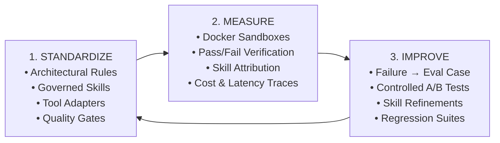
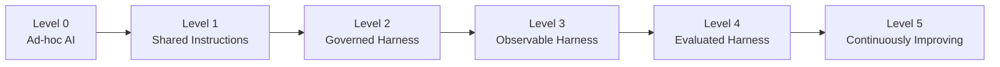
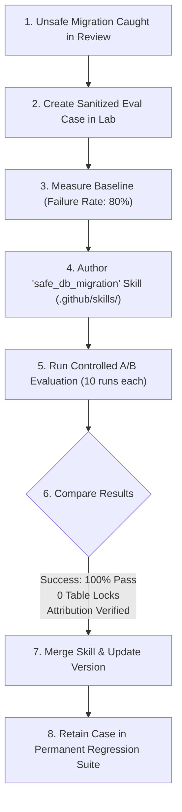
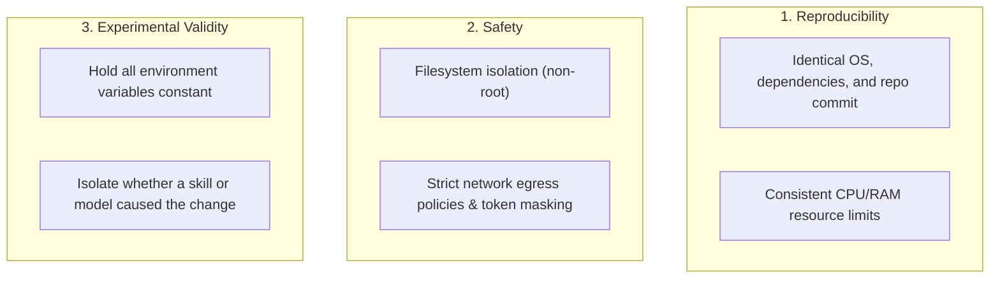

# Agentic SDLC for Engineering Teams

**From Individual AI Tooling to an Engineered, Measurable, and Continuously Improving System**

*Reading time: ~10 minutes*

---

## Executive Summary

Almost every software engineering organization has adopted AI coding assistants. Individual developers use tools like Claude Code, GitHub Copilot, Codex, Cursor, or OpenCode to generate boilerplate, refactor functions, and brainstorm designs.

However, most organizations remain trapped in an **ad-hoc paradigm**:
- Knowledge about how to guide AI models is trapped in individual chat sessions or shared via disconnected Slack messages.
- AI agents make subtle architectural violations, bypass security patterns, or generate unsafe database migrations that slip past initial reviews.
- Teams evaluate AI capabilities based on subjective "vibes" rather than reproducible benchmarks.
- When an agent makes a mistake, someone fixes the code manually, but the system learns nothing—ensuring the same mistake will recur next week.

**Harness Engineering** provides the methodology to solve this. It transforms AI development from an unpredictable tool into a version-controlled, observable, and continuously improving **Agentic Software Development Lifecycle (SDLC)**.

---

## The Guiding Engine: Standardize → Measure → Improve

To build an engineering system around autonomous agents, teams follow three disciplined phases:



1. **Standardize**: Define and version your engineering standards in repository-level configuration (`.github/rules/`, `.github/skills/`). Ensure all coding tools (Claude, Codex, OpenCode, Copilot) read from the same single source of truth through automated adapters.
2. **Measure**: Stop relying on impressions. Execute agents against reproducible task cases in isolated sandbox environments. Measure objective test outcomes, SDLC adherence, exact skill usage, step counts, and token costs.
3. **Improve**: Close the loop. When an agent fails, treat the failure like a traditional software bug: reproduce it in an evaluation case, improve the harness (rules, skills, or validation gates), verify the improvement with a controlled A/B test, and add the case to your permanent regression suite.

---

## The Agentic SDLC Maturity Model

Where does your organization sit today?



| Level | Name | Characteristics |
|---|---|---|
| **Level 0** | **Ad-hoc AI** | Every engineer uses AI tools independently without common rules, shared skills, or automated verification. |
| **Level 1** | **Shared Instructions** | Teams share prompt snippets and basic `AGENTS.md` / `CLAUDE.md` files, but synchronization and quality gates are manual. |
| **Level 2** | **Governed Harness** | Rules, skills, and multi-tool adapters are version-controlled in `.github/`; CI enforces drift control and pre-commit checks. |
| **Level 3** | **Observable Harness** | Telemetry captures step logs, token costs, latency, tool calls, and structured attribution (used vs available skills). |
| **Level 4** | **Evaluated Harness** | The team maintains an internal evaluation suite, running controlled A/B comparisons and skill ablations in isolated sandboxes. |
| **Level 5** | **Continuously Improving SDLC** | Production incidents and PR review findings automatically feed new evaluation cases, driving measurable harness upgrades and regression guards. |

*(Note: This model is a proposed organizational framework developed in this guide).*

---

## Concrete Enterprise Example: Database Migration Safety

Consider a challenge faced by many engineering teams: **AI coding agents generating unsafe, table-locking database migrations.**

### The Traditional (Ad-Hoc) Approach
1. An agent generates a migration altering a high-traffic table with a table-exclusive lock.
2. A senior engineer catches the issue during PR code review and manually explains why it is unsafe.
3. The developer manually rewrites the migration.
4. Two weeks later, another developer asks an agent to add a column, and the agent generates the exact same dangerous migration pattern again.

### The Harness Engineering Approach



1. **Capture**: The team sanitizes the failed migration into a reproducible evaluation case.
2. **Baseline**: The case is run across 10 trials in an isolated Docker container without assistance. The failure rate is 80%.
3. **Harness Improvement**: The team authors a governed skill (`.github/skills/safe_db_migration.md`) specifying zero-downtime migration patterns (adding nullable columns, backfilling in batches, separate index creation).
4. **Controlled Experiment**: The evaluation lab runs an A/B trial (*Control* vs *Treatment with Skill*).
5. **Validation**: The treatment arm achieves 100% compliance with zero table-locking operations and verified skill attribution.
6. **Compound Knowledge**: The skill is merged to the shared repository, and the evaluation case becomes a permanent regression test. The organization will never suffer that failure mode again.

---

## Why Sandboxing & Controlled Environments Are Non-Negotiable

A coding agent is not a simple text generator. It:
- Reads and rewrites files across the repository.
- Runs bash commands and compiles code.
- Executes test runners and linters.
- Installs external packages.
- Interacts with system state and network services.

Evaluating an agent requires controlling its **runtime environment**. There are three distinct engineering reasons for this:



### Industry Evidence
- **SWE-bench**: Uses per-instance containerized Docker environments to evaluate patches against standardized test suites without cross-run pollution.
- **OpenAI ("Running Codex safely at OpenAI")**: Documents OS-level sandboxing (Seatbelt, Landlock), permission policies, and OpenTelemetry logging to contain autonomous execution.
- **Anthropic ("Demystifying evals for AI agents" & "Quantifying infrastructure noise in agentic coding evals")**: Proves that varying container CPU/RAM allocations can cause up to a **6 percentage point swing** on coding benchmarks—reinforcing that the environment is an active experimental variable that must be strictly controlled.

---

## Observability vs Evaluation vs Experimentation

Many teams install an LLM tracing platform and assume they have solved evaluation. However, these are three distinct disciplines:

```
Observability:   "What happened?"                     (Traces, tokens, steps, errors)
Evaluation:      "Was the outcome good and correct?"   (Tests passed, rubric, adherence)
Experimentation: "Did this change cause improvement?"  (Control vs Treatment, A/B ablation)
```

- **Observability** gives you the runtime transcript.
- **Evaluation** applies objective test gates and judges to score the outcome.
- **Experimentation** controls variables to prove that an improved rule or skill was the actual cause of a higher pass rate.

---

## Building Your Internal Evaluation Suite

While public benchmarks like SWE-bench provide broad capability baselines, an organization's highest ROI comes from **internal evaluation suites** that mirror its proprietary architecture:

```
Sources of Internal Eval Cases:
├── Architecture Layering (Domain vs Infrastructure separation)
├── Zero-Downtime Database Migrations
├── Concurrency & Thread-Safety Patterns
├── Infrastructure-as-Code & Terraform Conventions
├── Internal Authentication & Authorization Policies
└── Sanitized Production Incidents
```

Over time, this suite becomes an **organizational benchmark for AI-assisted engineering**, guaranteeing that AI agents respect company conventions as models evolve.

---

## How to Get Started (The 4-Step Plan)

1. **Standardize a Pilot Repository**: Centralize coding guidelines and 2–3 critical skills in `.github/`. Introduce automated quality gates (`make check`).
2. **Setup Execution Sandboxes**: Ensure all agent evaluation runs take place inside isolated Docker containers.
3. **Capture Your First 5 Internal Eval Cases**: Convert recent bug fixes or PR review friction points into reproducible evaluation instances.
4. **Establish the Improvement Loop**: When an agent fails, draft a proposal, improve the skill, measure the delta, and lock the case into your regression suite.

---

## Reference Implementations

This guide is backed by two open-source reference repositories:

- **[`ml-python-base`](https://github.com/marcosdh1987/ml-python-base)**: A reference implementation of a **Governed Harness** (centralized rules, skills sync, multi-tool adapters, CI lockfile gates).
- **[`ai-agentic-harness-lab`](https://github.com/marcosdh1987/ai-agentic-harness-lab)**: A reference implementation of an **Evaluation & Continuous Improvement Platform** (Docker execution, attribution, LLM audits, sanitized proposal generator).

---

### Explore Further
- **[What is Harness Engineering?](what-is-harness-engineering.md)**
- **[Agentic SDLC Maturity Model](../adoption/maturity-model.md)**
- **[Controlled Environments & Sandboxing](../evaluation/controlled-environments-sandboxing.md)**
- **[Building an Internal Evaluation Suite](../adoption/internal-evaluation-suite.md)**
