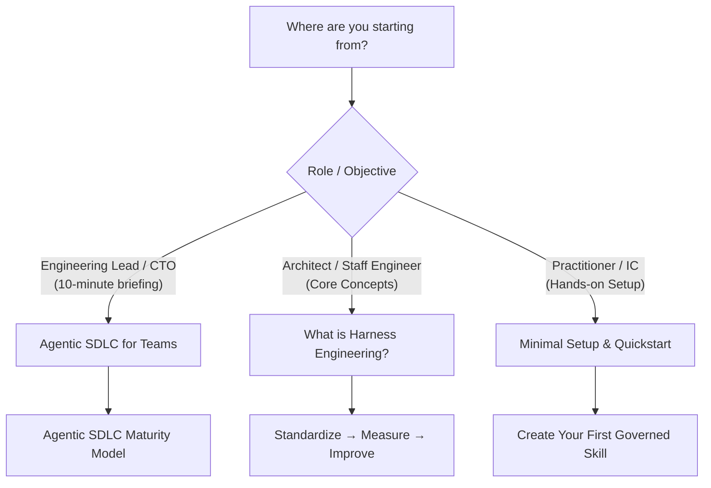

# Start Here

Welcome to the **Harness Engineering Guide**. This section is designed to quickly orient you through the core concepts, guiding methodology, and practical setup.

---

## Recommended Paths

### 1. For Engineering Leaders & Architects
- **[Agentic SDLC for Engineering Teams](agentic-sdlc-for-teams.md)**: A complete 10-minute executive and technical briefing explaining the problem, the maturity progression, the database migration safety case, and the closed-loop methodology.
- **[What is Harness Engineering?](what-is-harness-engineering.md)**: Conceptual foundation and the Harness Stack architecture.
- **[Standardize → Measure → Improve](standardize-measure-improve.md)**: Deep dive into the three-stage continuous improvement lifecycle.

### 2. For Hands-on Engineers & Practitioners
- **[Minimal Setup](minimal-setup.md)**: Step-by-step instructions to configure your first governed repository.
- **[Claude Code Basics](claude-code-basics.md)**: CLI mechanics, `CLAUDE.md`, and custom command patterns.
- **[Create Your First Skill](create-your-first-skill.md)**: Building structured, deterministic skills with input validation.
- **[The Company Brain Template](company-brain-template.md)**: Structuring enterprise knowledge bases for multi-agent retrieval.
- **[Adopting an Existing Project](adopt-existing-project.md)**: Retrofitting an existing legacy codebase with an AI harness.

### 3. Structured Learning
- **[Learning Path](../learning-path.md)**: Role-specific reading paths for individual contributors, tech leads, and platform engineers.
