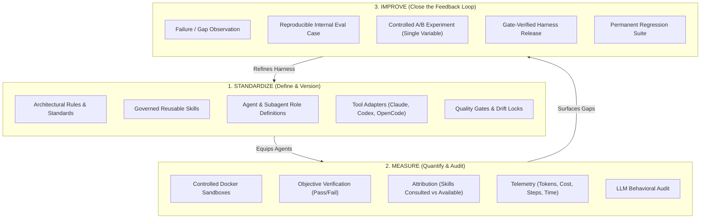
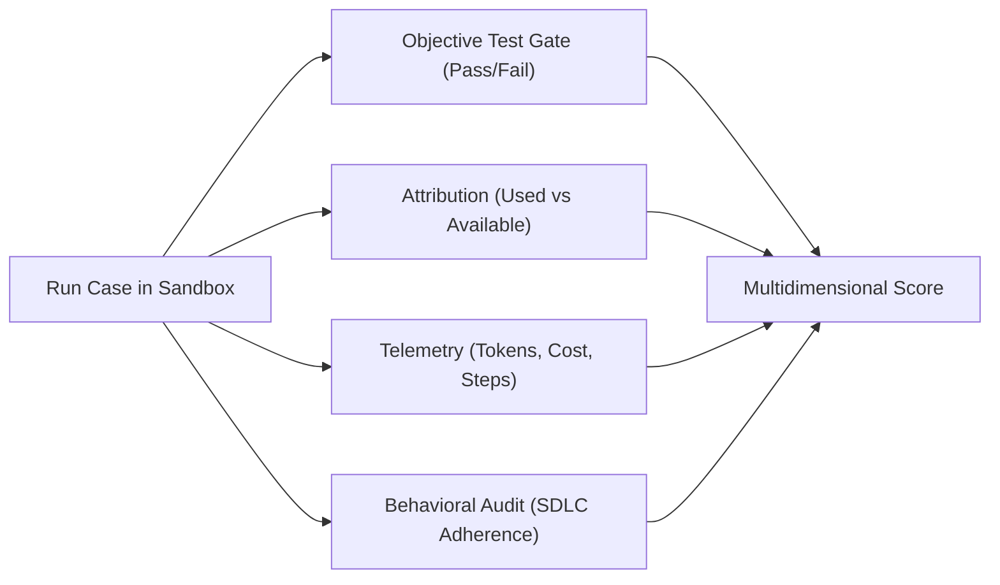

# Standardize → Measure → Improve

It usually starts with a Slack thread. Someone says the agent "got worse this week"; someone else swears the new planning skill "makes everything slower"; a third person pastes one great transcript as proof that everything is fine. Three opinions, zero measurements, about a system the whole team depends on daily. The cycle below is the way out: not more discipline in the arguments, but a method that makes the arguments unnecessary.

The guiding thread of Harness Engineering is the continuous engineering cycle:

$$\mathbf{STANDARDIZE} \longrightarrow \mathbf{MEASURE} \longrightarrow \mathbf{IMPROVE}$$

This methodology enables an engineering team to systematically manage, verify, and upgrade the AI-assisted development workflow.

---



---

## 1. STANDARDIZE: Define and Version the Agent's Operating Surface

Before we can evaluate or improve AI agents, we must establish a clear, version-controlled definition of how they are expected to work within the repository.

### What is Standardized?
- **Engineering Rules**: Explicit architecture layering (Domain, Application, Infrastructure), absolute import conventions, type safety standards, and banned library anti-patterns.
- **Governed Skills**: Executable, structured markdown documents (`.github/skills/`) that teach agents step-by-step procedures (e.g., systematic debugging, generating end-to-end tests, safe database migrations).
- **Agent and Subagent Roles**: Specialized roles (such as *Planner*, *Implementer*, *Reviewer*, *Tester*) with defined handoff contracts and review policies.
- **Multi-Tool Adapters**: Automated synchronization engines that project the centralized `.github/` rules into native formats (`CLAUDE.md`, `AGENTS.md`, `OPENCODE.md`, `GEMINI.md`, `.github/copilot-instructions.md`).
- **Quality Gates & Drift Control**: Automated pre-commit hooks, CI checks, and lockfile verifications (`make check`, `make check-sync`) that fail fast if uncommitted drift or rule violations occur.

> [!NOTE]
> **Reference Implementation**: [`marcosdh1987/ml-python-base`](https://github.com/marcosdh1987/ml-python-base) serves as an open reference implementation of this governed layer, demonstrating centralized rules, Python-based skills synchronization, and read-only CI gates.

---

## 2. MEASURE: Replace Perceptions with Reproducible Evidence

In many organizations, AI tools are evaluated by "gut feeling", a developer attempts a task, notices whether it succeeded or failed, and posts a subjective opinion in chat. This approach cannot support high-stakes engineering.

Harness Engineering replaces perception with **reproducible, multidimensional measurement** in isolated environments:



### What We Measure
1. **Objective Correctness**: Did the agent's patch solve the problem and pass all unit/integration tests? (If objective tests fail, subjective scores are capped).
2. **SDLC Adherence**: Did the agent follow required development practices (e.g., drafting a plan, running local tests, checking for regressions) instead of modifying code blindly?
3. **Structured Attribution**: Which governed rules, documentation files, and skills were actually consulted by the agent during its multi-step execution?
4. **Efficiency Metrics**: Step count, token usage, financial cost, and wall-clock latency per run.
5. **Behavioral Integrity**: LLM-driven behavioral audits detecting tool thrashing, hallucinated flags, or repetitive command loops.

!!! tip "The honest instrument"
    Measurement is only trustworthy if the instrument is honest about what each number *is*. Four rules that cost little and change everything:

    1. **Label provenance**: a test exit code (*fact*), a value parsed from artifacts (*observation*), and an LLM judge's opinion (*judgement*) must never render as the same kind of number.
    2. **"Not measured" is never zero**: a metric that could not be computed skips with a stated reason instead of poisoning the aggregate.
    3. **Prudent verdict language**: with few repetitions, say *exploratory*; never say *significant*, a team-scale harness runs no hypothesis tests.
    4. **Read the case matrix before the average**: "+8 points" can be "fixed four, broke two".

    The full doctrine: **[The Three Questions (Evaluation Modes)](../evaluation/the-three-questions.md)**.

### Evaluation Sources
Teams should combine diverse evaluation sources:
- **Public Benchmarks**: SWE-bench / SWE-bench Lite for general software maintenance comparisons.
- **Designed Synthetic Cases**: Specially crafted tasks testing edge cases (e.g., complex concurrency, refactoring legacy interfaces).
- **Sanitized Real-World Incidents**: Internal bugs, code review findings, and security flaws transformed into reproducible test cases.
- **Regression Suites**: A growing bank of internal challenges that every harness candidate must satisfy.

> [!NOTE]
> **Reference Implementation**: [`marcosdh1987/ai-agentic-harness-lab`](https://github.com/marcosdh1987/ai-agentic-harness-lab) demonstrates containerized per-run evaluation, automated attribution parsing, and multidimensional validation scoring.

---

## 3. IMPROVE: Close the Feedback Loop

Measurement is only valuable if it drives concrete improvements. Harness Engineering establishes a systematic loop to compound organizational knowledge:

```
agent failure / observation
       ↓
reproducible evaluation case
       ↓
baseline measurement
       ↓
targeted change (rule / skill / agent / tool / prompt)
       ↓
controlled A/B experiment
       ↓
evaluation & attribution comparison
       ↓
promote or reject
       ↓
permanent regression test suite
```

### The Rules of Controlled Improvement
1. **Isolate Single Variables**: Change only one variable at a time (e.g., test *Model A + Harness v1* vs *Model A + Harness v2*, or *with skill* vs *without skill*).
2. **Account for Stochasticity**: LLM agents exhibit variance across runs. Always perform multiple runs per condition to establish statistical reliability.
3. **Deterministic Sanitization**: Strip private tokens, internal endpoints, and machine-specific paths when transferring evaluation findings into public or shared governance repositories.
4. **Permanent Regression Guard**: Once a weakness is resolved, keep the evaluation case in the regression suite so future model updates or prompt edits never reintroduce the defect.

---

## Comparative Overview

| Dimension | Ad-Hoc AI Coding | Governed Harness | Evaluated & Improving Agentic SDLC |
|---|---|---|---|
| **Instruction Delivery** | Manual chat prompts | Centralized `.github/` rules & skills | Dynamic, ablated, versioned skill sets |
| **Tool Adaptation** | Tool-specific manual copy-paste | Synchronized multi-CLI adapters | Deterministic adapter generation |
| **Quality Verification** | Human visual inspection | Automated CI quality gates | Sandboxed multi-grader test suites |
| **Evaluation Method** | Anecdotal developer perception | Pre-merge unit tests | Multi-run A/B benchmarks & attribution |
| **Failure Handling** | Prompt rewritten in chat | Bug fixed in repository | Case added to permanent regression suite |
| **Organizational Learning** | Ephemeral (lost in Slack) | Static documentation | Compounding evaluation asset |

---

### Next Steps
- Review the **[Agentic SDLC Maturity Model](../adoption/maturity-model.md)** to determine where your team sits today.
- Learn how to **[Build an Internal Evaluation Suite](../adoption/internal-evaluation-suite.md)** from real company workflows.
- Explore **[Controlled Environments & Sandboxing](../evaluation/controlled-environments-sandboxing.md)**.
