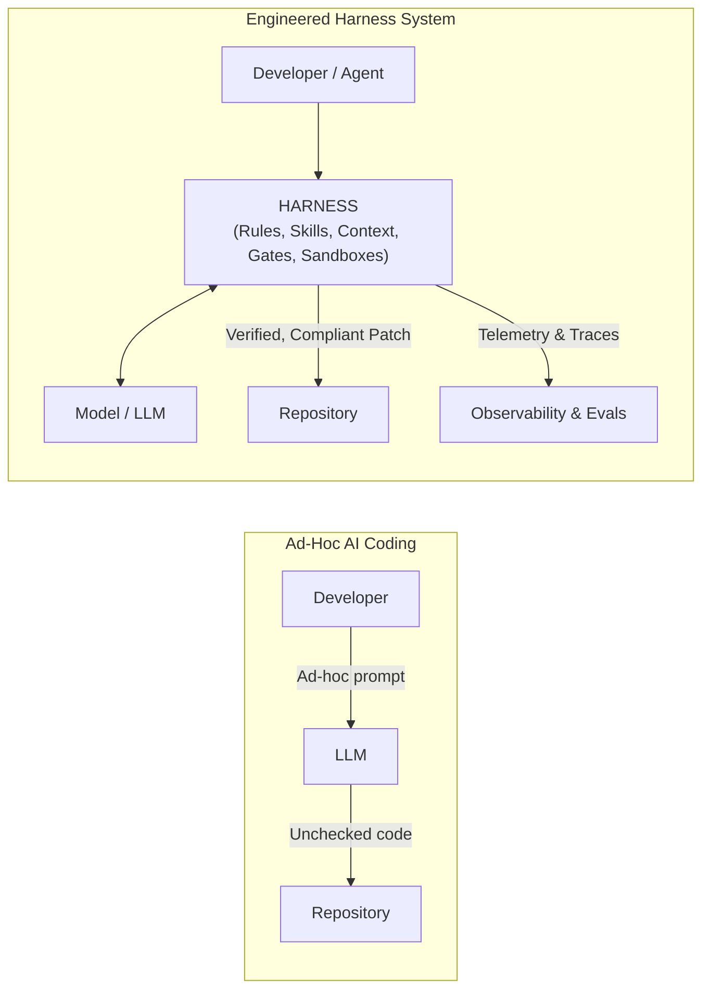
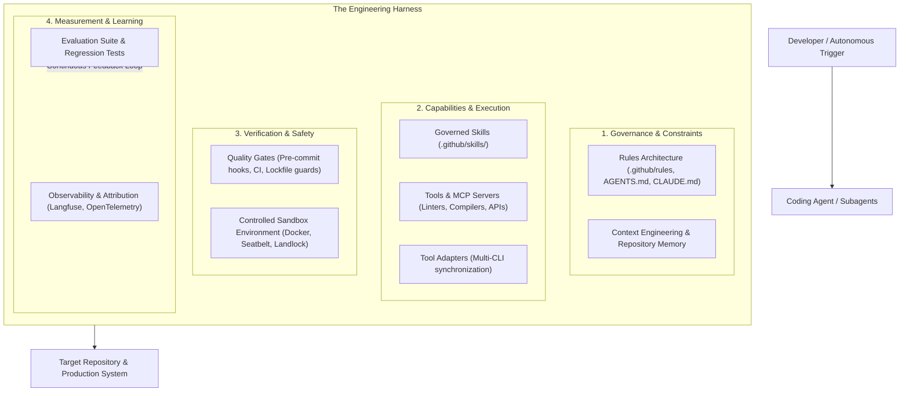
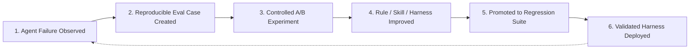

# What is Harness Engineering?

**Harness Engineering** is the engineering discipline of designing, governing, observing, evaluating, and continuously improving the complete system around artificial intelligence coding agents.

Rather than viewing AI assistance merely as an ephemeral chat session or a collection of disconnected prompt templates, Harness Engineering treats the agent's operating environment, behavioral rules, contextual memory, tool capabilities, execution sandboxes, quality gates, and evaluation suites as a unified, version-controlled software product.

---

## Beyond "Vibe Coding" and Simple Prompts

In early adoption phases, developers often interact with AI models through single-turn autocompletions or ad-hoc prompts ("vibe coding"). While this accelerates prototyping for individual contributors, it does not scale across an engineering organization:

### Limitations of Prompts Alone
1. **Context Decay**: Prompts entered manually into chat interfaces are forgotten when the session closes.
2. **Lack of Tool Boundaries**: An unconstrained agent can execute dangerous commands, overwrite critical files, or install conflicting dependencies.
3. **No Verifiability**: A prompt cannot guarantee that generated code compiles, passes tests, adheres to strict typing, or respects layered architectural boundaries.
4. **Tool Fragmentation**: Different developers use different coding tools (Claude Code, GitHub Copilot, Codex, OpenCode, Antigravity) with divergent, un-synchronized instructions.

---

## The Harness Stack

A complete AI development harness sits between the reasoning model and the target repository/environment. It consists of multiple coordinated layers:

### Components of the Harness Stack

| Component | Responsibility | Example in Reference Implementation |
|---|---|---|
| **Rules & Constraints** | Defines architectural layering, style guides, domain boundaries, and banned patterns. | `.github/standards.md`, `.github/architecture.md` |
| **Context Engineering** | Curates project memory, domain contracts, and index files within token budget constraints. | Context window preflight, domain contract schemas |
| **Governed Skills** | Modular, multi-step capabilities with strict input validation and executable workflows. | `.github/skills/systematic_debugging.md`, `generate_e2e_tests.md` |
| **Tool & MCP Access** | Controlled interface for reading files, editing ASTs, running tests, or querying internal APIs. | Native MCP servers, Read/Edit/Bash permissions |
| **Multi-Tool Adapters** | Renders tool-specific configurations from a single centralized rules layer. | `CLAUDE.md`, `AGENTS.md`, `OPENCODE.md`, `GEMINI.md` |
| **Quality Gates** | Read-only automated checks that block non-compliant changes before merge. | `make check`, `uv.lock` drift detection, pre-commit hooks |
| **Controlled Sandboxes** | Isolated execution environments preventing side-effects and ensuring reproducibility. | Docker container per run, non-root user, network policies |
| **Observability & Attribution** | Telemetry capturing steps, latency, token costs, and exact skill usage. | Step logging, Langfuse traces, used vs available attribution |
| **Evaluation Suite** | Reproducible test cases that measure whether agent outputs solve real tasks without regressions. | `ai-agentic-harness-lab` custom cases, SWE-bench lanes |

---

## The Continuous Improvement Loop

Harness Engineering is not a static setup; it is a **continuous improvement practice**. When an agent makes a mistake in development or generates an unsafe pattern:

1. The failure is captured and sanitized into an **internal evaluation case**.
2. A baseline score is measured in an isolated sandbox.
3. The harness is modified (refining a skill, updating a rule, or adding a quality gate).
4. An A/B experiment evaluates whether the change resolved the issue across multiple runs.
5. The case is permanently added to the team's **regression suite** to ensure future model or harness updates do not reintroduce the bug.

---

## Summary

Harness Engineering moves organizations from asking *"How good is this AI model at coding?"* to answering:

> **"How effectively does our engineering system guide, constrain, verify, evaluate, and continuously improve the autonomous work of AI coding agents?"**

---

### Related Resources
- **[Standardize → Measure → Improve](standardize-measure-improve.md)**: The step-by-step methodology.
- **[Agentic SDLC for Teams](agentic-sdlc-for-teams.md)**: 10-minute briefing for engineering leadership.
- **[Agentic SDLC Maturity Model](../adoption/maturity-model.md)**: Evaluating organizational maturity.
