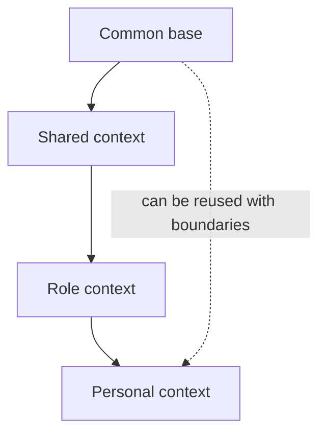

# Company Brain, Role Brain and Second Brain

!!! info "About this page"
    **What you will learn:** how to distinguish knowledge scopes, ownership, and privacy boundaries.

    **For:** managers, PMs, AI champions, knowledge workers, and teams designing shared context.

    **Read this when:** you are deciding what knowledge should be shared, specialized, or kept personal.

These names describe scopes of context. They do not require four repositories, four products, or a single physical hierarchy.

| Concept | Scope | Ownership | Typical content |
| --- | --- | --- | --- |
| Company Brain | Organizational knowledge | Organization | Policies, decisions, systems, conventions, and trusted sources |
| Team Brain | Team context | Team | Ways of working, current goals, local decisions, and runbooks |
| Role Brain | Functional context | Role or function | Responsibilities, recurring workflows, and role-specific knowledge |
| Second Brain | Personal context | Individual | Notes, projects, sources, preferences, decisions, and learning |

## A composition model

The layers can be composed logically. They do not have to be implemented as nested repositories. Search, retrieval, connectors, skills, rules, provenance, and security may be shared while the data, access, retention, and owners remain distinct.

## Adoption without infrastructure

Conceptual adoption can begin with a source register, decision log, ownership rules, and a review habit. A reference implementation becomes useful when a team needs repeatable automation, connectors, validation, or agent access.

!!! warning "Privacy and trust"
    Shared organizational knowledge, private personal knowledge, operational telemetry, and performance management are different categories. A Second Brain is not automatically an organizational asset. Individual telemetry is not automatically a performance signal.

For the technical template, see [company-brain-template](../reference-implementation/company-brain-template/index.md).
