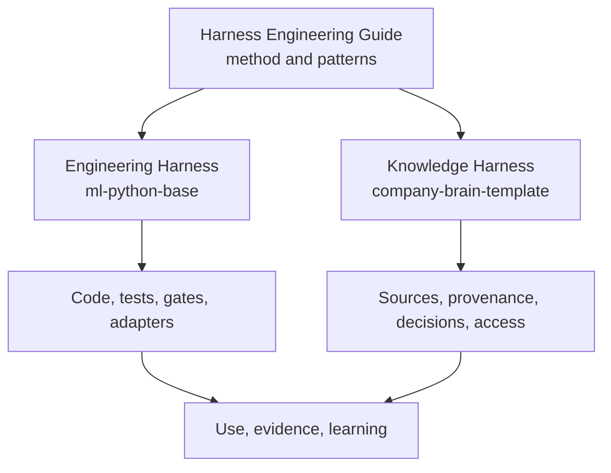
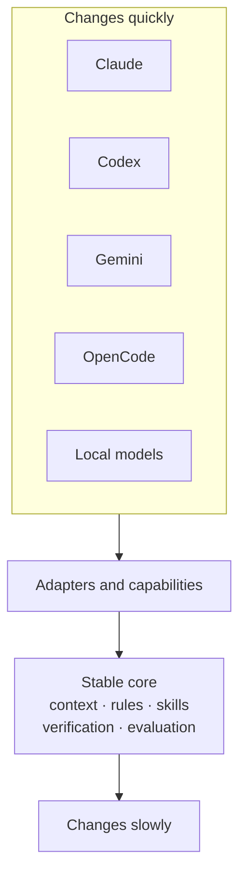

# Engineering Harness vs Knowledge Harness

!!! info "About this page"
    **What you will learn:** how the software and knowledge applications of Harness Engineering relate.

    **For:** developers, tech leads, managers, AI champions, and knowledge workers.

    **Read this when:** you need to decide whether your next problem is mainly about execution, context, or both.

Harness Engineering is the methodology. An Engineering Harness and a Knowledge Harness are two applications of the same durable idea: make the context and feedback around AI explicit, owned, verifiable, and improvable.

## What each one stabilizes

| | Engineering Harness | Knowledge Harness |
| --- | --- | --- |
| Main question | How should software work be executed and verified? | What context can people and agents trust? |
| Stable core | Rules, skills, tools, workflows, verification, and quality gates | Sources, provenance, decisions, ownership, access, and maintenance |
| Reference implementation | `ml-python-base` | `company-brain-template` |
| Typical evidence | Tests, CI, review, architecture checks, and regressions | Source history, decision records, freshness, access, and provenance |
| Primary users | Developers, tech leads, and engineering teams | Managers, teams, roles, and knowledge workers |

They can share connectors, retrieval, skills, rules, security, and evaluation practices. They should not be collapsed into one product or one repository by default.

## The stable core and the changing edge

We do not standardize the provider. We standardize the cycle. The guide therefore remains useful as tools, models, frameworks, MCP servers, and runtimes change.

!!! note "Claim level"
    The distinction above is a guide recommendation. The repository names and capabilities are reference implementation facts, described in the [ecosystem overview](../reference-implementation/index.md).
