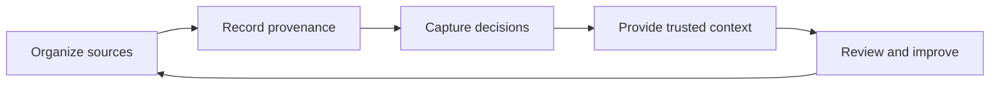

# Knowledge work

!!! info "About this page"
    **What you will learn:** how to apply harness ideas to shared and personal knowledge.

    **For:** managers, PMs, AI champions, knowledge workers, and teams building trusted context.

    **Read this when:** you want the benefits of structured context without starting from a developer setup.

Knowledge work has the same basic problem as software work: useful context is scattered, decisions are hard to find, and lessons disappear after a conversation. A Knowledge Harness makes sources, provenance, ownership, access, and maintenance explicit.

You do not need to clone a repository, install Python, or run Docker to adopt this concept. A reference implementation is available when a team needs to operate the system.

## A practical route

Start with one question that people ask repeatedly. Identify the authoritative sources, record why they are trusted, and define who owns maintenance. Add retrieval or agent connections only when the basic knowledge flow is clear.

## Choose the scope

| Scope | What it contains | Ownership |
| --- | --- | --- |
| Company Brain | Shared organizational knowledge, decisions, and operating context | Organization |
| Team or Role Brain | Context needed by a team or function | Team or role |
| Second Brain | Notes, projects, preferences, sources, and learning | Individual |

These are knowledge scopes, not a requirement to create four repositories. They can share search, provenance, connectors, skills, rules, and security while keeping different sources, permissions, retention, ownership, and personalization.

Continue with [Company Brain, Role Brain and Second Brain](../understand/company-role-second-brain.md).

!!! warning "Keep boundaries explicit"
    Shared organizational knowledge, private personal knowledge, operational telemetry, and performance management are different things. Do not assume that personal notes or individual usage telemetry should be shared with an organization.
